# OpenCode ワークフロー概要

このディレクトリには、ソフトウェア設計の自動化ワークフローが定義されています。

## ワークフロー全体図

```mermaid
flowchart TB
    subgraph title["OpenCode 設計自動化パイプライン"]
        direction TB
        
        %% 入力
        IDEA[("アイデア・メモ<br/>docs/memos/")]
        
        %% 要件定義ワークフロー
        subgraph REQ["/req-workflow<br/>要件定義完全ワークフロー"]
            direction TB
            REQ1["コンテキスト収集"]
            REQ05{"Phase 0.5<br/>既存要件確認"}
            REQ2["要件定義書作成<br/>@req-writer"]
            REQ3{"レビューループ<br/>@req-reviewer<br/>最大5回"}
            REQ_OUT[["REQ-XXX.md<br/>8点以上"]]
            
            REQ1 --> REQ05
            REQ05 -->|"追記/新規"| REQ2
            REQ05 -->|"中断"| REQ_ABORT(("中断"))
            REQ2 --> REQ3
            REQ3 -->|"不合格"| REQ2
            REQ3 -->|"合格"| REQ_OUT
        end
        
        %% 技術キャッチアップワークフロー
        subgraph TECH["/tech-catchup-workflow<br/>技術キャッチアップ"]
            direction TB
            TECH1["調査対象特定<br/>優先度付け"]
            TECH2["最新情報収集<br/>@librarian"]
            TECH3["技術調査レポート作成"]
            TECH_OUT[["TECH-XXX.md<br/>技術調査レポート"]]
            
            TECH1 --> TECH2 --> TECH3 --> TECH_OUT
        end
        
        %% 基本設計ワークフロー
        subgraph BASIC["/basic-design-workflow<br/>基本設計完全ワークフロー"]
            direction TB
            BASIC05A{"Phase 0.5-A<br/>技術スタック<br/>ヒアリング"}
            BASIC05B{"Phase 0.5-B<br/>既存設計書確認"}
            BASIC1["技術スタック検証<br/>未定義は I-XXX"]
            BASIC2["基本設計書作成<br/>@basic-design-writer"]
            BASIC3{"レビューループ<br/>@basic-design-reviewer<br/>最大3回"}
            BASIC4["詳細設計準備<br/>フォルダ構造作成"]
            BASIC_OUT[["BASIC-XXX.md<br/>9点以上"]]
            
            BASIC05A --> BASIC05B
            BASIC05B -->|"統合/新規"| BASIC1
            BASIC05B -->|"中断"| BASIC_ABORT(("中断"))
            BASIC1 --> BASIC2 --> BASIC3
            BASIC3 -->|"不合格"| BASIC2
            BASIC3 -->|"合格"| BASIC4 --> BASIC_OUT
        end
        
        %% 詳細設計ワークフロー
        subgraph DETAIL["/detailed-design-workflow<br/>詳細設計完全ワークフロー"]
            direction TB
            DETAIL05{"Phase 0.5<br/>既存Issue・<br/>コードベース確認"}
            DETAIL1["機能分析<br/>画面/API/DB/外部連携"]
            DETAIL2["設計書作成<br/>@detailed-design-writer<br/>BE/FE/画面/DB/インフラ等"]
            DETAIL3["モックアップ生成<br/>Playwright<br/>【必須】"]
            DETAIL4{"レビューループ<br/>@detailed-design-reviewer<br/>最大3回"}
            DETAIL5["テスト項目書<br/>@test-spec-writer"]
            DETAIL6["Issue作成<br/>GitHub Issue化"]
            DETAIL_OUT[["詳細設計書群<br/>+ テスト項目書<br/>+ GitHub Issues"]]
            
            DETAIL05 -->|"続行/調整"| DETAIL1
            DETAIL05 -->|"中断"| DETAIL_ABORT(("中断"))
            DETAIL1 --> DETAIL2 --> DETAIL3 --> DETAIL4
            DETAIL4 -->|"不合格"| DETAIL2
            DETAIL4 -->|"合格"| DETAIL5 --> DETAIL6 --> DETAIL_OUT
        end
        
        %% 実装ワークフロー
        subgraph IMPL["/implement-issues<br/>実装ワークフロー"]
            direction TB
            I_START("Issue選択<br/>⚡ 複数指定で並列処理")
            I_DESIGN{"📋 設計書確認"}
            I_ENV["🐳 container-use<br/>環境構築"]
            I_SVC["サービス追加<br/>(DB/Redis等)"]
            I_TEST["🔴 テスト実装<br/>(Red)"]
            I_CODE["🟢 実装<br/>(Green)"]
            I_REF["🔵 リファクタリング"]
            I_CHECK{"品質検証<br/>AI Review<br/>9点以上"}
            I_APPROVE{"👤 ユーザー承認<br/>PR作成許可"}
            I_PR["🔀 PR作成"]
            
            I_START --> I_DESIGN
            I_DESIGN -->|"存在"| I_ENV
            I_DESIGN -->|"不在"| DESIGN_FIX
            I_ENV --> I_SVC --> I_TEST --> I_CODE --> I_REF --> I_CHECK
            I_CHECK -->|"修正"| I_CODE
            I_CHECK -->|"OK"| I_APPROVE
            I_APPROVE -->|"承認"| I_PR
            I_APPROVE -->|"却下"| I_CODE
        end

        %% フィードバックループ
        I_CODE -.->|"❌ 設計不備検知"| DESIGN_FIX>"設計修正リクエスト<br/>(Design Fix)"]
        DESIGN_FIX -.-> DETAIL

        %% 人間による承認ゲート
        PR_REVIEW{"👤 ユーザー/メンテナー<br/>レビュー"}
        MERGE(("マージ & デプロイ"))
        
        I_PR --> PR_REVIEW
        PR_REVIEW -->|"Approve"| MERGE
        PR_REVIEW -->|"Request Changes"| I_CODE
        
        %% フロー接続
        IDEA --> REQ
        REQ_OUT --> TECH
        TECH_OUT --> BASIC
        BASIC_OUT --> DETAIL
        DETAIL_OUT --> IMPL
        
        %% 技術キャッチアップはスキップ可能
        REQ_OUT -.->|"スキップ可"| BASIC
    end

    %% スタイル
    classDef inputNode fill:#e1f5fe,stroke:#01579b
    classDef outputNode fill:#e8f5e9,stroke:#2e7d32
    classDef reviewNode fill:#fff3e0,stroke:#e65100
    classDef processNode fill:#f3e5f5,stroke:#7b1fa2
    classDef human fill:#ffccbc,stroke:#d84315
    
    class IDEA inputNode
    class REQ_OUT,BASIC_OUT,DETAIL_OUT,IMPL_OUT,TECH_OUT outputNode
    class REQ3,BASIC3,DETAIL4 reviewNode
    class PR_REVIEW human
    class TECH processNode
```



---

## ワークフロー一覧

| コマンド | 入力 | 出力 | 合格基準 |
|---------|------|------|---------|
| `/req-workflow` | アイデア・メモ | 要件定義書 (REQ-XXX.md) | 8点以上 |
| `/tech-catchup-workflow` | 技術リスト / 要件定義書 | 技術調査レポート (TECH-XXX.md) | - (調査完了) |
| `/basic-design-workflow` | 要件定義書 + 技術調査レポート | 基本設計書 (BASIC-XXX.md) | 9点以上 |
| `/detailed-design-workflow` | 基本設計書 | 詳細設計書群 + テスト項目書 + Issues | 9点以上 |
| `/implement-issues` | GitHub Issues | 実装コード + PR | 9点以上（全レビュアー）⚡並列対応 |

> **Note**: `/tech-catchup-workflow` は任意実行。全技術が既知かつ最新の場合はスキップ可能。

---

## 使用エージェント

### ライター（作成担当）

| エージェント | 役割 |
|-------------|------|
| `@req-writer` | 要件定義書の作成・修正 |
| `@basic-design-writer` | 基本設計書の作成・修正 |
| `@detailed-design-writer` | 詳細設計書の作成・修正 |
| `@test-spec-writer` | テスト項目書の作成 |

### レビュアー（品質保証担当）

| エージェント | 役割 | 評価観点 |
|-------------|------|---------|
| `@req-reviewer` | 要件定義書のレビュー | 完全性、一貫性、実現可能性 |
| `@basic-design-reviewer` | 基本設計書のレビュー | 要件整合性、アーキテクチャ妥当性、技術スタック網羅性 |
| `@detailed-design-reviewer` | 詳細設計書のレビュー | 整合性、具体性、実装可能性 |

### スペシャリストレビュアー（専門領域）

| エージェント | 役割 |
|-------------|------|
| `@frontend-reviewer` | フロントエンド設計のレビュー |
| `@backend-reviewer` | バックエンド設計のレビュー |
| `@database-reviewer` | データベース設計のレビュー |
| `@security-reviewer` | セキュリティ設計のレビュー |
| `@infra-reviewer` | インフラ設計のレビュー |

---

## 品質ゲート

### サーキットブレーカー

各ワークフローには以下の安全装置が実装されています：

| 条件 | アクション |
|------|----------|
| 最大リトライ超過 | 警告マーク付与して終了 |
| スコア悪化検知 | 即座に中断 |
| 必須チェック失敗 | 未解決課題として記録 |

### 失敗時のリカバリ

```bash
# 要件定義でリトライ上限到達時
/req-workflow "入力パス" --resume-from=phase2

# 基本設計でスコア悪化時
/basic-design-workflow "REQ-XXX.md" --resume-from=phase2

# 詳細設計で特定機能のみ再実行
/detailed-design-workflow "BASIC-XXX.md" --target="ユーザー管理" --resume-from=phase3
```

---

## ドキュメント構成

```
docs/
├── memos/                        # アイデア・メモ（入力）
│   ├── archive/                  # 解決済みメモ
│   └── *.md
├── research/                     # 技術調査レポート
│   └── TECH-[カテゴリ]-NNN_技術名.md
├── requirements/                 # 要件定義書
│   └── REQ-XXX-NNN_機能名.md
└── designs/
    ├── basic/                    # 基本設計書
    │   └── BASIC-XXX-NNN_機能名.md
    └── detailed/                 # 詳細設計書
        └── {機能名}/
            ├── README.md
            ├── {サブ機能}/
            │   ├── 詳細設計書.md
            │   ├── バックエンド設計書.md
            │   ├── 画面設計書.md
            │   ├── フロントエンド設計書.md
            │   ├── *.png            # モックアップ画像
            │   └── mockup*.html     # HTMLモックアップ
            └── 共通/
                ├── データベース設計書.md
                ├── インフラ設計書.md
                └── セキュリティ設計書.md
```

---

## クイックスタート

### 新規プロジェクト開始

```bash
# 1. アイデアをメモに記載
# docs/memos/my-idea.md

# 2. 要件定義書を作成
/req-workflow "プロジェクト: タスク管理システム, ビジネス: チーム生産性向上, メモ: docs/memos/my-idea.md"

# 3. 技術キャッチアップ（推奨）
/tech-catchup-workflow "技術: Next.js 15, Prisma, 深度: standard, 要件: docs/requirements/REQ-XXX-001_機能名.md"

# 4. 基本設計書を作成
/basic-design-workflow "docs/requirements/REQ-XXX-001_機能名.md"

# 5. 詳細設計書を作成
/detailed-design-workflow "docs/designs/basic/BASIC-XXX-001_機能名.md"

# 6. 実装開始
/implement-issues
```

---

## スキルドキュメント

実装・レビュー時に参照する詳細ガイドです。

| ドキュメント | 説明 | 参照タイミング |
|-------------|------|---------------|
| [container-use環境構築](./skill/container-use-guide.md) | コンテナ環境での開発・テスト手順 | **実装開始時（必須）** |
| [container-useエージェントルール](./instructions/container-use.md) | 障害対応・セッション復旧・フォールバック手順 | **障害発生時・セッション再開時** |
| [設計書同期ポリシー](./instructions/design-sync.md) | 設計書と実装の同期ルール、差分ドキュメント化 | **実装時（設計書参照時）** |
| [テスト戦略](./instructions/testing-strategy.md) | 環境依存コードのテスト方針、Mock実装パターン | **テスト実装時** |
| [プラットフォーム例外ポリシー](./instructions/platform-exception.md) | macOS/Windows固有コードのcontainer-use例外判断 | **プラットフォーム固有コード実装時** |
| [レビューガイド](./skill/review-guidelines.md) | DB/セキュリティ/アーキテクチャの詳細レビュー観点 | レビュー時 |
| [コード品質ルール](./skill/code-quality-rules.md) | 500行ルール、固定アーキテクチャ、命名規則 | 実装時 |
| [インフラワークフロー](./skill/infra-workflow.md) | Terraform/Docker Composeの設計・実装フロー | インフラ構築時 |
| [申し送り処理](./skill/handover-process.md) | BE↔FE間の申し送り処理ルール | 実装時 |
| [反復レビュー](./skill/iterative-review.md) | OpenCode自己改善の修正→レビュー→修正ループ | **.opencode/修正時** |
| [CI監視ワークフロー](./skill/ci-workflow.md) | CI監視・修正・自動マージフロー | **PR作成後（必須）** |
| [Subtask検出](./skill/subtask-detection.md) | 親Issue→Subtask検出・依存関係解決 | **Issue実装開始時** |
| [品質レビューフロー](./skill/quality-review-flow.md) | レビュースコア基準・客観的品質基準 | **PR作成前（必須）** |
| [Issue粒度判定](./skill/issue-size-estimation.md) | 200行ルール・サイズラベル・行数見積もり | **Issue実装開始時** |
| [TDD実装フロー](./skill/tdd-implementation.md) | Red→Green→Refactorサイクル | **コード実装時** |
| [environments.json管理](./skill/environments-json-management.md) | 環境ID追跡・ステータス管理API | **環境作成・削除時** |
| [Sisyphus実装ガイド](./skill/sisyphus-implementation-guide.md) | Sisyphus専用の実行フロー・チェックリスト | **Issue実装時（Sisyphus）** |
| [GitHub GraphQL API](./skill/github-graphql-api.md) | Sub-issue登録等のGraphQL API共通処理 | **Issue作成時** |
| [承認ゲート](./skill/approval-gate.md) | ユーザー承認ゲートの共通フォーマット | **フェーズ移行時** |
| [レビュアー共通](./skill/reviewer-common.md) | 実装レビュアーの共通ガイドライン | **レビュー時** |
| [Phase命名規約](./skill/workflow-phase-convention.md) | Phase番号・承認ゲート・リトライ回数の標準 | **ワークフロー設計時** |
| [バグ修正ワークフロー](./command/bug-fix.md) | バグ報告→修正→PR作成の完全フロー（`/bug-fix`コマンド） | **バグ修正時** |

---

## コード品質ルール（概要）

詳細は [コード品質ルール](./skill/code-quality-rules.md) を参照。

### 500行ルール

| 条件 | 対応 |
|------|------|
| 500行以下 | OK |
| 500行超過 | 自動分割を実行 |

### 固定アーキテクチャ

| 領域 | アーキテクチャ |
|------|---------------|
| バックエンド | オニオン/クリーンアーキテクチャ + TDD |
| フロントエンド | Atomic Design + MVVM |

### テストカバレッジ

| 対象 | 閾値 |
|------|------|
| 新規コード | **80%以上** |

---

## 申し送り処理（概要）

詳細は [申し送り処理](./skill/handover-process.md) を参照。

| 方向 | 種別 | 例 |
|------|------|-----|
| BE→FE | `api_change` | APIレスポンス形式変更 |
| BE→FE | `error_code` | 新規エラーコード追加 |
| FE→BE | `api_request` | 新規API追加依頼 |
| FE→BE | `validation` | バリデーション追加依頼 |

---

## container-use（コンテナ開発環境）

**実装フェーズでは container-use を使用したコンテナ環境での開発が必須です。**

詳細は [container-use環境構築ガイド](./skill/container-use-guide.md) を参照。

### メリット

| メリット | 説明 |
|----------|------|
| 環境分離 | ローカル環境を汚さない |
| 再現性 | チーム全員が同一環境で作業 |
| サービス統合 | DB/Redis等を安全にテスト |
| クリーンな状態 | いつでもリセット可能 |

### 基本フロー

```bash
# 1. 環境作成
container-use_environment_create(title="Issue #123")

# 2. 環境設定
container-use_environment_config(base_image="node:20-slim", setup_commands=["npm ci"])

# 3. サービス追加 (必要に応じて)
container-use_environment_add_service(name="postgres", image="postgres:15")

# 4. コマンド実行 (テスト等)
container-use_environment_run_cmd(command="npm test")
```

### 対応サービス

| サービス | イメージ | 用途 |
|----------|---------|------|
| PostgreSQL | `postgres:15-alpine` | リレーショナルDB |
| MySQL | `mysql:8` | リレーショナルDB |
| Redis | `redis:7-alpine` | キャッシュ/セッション |
| MongoDB | `mongo:7` | ドキュメントDB |
| Elasticsearch | `elasticsearch:8` | 全文検索 |

---

## 外部ツール依存

| ツール | 用途 | インストール |
|--------|------|-------------|
| container-use | コンテナ開発環境 | **組み込みツール（インストール不要）** |
| Docker | コンテナランタイム | Docker Desktop |
| Playwright | モックアップスクリーンショット生成 | `npx playwright install chromium` |
| GitHub CLI | Issue/PR作成 | `brew install gh` |
| Terraform | インフラ構築（オプション） | `brew install terraform` |

---

## 変更履歴

| 日付 | バージョン | 変更内容 |
|:---|:---|:---|
| 2026-01-08 | 3.20.0 | **ワークフロー構造改善**: bug-fix-workflow.mdをコマンドに昇格（`/bug-fix`）。container-use-guide.md軽量化（656→611行）。スキル参照形式の完全統一。古い変更履歴をCHANGELOG.mdにアーカイブ |
| 2026-01-08 | 3.19.0 | **ワークフローレビュー対応**: Phase命名規約（workflow-phase-convention.md）を新規作成。スキル参照を`{{skill:xxx}}`形式に統一。bug-fix-workflow.mdの重複削除（1382→1322行）。孤立スキル参照の修正 |
| 2026-01-08 | 3.18.0 | **ワークフロー汎用化**: 全ファイルからプロジェクト固有の例（Pomodoro, ECサイト, Daemon, launchctl等）を汎用プレースホルダに置換。スキル参照（github-graphql-api, approval-gate）を適用。Issue参照を削除し、ドキュメントを自己完結型に |
| 2026-01-08 | 3.17.4 | **重複コード共通化 & エージェント最適化**: GraphQL API共通化（github-graphql-api.md）、承認ゲート共通化（approval-gate.md）、レビュアー共通ガイドライン作成。agent/ディレクトリ2,704行→2,407行（11%削減） |
| 2026-01-08 | 3.17.3 | **implement-issues.md 分割（第2弾）**: 2,011行→1,427行（29%削減）。Issue粒度判定、TDD実装、environments.json管理、Sisyphus実装ガイドを分離 |
| 2026-01-08 | 3.17.2 | **厳格レビュー対応**: 循環参照解消（subtask-detection.mdから実行ロジック削除）、品質レビューフロー分離（quality-review-flow.md）、重複定義削除 |
| 2026-01-08 | 3.17.0 | **implement-issues.md 分割**: 2,590行→2,131行（18%削減）。CI監視フロー（ci-workflow.md）、Subtask検出ロジック（subtask-detection.md）を分離。Git conflict marker修正、セクション番号整合性修正 |
| 2026-01-08 | 3.16.0 | **Sub-issue登録GraphQL化 & トークン最適化**: REST APIバグ回避のためGraphQL APIに変更（decompose-issue, detailed-design-workflow）。implement-issuesトークン消費65%削減（container-workerプロンプト簡素化、implement-subtask-rules.md分離） |
| 2026-01-07 | 3.15.1 | **命名規則ガイドライン追加**: `issue_id`（コード内変数）vs `issue_number`（environments.json）の使い分けを明文化 |
| 2026-01-07 | 3.15.0 | **厳格レビュー対応**: (1) environments.jsonをSSOTに簡素化 (2) 設計書乖離検出を手動チェックに変更 (3) CI修正時のgit pull追加 (4) platform-exceptionにビルドテスト追加 (5) レビューループに同一指摘検出追加 (6) --delete-branch統一 (7) build_subtask_worker_prompt実装追加 (8) 客観的品質基準追加 (9) ロールバック手順追加 |
| 2026-01-07 | 3.14.0 | **ワークフロー改善5点**: (1) プラットフォーム例外ポリシー新規追加 (2) 設計書乖離自動検出機能追加 (3) セッション自動保存機能追加 (4) CI失敗時の分類・修正フロー追加 (5) スキルドキュメント参照にプラットフォーム例外ポリシーを追加 |
| 2026-01-05 | 3.13.0 | **environments.json必須化**: container-use操作時のenvironments.json読み書きを必須化。環境作成・PR作成・マージ・削除の各タイミングで更新を強制。セッション復旧時のenvironments.json参照を優先化 |
| 2026-01-05 | 3.12.0 | **追加仕様対応**: 全設計ワークフロー（req/basic/detailed）にPhase 0.5（既存ドキュメント整合性確認）を追加。既存プロジェクトへの仕様追加時に、要件定義書・基本設計書・詳細設計書・Issue・コードベースとの整合性を自動チェックし、影響範囲を明確化 |
| 2026-01-04 | 3.11.0 | **ワークフローレビュー反映**: PRマージフロー改善（クリーンアップ統合）、Related Documentsセクション追加、設計書更新手順追加、mockallクレート追加、現行テスト構造との差異明記 |
| 2026-01-04 | 3.10.0 | **ワークフロー改善**: PRテンプレート必須化（`Closes #XX`自動クローズ）、リモートブランチ削除義務化、設計書同期ポリシー（`design-sync.md`）、環境依存テスト戦略（`testing-strategy.md`）を追加 |

> **過去の変更履歴**: 3.9.0以前の変更履歴は [CHANGELOG.md](./CHANGELOG.md) を参照してください。
