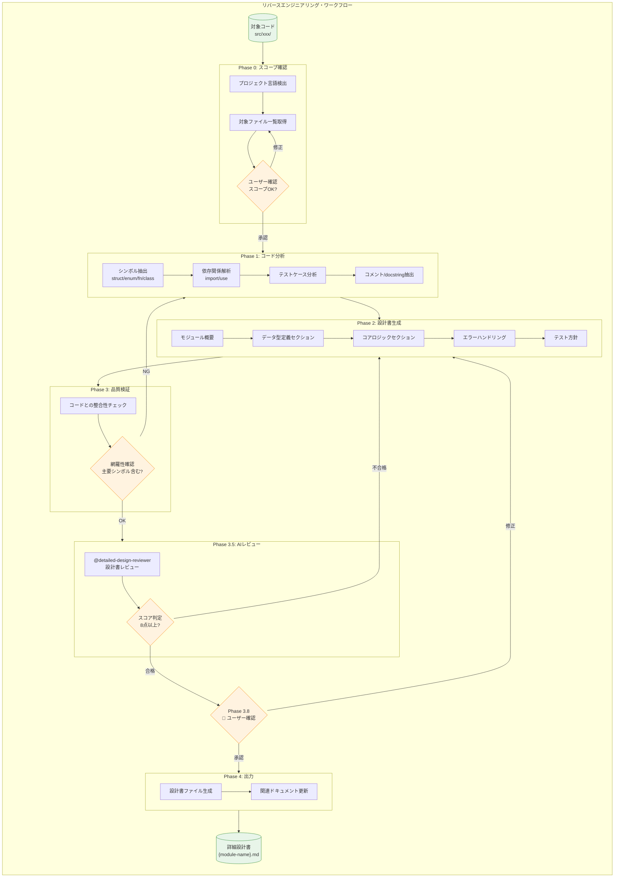

# リバースエンジニアリング・ワークフロー (v1.2)

既存のソースコードを分析し、詳細設計書を自動生成するワークフロー。
設計書のないプロジェクトの追加開発や、レガシーコード理解に活用する。

## 入力

$ARGUMENTS（対象モジュール/ディレクトリのパス）

例:
- `src/notification/` - 特定モジュール
- `src/` - プロジェクト全体
- `packages/api/src/services/` - モノレポ内の特定サービス

## 前提条件

| 項目 | 要件 | 確認方法 |
|------|------|---------|
| **Serena** | プロジェクトが設定済み | `serena_get_current_config()` |
| **LSP** | 対象言語のLSPサーバーが起動可能 | `serena_activate_project()` 成功 |
| **対象コード** | コンパイル/構文エラーなし | ビルド成功 or Linter通過 |
| **権限** | `docs/designs/reverse/` への書き込み権限 | - |

> **Note**: Serena 未設定の場合は `serena_onboarding()` を先に実行してください。

## 全体フロー図



---

## 実行プロセス

### Phase 0: スコープ確認 & 言語検出

**目的**: 対象コードの言語・フレームワークを特定し、分析範囲を確定する。

#### 0.1 プロジェクト言語検出

以下のファイルを確認して言語を特定:

| ファイル | 言語 | 追加情報 |
|---------|------|---------|
| `Cargo.toml` | Rust | edition, dependencies |
| `package.json` | JavaScript/TypeScript | framework (React, Next.js等) |
| `pyproject.toml` / `setup.py` | Python | framework (FastAPI, Django等) |
| `go.mod` | Go | - |
| `pom.xml` / `build.gradle` | Java | framework (Spring等) |

```
# Serena ツールによる言語検出

# 1. 設定ファイルを検索
serena_find_file(file_mask="Cargo.toml", relative_path=".")
serena_find_file(file_mask="package.json", relative_path=".")
serena_find_file(file_mask="pyproject.toml", relative_path=".")
serena_find_file(file_mask="go.mod", relative_path=".")

# 2. 見つかった設定ファイルから言語を判定
# Cargo.toml → Rust
# package.json + tsconfig.json → TypeScript
# package.json のみ → JavaScript
# pyproject.toml → Python
# go.mod → Go
```

#### 0.2 対象ファイル一覧取得

```
# Serena を使用してファイル一覧取得
serena_list_dir(relative_path="$TARGET_PATH", recursive=True, skip_ignored_files=True)
```

#### 0.3 ユーザー確認

```markdown
---
## 🔍 リバースエンジニアリング対象確認

### 検出結果
| 項目 | 値 |
|------|-----|
| 対象パス | `$TARGET_PATH` |
| 言語 | $DETECTED_LANGUAGE |
| ファイル数 | $FILE_COUNT |
| 主要モジュール | $MODULE_LIST |

### 対象ファイル一覧
| パス | 種別 | 行数 |
|------|------|------|
| `src/xxx/mod.rs` | モジュールエントリ | 50 |
| `src/xxx/types.rs` | 型定義 | 200 |
| ...

⏸️ **確認**: この範囲で分析を開始してよろしいですか？
- `続行` → Phase 1に進む
- `修正` → 対象範囲を変更
- `中断` → ワークフロー終了
---
```

---

### Phase 1: コード分析

**目的**: Serena/LSPツールを使用してコード構造を詳細に解析する。

#### 1.1 シンボル抽出

```
# Serena ツールによるシンボル抽出

# 1. 対象ディレクトリのファイル一覧を取得
serena_list_dir(relative_path="$TARGET_PATH", recursive=True, skip_ignored_files=True)

# 2. 各ファイルのシンボル概要を取得（depth=2 でメソッドまで）
serena_get_symbols_overview(relative_path="src/xxx/mod.rs", depth=2)
# 結果例:
# - Structs: NotificationManager, NotificationConfig
# - Enums: NotificationError, NotificationLevel
# - Functions: send_notification, create_request
# - Traits: NotificationProvider

# 3. 公開シンボルの詳細を取得（必要に応じて）
serena_find_symbol(
    name_path_pattern="NotificationManager",
    relative_path="src/xxx/",
    include_body=True,
    depth=1  # メソッドも取得
)

# シンボル種別（LSP SymbolKind）:
# 5=class, 6=method, 10=enum, 12=function, 23=struct
```

**Serena ツール使用例**:

```
# モジュール概要取得
serena_get_symbols_overview(relative_path="src/notification/mod.rs", depth=1)

# 特定シンボルの詳細取得（本体含む）
serena_find_symbol(name_path_pattern="NotificationError", include_body=True)

# 依存関係解析
serena_find_referencing_symbols(name_path="NotificationManager", relative_path="src/notification/manager.rs")
```

#### 1.2 依存関係解析

```
# Serena ツールによる依存関係解析

# Rust の場合: use 文を検索
serena_search_for_pattern(
    substring_pattern="^use\\s+",
    relative_path="src/xxx/",
    restrict_search_to_code_files=True,
    context_lines_after=0
)

# TypeScript/JavaScript の場合: import 文を検索
serena_search_for_pattern(
    substring_pattern="^import\\s+",
    relative_path="src/xxx/",
    restrict_search_to_code_files=True
)

# Python の場合: import/from 文を検索
serena_search_for_pattern(
    substring_pattern="^(import|from)\\s+",
    relative_path="src/xxx/",
    restrict_search_to_code_files=True
)

# 特定シンボルの参照元を調べる（逆方向の依存関係）
serena_find_referencing_symbols(
    name_path="NotificationManager",
    relative_path="src/xxx/manager.rs"
)
```

#### 1.3 テストケース分析

```
# Serena ツールによるテスト分析

# 1. テストファイルを検索
# Rust: tests/ ディレクトリまたは *_test.rs
serena_find_file(file_mask="*test*.rs", relative_path=".")
serena_find_file(file_mask="*_test.rs", relative_path="src/")

# TypeScript/JavaScript: *.test.ts, *.spec.ts
serena_find_file(file_mask="*.test.ts", relative_path="src/")
serena_find_file(file_mask="*.spec.ts", relative_path="src/")

# Python: test_*.py, *_test.py
serena_find_file(file_mask="test_*.py", relative_path=".")

# 2. テスト関数のシンボルを取得
serena_get_symbols_overview(relative_path="tests/test_notification.rs", depth=1)

# 3. テスト名から仕様を推測
# 例: test_send_notification_success → 通知送信が成功するケース
# 例: test_invalid_recipient_returns_error → 不正な宛先でエラーを返す

# テスト関数名の命名規則:
# - test_{機能}_{条件}_{期待結果}
# - should_{期待動作}_when_{条件}
```

#### 1.4 コメント/docstring 抽出

```
# Serena ツールによるドキュメント抽出

# Rust: /// ドキュメントコメントを検索
serena_search_for_pattern(
    substring_pattern="^\\s*///",
    relative_path="src/xxx/",
    context_lines_after=5
)

# Rust: //! モジュールコメントを検索
serena_search_for_pattern(
    substring_pattern="^//!",
    relative_path="src/xxx/",
    context_lines_after=3
)

# Python: docstring を検索
serena_search_for_pattern(
    substring_pattern='""".*?"""',
    relative_path="src/xxx/",
    context_lines_before=1
)

# TypeScript/JavaScript: JSDoc を検索
serena_search_for_pattern(
    substring_pattern="/\\*\\*",
    relative_path="src/xxx/",
    context_lines_after=10
)
```

---

### Phase 2: 設計書生成

**目的**: 分析結果を構造化された設計書に変換する。

#### 2.1 設計書テンプレート

```markdown
# {モジュール名} 詳細設計書（リバースエンジニアリング）

## メタ情報

| 項目 | 内容 |
|------|------|
| ドキュメントID | {module-name} |
| 生成日 | {DATE} |
| 対象コード | `{TARGET_PATH}` |
| 言語 | {LANGUAGE} |
| バージョン | 1.0.0 |
| ステータス | 自動生成（要レビュー） |

> ⚠️ **注意**: このドキュメントは既存コードから自動生成されました。
> 実装意図や設計判断の背景は含まれていない可能性があります。

---

## 1. 概要

### 1.1 目的

{モジュールの目的 - docstringまたはREADMEから抽出}

### 1.2 スコープ

本モジュールは以下を提供する：

{主要機能のリスト}

### 1.3 用語定義

| 用語 | 定義 |
|------|------|
{コード内の専門用語を抽出}

---

## 2. モジュール設計

### 2.1 モジュール構成

```
{TARGET_PATH}/
├── mod.rs              # {説明}
├── {file1}.rs          # {説明}
└── ...
```

### 2.2 モジュール依存関係

```mermaid
flowchart TB
    {依存関係図 - Mermaid形式}
```

### 2.3 モジュール責務

| モジュール | 責務 | 主要型 |
|-----------|------|--------|
{各ファイルの責務を推測}

---

## 3. データ型定義

### 3.1 列挙型（Enum）

{抽出した enum を詳細記述}

### 3.2 構造体（Struct）

{抽出した struct を詳細記述}

### 3.3 トレイト/インターフェース

{抽出した trait/interface を詳細記述}

---

## 4. コアロジック

### 4.1 主要関数/メソッド

| 関数名 | 説明 | 引数 | 戻り値 |
|--------|------|------|--------|
{抽出した公開関数}

### 4.2 処理フロー

{主要な処理フローを Mermaid sequence/flowchart で表現}

---

## 5. エラーハンドリング

### 5.1 エラー型

{Error enum/型を抽出}

### 5.2 エラー処理方針

| エラー種別 | 説明 | 対処方法 |
|-----------|------|---------|
{エラーバリアントごとの説明}

---

## 6. テスト方針

### 6.1 既存テスト一覧

| テスト名 | テスト内容（推測） | ファイル |
|---------|------------------|---------|
{既存テスト関数から抽出}

### 6.2 テストカバレッジ

{テスト対象の推測}

---

## 7. 未解決事項・推測

> 以下はコードから推測した内容です。実装者への確認が推奨されます。

| ID | 内容 | 確認方法 |
|----|------|---------|
| Q-001 | {不明確な設計判断} | コードレビュー |
| Q-002 | {推測した仕様} | 実装者に確認 |

---

## 変更履歴

| 日付 | バージョン | 変更内容 | 担当者 |
|------|-----------|---------|--------|
| {DATE} | 1.0.0 | リバースエンジニアリングにより自動生成 | AI |
```

#### 2.2 言語別テンプレート調整

| 言語 | 追加セクション |
|------|---------------|
| **Rust** | クレート依存、Feature flags、unsafe使用箇所 |
| **TypeScript** | コンポーネント階層、状態管理、API連携 |
| **Python** | デコレータ、型ヒント、依存注入 |
| **Go** | パッケージ構成、goroutine使用、エラーラップ |

#### 2.3 言語別ツール呼び出し例

**TypeScript/React の場合:**

```
# コンポーネント抽出
serena_search_for_pattern(
    substring_pattern="^export (default )?(function|const) \\w+",
    relative_path="src/components/",
    restrict_search_to_code_files=True
)

# Props/State 型定義
serena_find_symbol(
    name_path_pattern="*Props",
    relative_path="src/",
    include_body=True
)

# カスタムフック
serena_search_for_pattern(
    substring_pattern="^export function use\\w+",
    relative_path="src/hooks/"
)
```

**Python/FastAPI の場合:**

```
# エンドポイント抽出
serena_search_for_pattern(
    substring_pattern="@(app|router)\\.(get|post|put|delete)",
    relative_path="src/api/",
    context_lines_after=5
)

# Pydantic モデル
serena_find_symbol(
    name_path_pattern="*",
    relative_path="src/models/",
    include_kinds=[5]  # class only
)

# 依存注入
serena_search_for_pattern(
    substring_pattern="Depends\\(",
    relative_path="src/"
)
```

---

### Phase 3: 品質検証

**目的**: 生成した設計書がコードを正確に反映しているか検証する。

#### 3.1 整合性チェック

```
# 整合性検証の手順

# 1. コードから抽出したシンボル一覧を取得
serena_get_symbols_overview(relative_path="src/xxx/", depth=1)

# 2. 設計書に記載されているシンボルと比較
# チェック項目:
# - 全 pub struct/enum が「3. データ型定義」に記載されているか
# - 全 pub fn が「4. コアロジック」に記載されているか
# - Error 型が「5. エラーハンドリング」に記載されているか

# 3. 依存関係の検証
# - use 文から抽出した依存が「2.2 モジュール依存関係」と一致するか

# 4. テストケースの検証
# - tests/ 内のテスト関数が「6. テスト方針」に記載されているか

# 不整合があれば「7. 未解決事項」セクションに記録
```

#### 3.2 網羅性確認

| チェック項目 | 必須 | 確認方法 |
|-------------|:----:|---------|
| 全公開struct/enum記載 | ✅ | シンボル比較 |
| 全公開関数記載 | ✅ | シンボル比較 |
| モジュール依存関係 | ✅ | import解析 |
| エラー型記載 | ✅ | Error enum検索 |
| テスト一覧 | ⚪ | テストファイル解析 |

---

### Phase 3.5: AIレビュー（オプション）

**目的**: 生成した設計書を `@detailed-design-reviewer` でレビューし、品質を担保する。

#### レビュー実行

```
# @detailed-design-reviewer を呼び出し
task(
    subagent_type="detailed-design-reviewer",
    prompt="""
    以下の詳細設計書をレビューしてください。
    
    ## レビュー対象
    {生成した設計書の内容}
    
    ## レビュー観点
    - 整合性: コードと設計書の一致
    - 具体性: 実装可能なレベルの詳細度
    - 網羅性: 主要機能の記載漏れ
    
    ## 特記事項
    この設計書は既存コードからリバースエンジニアリングで生成されました。
    「設計意図」や「判断理由」は推測であり、確認が必要な箇所は
    「未解決事項」セクションに記載されています。
    """
)
```

#### 合格基準

| スコア | アクション |
|--------|----------|
| 8点以上 | Phase 3.8（ユーザー確認）へ進む |
| 6-7点 | 指摘事項を修正し、再レビュー（最大3回） |
| 5点以下 | Phase 1 からやり直し |

#### サーキットブレーカー

| 条件 | アクション |
|------|----------|
| レビュー3回失敗 | ⚠️ 警告マークを付与し、Phase 3.8 へ進む |
| スコア悪化 | 即座に中断、前回バージョンを使用 |

> **Note**: このフェーズはオプションです。`--skip-review` フラグで省略可能。

---

### Phase 3.8: ユーザー確認ゲート【必須】

```markdown
---
## 🔔 リバースエンジニアリング完了確認

### 生成結果サマリー

| 項目 | 件数 |
|------|------|
| 抽出した構造体/クラス | {N}件 |
| 抽出した列挙型 | {N}件 |
| 抽出した関数/メソッド | {N}件 |
| 抽出したテスト | {N}件 |
| 未解決事項 | {N}件 |

### 生成予定ファイル

| パス | 種別 |
|------|------|
| `docs/designs/reverse/{module-name}.md` | 詳細設計書 |

### プレビュー

{設計書の主要セクションをプレビュー表示}

---
⏸️ **確認**: この内容で設計書を生成してよろしいですか？
- `生成` → ファイル出力
- `修正` → 設計書内容を修正
- `中断` → 生成をキャンセル
---
```

---

### Phase 4: 出力

#### 4.1 ファイル生成

```
# 出力ファイル生成手順

# 1. モジュール名を抽出
# src/notification/ → notification
# src/cli/commands.rs → cli-commands

# 2. 出力ディレクトリを確認・作成
# docs/designs/reverse/ が存在しない場合は作成

# 3. 設計書ファイルを書き込み
# Write ツールを使用:
write(
    filePath="docs/designs/reverse/{module-name}.md",
    content="{生成した設計書}"
)

# 4. 完了メッセージを表示
# - 出力ファイルパス
# - 抽出したシンボル数
# - 次のステップ（レビュー推奨）
```

#### 4.2 出力先ルール

| 条件 | 出力先 |
|------|--------|
| 既存設計書なし | `docs/designs/reverse/{module-name}.md` |
| 既存設計書あり | `docs/designs/reverse/{module-name}_v{N}.md` |
| モノレポ | `docs/designs/reverse/{package}/{module-name}.md` |

---

## サーキットブレーカー

| 条件 | アクション |
|------|----------|
| 対象ファイルが100件超 | 警告を表示し、サブモジュール単位での分割を提案 |
| 解析エラー発生 | エラー箇所をスキップし、未解決事項として記録 |
| 非対応言語 | エラー終了（対応言語リストを表示） |

---

## エラーハンドリング

### Phase 0 エラー

| エラー | 原因 | 対処 |
|--------|------|------|
| `対象パスが見つかりません` | パス指定ミス | 正しいパスを再指定 |
| `言語を検出できません` | 設定ファイルなし、非対応言語 | 手動で言語を指定、または対応言語を確認 |
| `ファイルが0件です` | 空ディレクトリ、gitignore対象 | パスを確認、`skip_ignored_files=False` を検討 |

### Phase 1 エラー

| エラー | 原因 | 対処 |
|--------|------|------|
| `シンボル取得失敗` | LSPサーバー未起動、構文エラー | Serenaプロジェクトをアクティベート、構文エラーを修正 |
| `タイムアウト` | 大規模ファイル | `max_answer_chars` を調整、ファイル分割を検討 |
| `パターン検索失敗` | 正規表現エラー | パターンを修正 |

### Phase 2 エラー

| エラー | 原因 | 対処 |
|--------|------|------|
| `テンプレート適用エラー` | 必須フィールド不足 | Phase 1 の結果を確認、手動で補完 |
| `Mermaid図生成エラー` | 依存関係が複雑すぎ | 図を簡略化、階層を分割 |

### Phase 3 エラー

| エラー | 原因 | 対処 |
|--------|------|------|
| `整合性チェック失敗` | コードと設計書の乖離 | Phase 1 からやり直し |
| `網羅性不足` | 主要シンボル欠落 | 欠落シンボルを手動追加 |

### Phase 4 エラー

| エラー | 原因 | 対処 |
|--------|------|------|
| `ファイル書き込み失敗` | 権限エラー、ディスク容量 | 権限確認、容量確保 |
| `既存ファイル上書き` | 同名ファイル存在 | バージョン付きファイル名で出力 |

### リカバリー手順

```bash
# Phase 1 で失敗した場合
/reverse-engineer "src/xxx/" --resume-from=phase1

# 特定ファイルのみ再解析
/reverse-engineer "src/xxx/specific.rs" --merge-into="docs/designs/reverse/xxx.md"
```

> **Note**: `--resume-from` と `--merge-into` は将来実装予定。現在は手動でワークフローを再開。

---

## チェックリスト

### Phase 1 完了条件

- [ ] 言語が正しく検出されている
- [ ] 全対象ファイルがリストされている
- [ ] 主要シンボルが抽出されている

### Phase 2 完了条件

- [ ] 設計書テンプレートが適用されている
- [ ] 全公開型が記載されている
- [ ] 依存関係図が生成されている
- [ ] エラー型が記載されている

### Phase 3 完了条件

- [ ] 整合性チェック合格
- [ ] 網羅性チェック合格（主要シンボル100%）

### Phase 4 完了条件

- [ ] 設計書ファイルが生成されている
- [ ] ファイルパスがユーザーに通知されている

---

## Sisyphusへの指示

### ワークフロー実行手順

```
# ============================================================
# Phase 0: スコープ確認
# ============================================================

# 0.1 Serena プロジェクトをアクティベート
serena_activate_project(project="/path/to/project")

# 0.2 対象ディレクトリの存在確認
serena_list_dir(relative_path="$TARGET_PATH", recursive=True, skip_ignored_files=True)
# → ファイルが0件なら終了

# 0.3 言語検出（設定ファイルを検索）
serena_find_file(file_mask="Cargo.toml", relative_path=".")
serena_find_file(file_mask="package.json", relative_path=".")

# 0.4 ユーザー確認を待つ（続行/修正/中断）

# ============================================================
# Phase 1: コード分析
# ============================================================

# 1.1 各ファイルのシンボル概要を取得
# 対象ファイルごとに実行:
serena_get_symbols_overview(relative_path="src/xxx/mod.rs", depth=2)
serena_get_symbols_overview(relative_path="src/xxx/types.rs", depth=2)
# ...

# 1.2 公開シンボルの詳細取得（include_body=True）
serena_find_symbol(
    name_path_pattern="MainStruct",
    relative_path="src/xxx/",
    include_body=True
)

# 1.3 依存関係解析
serena_search_for_pattern(
    substring_pattern="^use\\s+",  # Rust の場合
    relative_path="src/xxx/",
    restrict_search_to_code_files=True
)

# 1.4 テスト分析
serena_find_file(file_mask="*test*.rs", relative_path=".")
serena_get_symbols_overview(relative_path="tests/xxx_test.rs", depth=1)

# 1.5 ドキュメントコメント抽出
serena_search_for_pattern(
    substring_pattern="^\\s*///",
    relative_path="src/xxx/"
)

# ============================================================
# Phase 2: 設計書生成
# ============================================================

# 2.1 テンプレートに従って設計書を構成
# - 概要セクション: モジュールコメント (//!) から
# - データ型定義: struct/enum シンボルから
# - コアロジック: pub fn シンボルから
# - エラーハンドリング: Error enum から
# - テスト方針: テスト関数名から

# 2.2 Mermaid 図を生成
# - モジュール構成図: ファイル一覧から
# - 依存関係図: use 文から
# - 処理フロー図: 主要関数の呼び出し関係から

# ============================================================
# Phase 3: 品質検証
# ============================================================

# 3.1 整合性チェック
# - 全 pub シンボルが設計書に記載されているか
# - 依存関係が正確か
# - テストケースが記載されているか

# 3.2 不整合があれば「未解決事項」セクションに記録

# ============================================================
# Phase 3.5: AIレビュー（オプション）
# ============================================================

# @detailed-design-reviewer を呼び出し
task(
    subagent_type="detailed-design-reviewer",
    prompt="設計書をレビュー..."
)
# スコア8点以上 → Phase 3.8 へ
# スコア6-7点 → 修正して再レビュー（最大3回）
# スコア5点以下 → Phase 1 からやり直し

# --skip-review フラグ指定時はこのフェーズをスキップ

# ============================================================
# Phase 3.8: ユーザー確認
# ============================================================

# 生成結果サマリーを表示し、ユーザー確認を待つ（生成/修正/中断）

# ============================================================
# Phase 4: 出力
# ============================================================

# 4.1 設計書ファイルを生成
# 出力先: docs/designs/reverse/{module-name}.md

# 4.2 完了メッセージを表示
```

### 注意事項

1. **Phase 0/3.8 の確認ゲート**: 必ずユーザーの明示的な承認を待つ
2. **大規模モジュール**: 100ファイル超の場合は分割を提案
3. **エラー発生時**: スキップして「未解決事項」に記録、ワークフローは継続
4. **出力形式**: テンプレート（2.1 設計書テンプレート）に厳密に従う

---

## 対応言語

| 言語 | サポートレベル | Serena対応 |
|------|---------------|:----------:|
| Rust | ✅ 完全対応 | ✅ |
| TypeScript | ✅ 完全対応 | ✅ |
| Python | ✅ 完全対応 | ✅ |
| Go | ⚪ 基本対応 | ✅ |
| Java | ⚪ 基本対応 | ✅ |
| C# | ⚪ 基本対応 | ✅ |

---

## 使用例

```bash
# 特定モジュールを分析
/reverse-engineer src/notification/

# プロジェクト全体を分析（大規模プロジェクトでは非推奨）
/reverse-engineer src/

# モノレポの特定パッケージ
/reverse-engineer packages/api/src/services/auth/

# AIレビューをスキップ（高速化）
/reverse-engineer src/notification/ --skip-review
```

---

## 制限事項

1. **設計意図の推測限界**: コードから「なぜそう実装したか」は推測できない
2. **非公開シンボル**: private/internal シンボルは詳細度が低い
3. **動的言語**: Python/JavaScript の型推論は不完全な場合がある
4. **外部依存**: 外部ライブラリの詳細は含まれない

---

## 関連ドキュメント

| ドキュメント | 説明 | 参照タイミング |
|-------------|------|---------------|
| [詳細設計ワークフロー](./detailed-design-workflow.md) | 新規設計時のワークフロー | 比較・参考 |
| [設計書同期ポリシー](../instructions/design-sync.md) | 設計書と実装の同期ルール | 出力後の運用 |

---

## 変更履歴

| バージョン | 日付 | 変更内容 |
|-----------|------|---------|
| 1.2.0 | 2026-01-04 | 前提条件セクション追加、TypeScript/Python ツール例追加、コードブロック修正 |
| 1.1.0 | 2026-01-04 | Phase番号修正(3.5/3.8)、擬似コード削除、`--skip-review`追加、出力ファイル名統一 |
| 1.0.0 | 2026-01-04 | 初版作成 |
