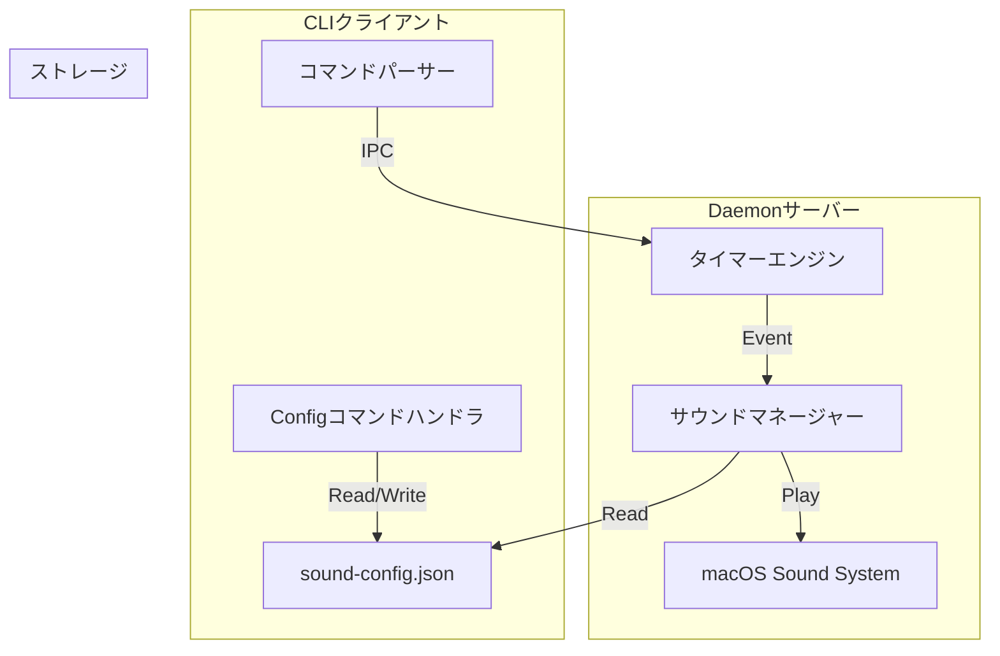

# 表示とサウンド機能強化 基本設計書

## メタ情報

| 項目 | 内容 |
|------|------|
| ドキュメントID | BASIC-CLI-002 |
| 対応要件 | REQ-CLI-002 |
| 親設計書 | BASIC-CLI-001 |
| バージョン | 1.0.0 |
| ステータス | ドラフト |
| 作成日 | 2026-01-06 |
| 最終更新日 | 2026-01-06 |
| 関連設計書 | [詳細設計書インデックス](../detailed/display-and-sound-enhancement/README.md) |

---

## 1. 概要

### 1.1 目的

本設計書は、macOS専用ポモドーロタイマーCLI（BASIC-CLI-001）に対して、視認性の高いインジケーター表示と、フェーズ（作業/休憩）に応じたサウンド通知機能を追加するための基本設計を定義する。

### 1.2 背景

REQ-CLI-002に基づき、既存のテキストベースの表示と単調なサウンド通知を改善し、ユーザー体験（UX）を向上させる。

### 1.3 スコープ

#### スコープ内（Phase 1）
- **表示強化**: `indicatif` と `colored` を用いたカラー対応インジケーター表示（F-024, F-027）
- **サウンド強化**: `rodio` を用いたフェーズ別（作業終了/休憩終了）システムサウンド再生（F-025）
- **設定機能**: サウンド選択機能と設定の永続化（F-026）
  - 設定ファイル: `~/.pomodoro/sound-config.json`（Phase 1限定の暫定措置）

#### スコープ外
- GUI設定画面（CLIのみ提供）
- カスタムサウンドファイルのインポート
- インジケーターのスタイルカスタマイズ（Phase 2）

---

## 2. システムアーキテクチャ

### 2.1 全体構成（差分）

BASIC-CLI-001のアーキテクチャをベースに、以下の拡張を行う。



### 2.2 コンポーネント拡張

| コンポーネント | 既存/新規 | 拡張内容 | 技術スタック |
|---------------|----------|---------|------------|
| **CLIクライアント** | 既存 | `sounds`, `config` コマンド追加 | clap |
| **Daemonサーバー** | 既存 | `SoundConfig` 読み込み、フェーズ判定ロジック追加 | serde_json |
| **サウンドマネージャー** | 既存(拡張) | フェーズ別サウンド再生、システムサウンド列挙 | rodio, walkdir |
| **表示モジュール** | 既存(拡張) | カラー出力、カスタムインジケーター | indicatif, colored |

### 2.3 データフロー

#### 2.3.1 サウンド設定フロー
1. ユーザーが `pomodoro config --work-sound Pop` を実行
2. CLIが `~/.pomodoro/sound-config.json` を更新
3. （オプション）CLIがDaemonに「設定リロード」IPCメッセージを送信、またはDaemonがファイル変更を検知（Phase 1は次回再生時/起動時読み込みで可とする）

#### 2.3.2 タイマー完了フロー（拡張）
1. タイマーエンジンが `TimeUp` イベント発行
2. 現在のフェーズ（Work/Break）を確認
3. `SoundConfig` から対応するサウンド名を取得
4. サウンドマネージャーが再生

---

## 3. 機能一覧

| 機能ID | 機能名 | 概要 | 優先度 | 対応コンポーネント |
|--------|--------|------|--------|-------------------|
| F-024 | インジケーター表示 | デザインされたプログレスバー表示 | 必須 | CLI, indicatif |
| F-025 | フェーズ別サウンド | 作業/休憩終了時の音を区別 | 必須 | Daemon, rodio |
| F-026 | サウンド選択 | サウンド設定の変更と保存 | 重要 | CLI, serde_json |
| F-027 | 色分け表示 | フェーズに応じた色（赤/緑/青） | 重要 | CLI, colored |

---

## 4. 画面・出力設計

### 4.1 SCR-001: ターミナルUI（拡張）

BASIC-CLI-001のSCR-001を拡張し、色とデザインを強化する。

**表示イメージ**:
```text
🍅 作業中 (25:00)
[====================>-----] 80%
タスク: 要件定義
```
↓
**拡張後**:
```text
(赤色で表示)
🍅 ポモドーロ #1 - 作業中
████████████████████░░░░░ 20:00 / 25:00
タスク: 要件定義
```

### 4.2 CLI出力（新規）

**サウンド一覧 (`pomodoro sounds`)**:
```text
利用可能なシステムサウンド:
  - Basso
  - Blow
  - Bottle
  - Funk (現在の作業終了音)
  - Glass (現在の休憩終了音)
  ...
```

---

## 5. API設計（IPC拡張）

既存のIPCプロトコル（BASIC-CLI-001 Sec 5）に加え、設定同期が必要な場合は以下を検討するが、Phase 1では「設定ファイル経由」での共有を主とするため、IPCの必須追加はない。ただし、設定反映の即時性を高めるため `reload_config` を追加候補とする。

| コマンド | パラメータ | 説明 |
|---------|------------|------|
| `reload_config` | なし | デーモンに設定ファイルの再読み込みを指示 |

---

## 6. データモデル

### 6.1 SoundConfig

設定ファイル `sound-config.json` の構造。

```rust
#[derive(Debug, Serialize, Deserialize)]
pub struct SoundConfig {
    pub work_end_sound: String,  // デフォルト: "Funk"
    pub break_end_sound: String, // デフォルト: "Glass"
}
```

---

## 7. 技術スタック

BASIC-CLI-001のスタックに加え、以下を追加・明記する。

| カテゴリ | 技術 | バージョン | 用途 |
|---------|------|-----------|------|
| **カラー出力** | `colored` | 3.0.0 | フェーズ別の色分け表示 |
| **ファイル操作** | `std::fs`, `serde_json` | 1.0 | 設定ファイルの読み書き |
| **ディレクトリ探索** | `walkdir` | 2.5 | `/System/Library/Sounds` のスキャン |

---

## 8. 既存設計への影響と移行計画

### 8.1 影響範囲
- **BASIC-CLI-001**: 設定ファイルの扱い（Phase 2→1への一部前倒し）以外は整合。
- **Daemon**: サウンド再生ロジックの差し替え。

### 8.2 移行計画
1. `SoundConfig` 構造体の実装と `serde` による入出力実装
2. `pomodoro config` / `sounds` コマンドの実装
3. Daemonのサウンド再生処理を `SoundConfig` 参照型に変更
4. `indicatif` のテンプレート修正と `colored` 適用

---

## 9. 未解決課題 (I-XXX)

| ID | 課題 | 方針 |
|----|------|------|
| I-101 | 設定変更の即時反映 | Phase 1ではCLI実行時にDaemonへ `reload` シグナルを送るか検討が必要。暫定的に「次回再生時反映」とする。 |
| I-102 | ダークモード対応 | ターミナルの背景色による視認性確認が必要。 |

