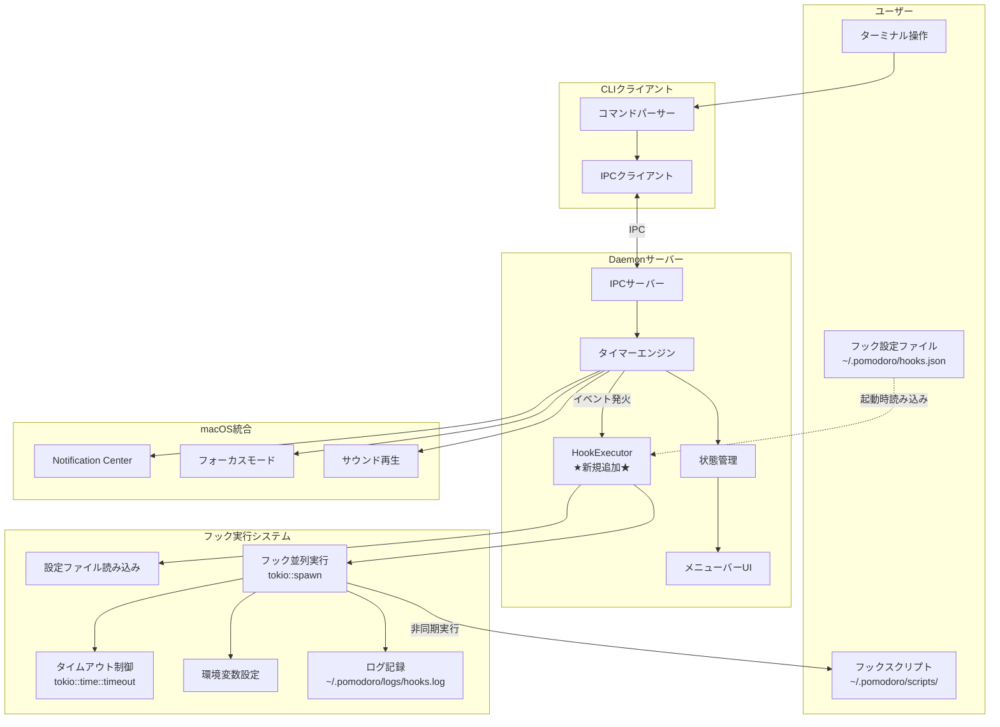
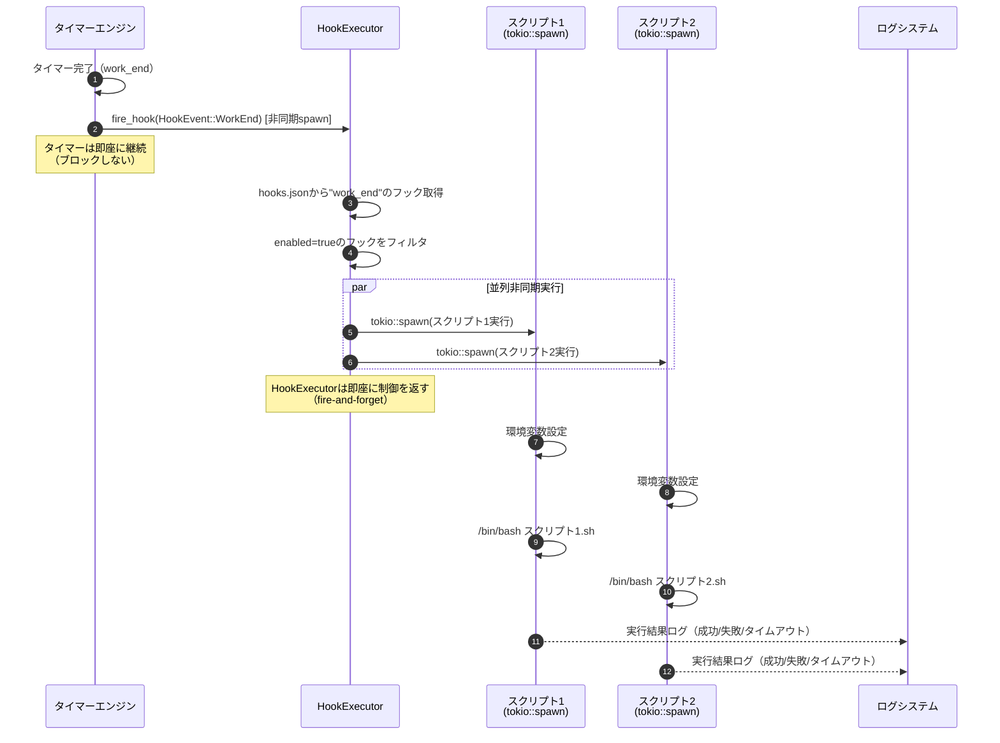
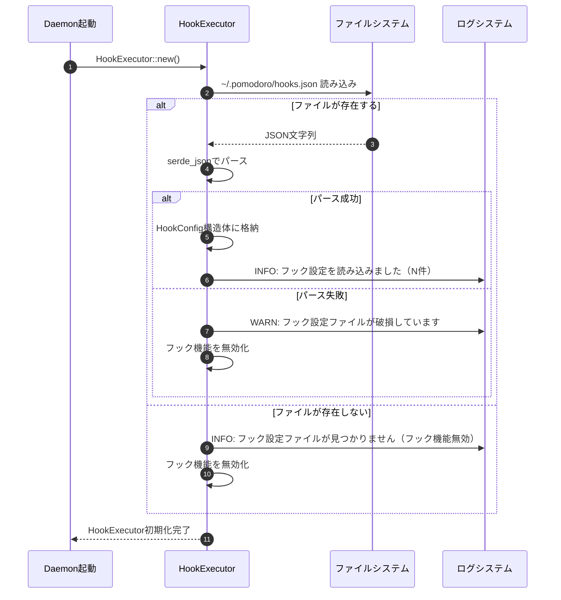
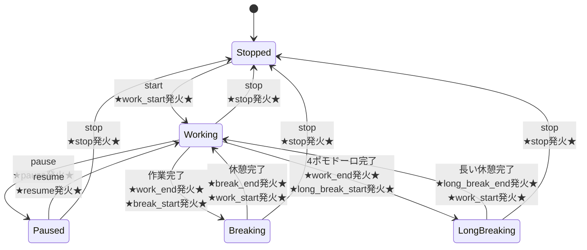
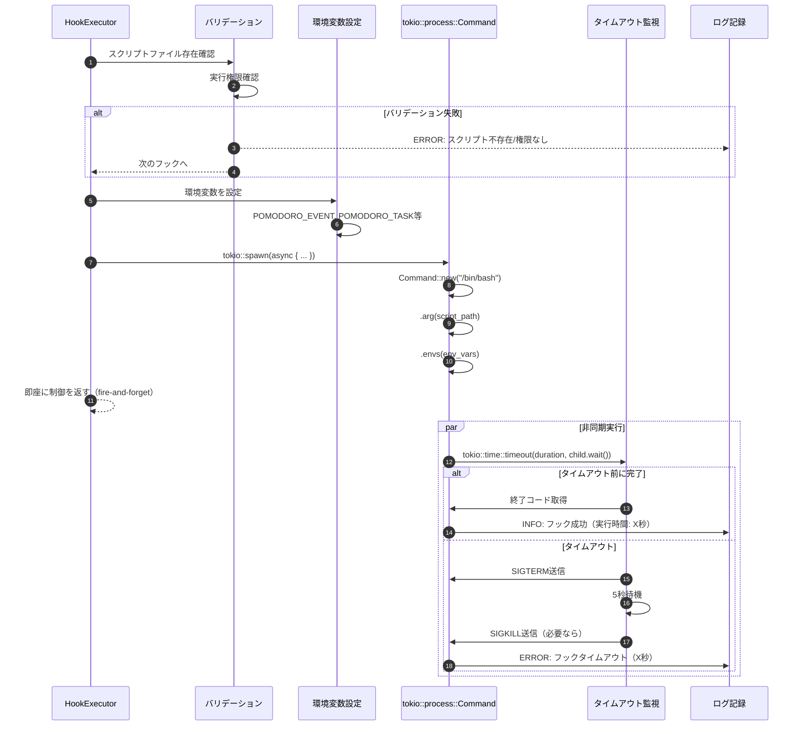
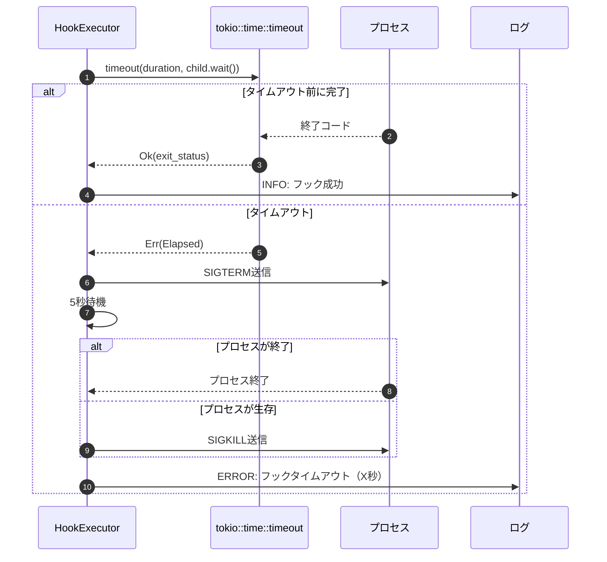
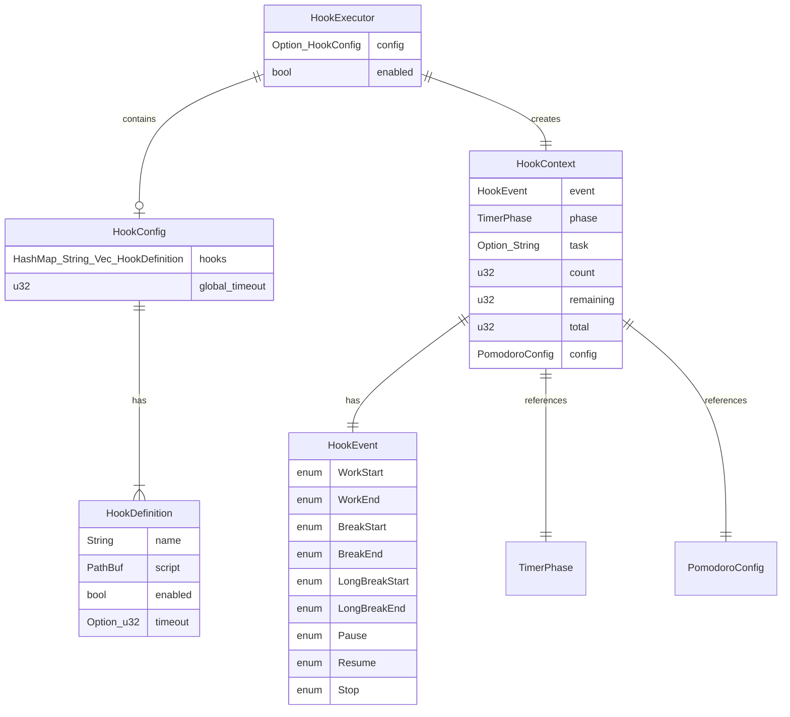

# イベントフック機能 基本設計書

## メタ情報

| 項目 | 内容 |
|------|------|
| ドキュメントID | BASIC-CLI-003 |
| 対応要件 | REQ-CLI-003 |
| バージョン | 1.0.0 |
| ステータス | ドラフト |
| 作成日 | 2026-01-06 |
| 最終更新日 | 2026-01-06 |
| 作成者 | - |
| レビュアー | - |
| 親基本設計書 | BASIC-CLI-001 |
| 関連設計書 | [詳細設計書インデックス](../detailed/event-hooks/README.md) |

---

## 1. 概要

### 1.1 目的

本設計書は、ポモドーロタイマーCLI（BASIC-CLI-001）にイベントフック機能を追加するための基本設計を定義する。タイマーイベント（作業開始、作業終了、休憩開始等）に対してユーザー定義のBashスクリプトを非同期実行することで、外部システム連携やカスタム処理を実現し、ツールの拡張性を大幅に向上させる。

### 1.2 背景

既存のポモドーロタイマーCLI（REQ-CLI-001）では、タイマー完了時にmacOS通知とサウンド再生が行われるが、以下のユーザー要望に応えられていない：

1. **外部システム連携**: Slack通知、メール送信、Webhook連携等の実現
2. **カスタム処理**: タイマーイベントに応じた任意のスクリプト実行
3. **柔軟性**: 1つのイベントに対して複数の処理を登録
4. **コンテキスト情報**: スクリプトにタスク名やフェーズ情報を渡す

これらを解決するため、イベント駆動型のフック機構を導入し、ユーザーがBashスクリプトを通じてタイマーイベントに独自の処理を追加できるようにする。

### 1.3 スコープ

#### スコープ内（Phase 1）

- イベント種別の定義（9種類: work_start, work_end, break_start, break_end, long_break_start, long_break_end, pause, resume, stop）
- Bashスクリプトの非同期実行機能（タイマーをブロックしない）
- 設定ファイルによるフック登録（`~/.pomodoro/hooks.json`）
- 1つのイベントに対する複数スクリプト登録
- 環境変数によるコンテキスト情報の提供（11種類）
- スクリプト実行のタイムアウト制御（デフォルト30秒）
- エラーハンドリングとログ記録（タイマーをブロックしない）

#### スコープ外（Phase 2以降）

- フック実行履歴の記録・閲覧機能
- フックのプレビュー・テスト機能
- GUI設定ツール
- スクリプトのバリデーション機能
- フック実行の優先順位制御
- 条件付きフック実行（特定のタスク名のみ等）
- カスタムイベントの定義

### 1.4 用語定義

| 用語 | 定義 |
|------|------|
| フック | 特定のイベント発生時に実行されるスクリプト |
| イベント | タイマーで発生する状態変化（作業開始、作業終了等） |
| コンテキスト情報 | スクリプトに渡されるタスク名やフェーズ等の情報 |
| タイムアウト | スクリプトの最大実行時間 |
| 非同期実行 | スクリプトの実行完了を待たずに次の処理に進む方式（本要件のデフォルト） |
| fire-and-forget | スクリプトを起動後、完了を待たずに即座に制御を戻す実行パターン |
| HookExecutor | フックスクリプトの実行を管理するモジュール |

---

## 2. システムアーキテクチャ

### 2.1 全体構成

イベントフック機能は、既存のDaemonサーバーに **HookExecutor** モジュールを追加する形で実装される。HookExecutorは、タイマーエンジンからイベント通知を受け取り、登録されたフックスクリプトを非同期実行する。



### 2.2 コンポーネント一覧

| コンポーネント | 責務 | 技術 | 備考 |
|---------------|------|------|------|
| **HookExecutor** | フック設定の読み込み、イベント受信、スクリプト非同期実行 | tokio::spawn, tokio::process::Command | 新規追加 |
| **HookConfig** | フック設定のデータモデル | serde, serde_json | 新規追加 |
| **HookContext** | スクリプトに渡すコンテキスト情報 | Rust struct | 新規追加 |
| **HookEvent** | イベント種別の列挙型 | Rust enum | 新規追加 |
| **タイマーエンジン** | イベント発火、HookExecutorへの通知 | tokio::time::interval | 既存（拡張） |

### 2.3 データフロー

#### 2.3.1 フック実行フロー（非同期・ノンブロッキング）



#### 2.3.2 起動時の設定ファイル読み込みフロー



---

## 3. 機能一覧

### 3.1 機能概要

| 機能ID | 機能名 | 概要 | 優先度 | 対応コンポーネント |
|--------|--------|------|--------|-------------------|
| F-028 | イベント定義 | タイマーイベントの種別を定義（9種類） | 必須 | HookEvent, タイマーエンジン |
| F-029 | フック登録 | 設定ファイルでフックスクリプトを登録 | 必須 | HookConfig, HookExecutor |
| F-030 | スクリプト実行 | Bashスクリプトを非同期実行 | 必須 | HookExecutor |
| F-031 | 環境変数提供 | スクリプトにコンテキスト情報を渡す | 必須 | HookContext |
| F-032 | 複数フック対応 | 1イベントに複数スクリプトを並列実行 | 重要 | HookExecutor |
| F-033 | タイムアウト制御 | スクリプト実行のタイムアウト設定 | 重要 | HookExecutor |
| F-034 | エラーハンドリング | スクリプト失敗時の処理とログ記録 | 必須 | HookExecutor, ログシステム |

### 3.2 機能詳細

#### 3.2.1 F-028: イベント定義

**実現方式**:
- `HookEvent` 列挙型で9種類のイベントを定義
- タイマーエンジンの状態遷移時にイベントを発火
- `fire_hook()` メソッドで HookExecutor に非同期通知

**イベント種別**:

| イベント名 | 説明 | 発生タイミング | 環境変数 `POMODORO_EVENT` |
|-----------|------|---------------|--------------------------|
| work_start | 作業開始 | 作業タイマー開始時 | `work_start` |
| work_end | 作業終了 | 作業タイマー完了時 | `work_end` |
| break_start | 休憩開始 | 休憩タイマー開始時 | `break_start` |
| break_end | 休憩終了 | 休憩タイマー完了時 | `break_end` |
| long_break_start | 長い休憩開始 | 長い休憩タイマー開始時 | `long_break_start` |
| long_break_end | 長い休憩終了 | 長い休憩タイマー完了時 | `long_break_end` |
| pause | 一時停止 | タイマー一時停止時 | `pause` |
| resume | 再開 | タイマー再開時 | `resume` |
| stop | 停止 | タイマー停止時 | `stop` |

**状態遷移図（イベント発火ポイント）**:



**ビジネスルール**:
- BR-070: イベント名は小文字とアンダースコアのみ使用
- BR-071: イベントは非同期的に処理される（タイマーをブロックしない）
- BR-072: イベント処理中もタイマーは継続する（UX最優先）

#### 3.2.2 F-029: フック登録

**実現方式**:
- `~/.pomodoro/hooks.json` に設定を記述
- Daemon起動時に `serde_json` でパース
- `HookConfig` 構造体にメモリ保持

**設定ファイル形式**:
```json
{
  "hooks": {
    "work_end": [
      {
        "name": "Slack通知",
        "script": "/Users/user/.pomodoro/scripts/notify-slack.sh",
        "enabled": true,
        "timeout": 10
      },
      {
        "name": "メール送信",
        "script": "/Users/user/.pomodoro/scripts/send-email.sh",
        "enabled": true,
        "timeout": 15
      }
    ],
    "break_start": [
      {
        "name": "音楽再生",
        "script": "/Users/user/.pomodoro/scripts/play-music.sh",
        "enabled": false,
        "timeout": 5
      }
    ]
  },
  "global_timeout": 30
}
```

**設定項目**:

| 項目 | 型 | 必須 | 説明 | デフォルト値 |
|------|-----|------|------|-------------|
| `hooks` | Object | ✓ | イベントごとのフック定義 | - |
| `hooks.<event>` | Array | - | イベントに登録するフックのリスト | `[]` |
| `hooks.<event>[].name` | String | ✓ | フックの名前（識別用） | - |
| `hooks.<event>[].script` | String | ✓ | スクリプトの絶対パス | - |
| `hooks.<event>[].enabled` | Boolean | - | フックの有効/無効 | `true` |
| `hooks.<event>[].timeout` | Number | - | タイムアウト時間（秒） | `global_timeout` |
| `global_timeout` | Number | - | グローバルタイムアウト（秒） | `30` |

**ビジネスルール**:
- BR-073: 設定ファイルが存在しない場合はフック機能を無効化
- BR-074: 設定ファイルが破損している場合は警告を出力し、フック機能を無効化
- BR-075: スクリプトパスは絶対パスのみ許可（セキュリティ上の理由）
- BR-076: `enabled: false` のフックは実行しない
- BR-077: フックは登録順に実行される（ただし並列実行のため完了順序は保証しない）

#### 3.2.3 F-030: スクリプト実行

**実現方式**:
- `tokio::spawn` で非同期タスクとして実行
- `tokio::process::Command` でBashスクリプトを起動
- `tokio::time::timeout` でタイムアウト制御
- 標準出力・標準エラー出力をキャプチャしてログに記録

**実行フロー**:


**ビジネスルール**:
- BR-078: スクリプトは `/bin/bash` で実行される
- BR-079: スクリプトの終了コード0を成功、それ以外を失敗とする
- BR-080: タイムアウト時はプロセスを強制終了（SIGTERM → SIGKILL）
- BR-081: スクリプトは非同期実行され、タイマーをブロックしない（UX最優先）
- BR-082: 標準出力・標準エラー出力は最大10KBまでログに記録

#### 3.2.4 F-031: 環境変数提供

**実現方式**:
- `HookContext` 構造体でコンテキスト情報を保持
- `to_env_vars()` メソッドで環境変数のHashMapを生成
- `Command::envs()` で環境変数を設定

**提供する環境変数**:

| 環境変数名 | 説明 | 値の例 | 必須 |
|-----------|------|--------|------|
| `POMODORO_EVENT` | イベント種別 | `work_end`, `break_start` | ✓ |
| `POMODORO_PHASE` | 現在のフェーズ | `working`, `breaking`, `long_breaking`, `stopped`, `paused` | ✓ |
| `POMODORO_TASK` | タスク名 | `API実装`, `ドキュメント作成` | - |
| `POMODORO_COUNT` | 現在のポモドーロ回数 | `1`, `2`, `3`, `4` | ✓ |
| `POMODORO_REMAINING` | 残り時間（秒） | `1500`, `300` | ✓ |
| `POMODORO_TOTAL` | 総時間（秒） | `1500`, `300` | ✓ |
| `POMODORO_WORK_MINUTES` | 作業時間設定（分） | `25`, `30` | ✓ |
| `POMODORO_BREAK_MINUTES` | 休憩時間設定（分） | `5`, `10` | ✓ |
| `POMODORO_LONG_BREAK_MINUTES` | 長い休憩時間設定（分） | `15`, `20` | ✓ |
| `POMODORO_AUTO_CYCLE` | 自動サイクル有効化 | `true`, `false` | ✓ |
| `POMODORO_FOCUS_MODE` | フォーカスモード有効化 | `true`, `false` | ✓ |

**スクリプト例**:
```bash
#!/bin/bash
# notify-slack.sh

# 環境変数を取得
EVENT=$POMODORO_EVENT
TASK=$POMODORO_TASK
COUNT=$POMODORO_COUNT

# Slack通知を送信
if [ "$EVENT" = "work_end" ]; then
  MESSAGE="🍅 ポモドーロ #${COUNT} 完了: ${TASK}"
  curl -X POST https://hooks.slack.com/services/YOUR/WEBHOOK/URL \
    -H 'Content-Type: application/json' \
    -d "{\"text\": \"${MESSAGE}\"}"
fi
```

**ビジネスルール**:
- BR-083: タスク名が未設定の場合、`POMODORO_TASK` は空文字列
- BR-084: 環境変数はすべてUTF-8エンコーディング
- BR-085: 環境変数名は `POMODORO_` プレフィックスで統一

#### 3.2.5 F-032: 複数フック対応

**実現方式**:
- イベントごとにフックのリストを保持
- `enabled: true` のフックのみをフィルタリング
- すべてのフックを `tokio::spawn` で並列非同期実行
- 各フックの実行結果を独立してログに記録

**並列実行の実装**:
```rust
// 擬似コード
for hook in hooks {
    let hook_clone = hook.clone();
    let context_clone = context.clone();
    
    tokio::spawn(async move {
        match execute_hook(&hook_clone, &context_clone).await {
            Ok(duration) => {
                tracing::info!("フック '{}' が成功しました (実行時間: {:.2}秒)", 
                    hook_clone.name, duration.as_secs_f64());
            }
            Err(e) => {
                tracing::error!("フック '{}' が失敗しました: {:?}", 
                    hook_clone.name, e);
            }
        }
    });
}
```

**ビジネスルール**:
- BR-086: フックは並列で非同期実行される（実行順序は保証しない）
- BR-087: 1つのフックの失敗は他のフックに影響しない（独立実行）
- BR-089: すべてのフックの実行結果をログに記録

**制約事項**:
- 1イベントあたり最大10個のフックまで
- 並列実行数の制限はなし（10個まで同時実行可能）

#### 3.2.6 F-033: タイムアウト制御

**実現方式**:
- `tokio::time::timeout` でスクリプト実行をラップ
- タイムアウト時間の優先順位: フック個別 > グローバル > デフォルト（30秒）
- タイムアウト時は SIGTERM → 5秒待機 → SIGKILL の順で終了

**タイムアウト処理フロー**:


**ビジネスルール**:
- BR-090: タイムアウト時間は1-300秒の範囲で設定可能
- BR-091: タイムアウト発生時はエラーとして扱う
- BR-092: タイムアウト時はプロセスを強制終了

#### 3.2.7 F-034: エラーハンドリング

**実現方式**:
- すべてのエラーを `tracing` でログに記録
- エラー発生時もタイマーは継続（ノンブロッキング）
- ログファイル: `~/.pomodoro/logs/hooks.log`

**エラー種別**:

| エラー種別 | 説明 | 対処 |
|-----------|------|------|
| スクリプト不存在 | スクリプトファイルが見つからない | ログに記録、次のフックを実行 |
| 実行権限なし | スクリプトに実行権限がない | ログに記録、次のフックを実行 |
| 実行失敗 | スクリプトが非0の終了コードで終了 | ログに記録、次のフックを実行 |
| タイムアウト | スクリプトがタイムアウト時間内に終了しない | プロセス強制終了、ログに記録 |
| 設定エラー | 設定ファイルが破損している | フック機能を無効化、警告を出力 |

**ログ出力例**:
```
[2026-01-06 10:30:00] [INFO] イベント 'work_end' のフックを非同期実行開始 (2件)
[2026-01-06 10:30:00] [INFO] フック 'Slack通知' を非同期実行中...
[2026-01-06 10:30:00] [INFO] フック 'メール送信' を非同期実行中...
[2026-01-06 10:30:01] [INFO] フック 'Slack通知' が成功しました (実行時間: 1.2秒)
[2026-01-06 10:30:11] [ERROR] フック 'メール送信' がタイムアウトしました (タイムアウト: 10秒)
```

**ビジネスルール**:
- BR-093: すべてのエラーはログファイル（`~/.pomodoro/logs/hooks.log`）に記録
- BR-094: エラー発生時もタイマーは継続する
- BR-095: 設定ファイルエラー時はフック機能全体を無効化
- BR-096: スクリプトエラー時は該当フックのみスキップ

---

## 4. 画面一覧

本機能はバックグラウンドで動作するため、専用の画面UIは存在しない。ログ出力のみ。

| 画面ID | 画面名 | 概要 | 対応機能 |
|--------|--------|------|---------|
| N/A | ログ出力 | フック実行結果のログ記録 | F-034 |

---

## 5. API一覧（内部IPC）

本機能では新規のIPCコマンドは追加しない。既存のタイマーコマンド（start, pause, resume, stop）実行時に、内部的にイベントが発火される。

**内部API（タイマーエンジン → HookExecutor）**:

```rust
// タイマーエンジン内部でイベント発火
impl TimerEngine {
    fn fire_hook(&self, event: HookEvent) {
        let context = HookContext {
            event,
            phase: self.state.phase,
            task: self.state.task.clone(),
            count: self.state.pomodoro_count,
            remaining: self.state.remaining_seconds,
            total: self.state.total_duration(),
            config: self.state.config.clone(),
        };
        
        // 非同期でフック実行（fire-and-forget）
        let executor = self.hook_executor.clone();
        tokio::spawn(async move {
            if let Err(e) = executor.execute(context).await {
                tracing::error!("フック実行エラー: {:?}", e);
            }
        });
    }
}
```

---

## 6. データモデル概要

### 6.1 主要エンティティ

| エンティティ | 説明 | 属性 |
|-------------|------|------|
| HookEvent | イベント種別の列挙型 | WorkStart, WorkEnd, BreakStart, BreakEnd, LongBreakStart, LongBreakEnd, Pause, Resume, Stop |
| HookConfig | フック設定のデータモデル | hooks, global_timeout |
| HookDefinition | 個別フックの定義 | name, script, enabled, timeout |
| HookContext | スクリプトに渡すコンテキスト情報 | event, phase, task, count, remaining, total, config |
| HookExecutor | フック実行を管理するモジュール | config, enabled |

### 6.2 データモデル詳細

#### 6.2.1 HookEvent

```rust
/// フックイベント種別
#[derive(Debug, Clone, Copy, PartialEq, Eq, Serialize, Deserialize)]
#[serde(rename_all = "snake_case")]
pub enum HookEvent {
    WorkStart,
    WorkEnd,
    BreakStart,
    BreakEnd,
    LongBreakStart,
    LongBreakEnd,
    Pause,
    Resume,
    Stop,
}

impl HookEvent {
    pub fn as_str(&self) -> &'static str {
        match self {
            HookEvent::WorkStart => "work_start",
            HookEvent::WorkEnd => "work_end",
            HookEvent::BreakStart => "break_start",
            HookEvent::BreakEnd => "break_end",
            HookEvent::LongBreakStart => "long_break_start",
            HookEvent::LongBreakEnd => "long_break_end",
            HookEvent::Pause => "pause",
            HookEvent::Resume => "resume",
            HookEvent::Stop => "stop",
        }
    }
}
```

#### 6.2.2 HookConfig

```rust
/// フック設定
#[derive(Debug, Clone, Serialize, Deserialize)]
pub struct HookConfig {
    /// イベントごとのフック定義
    pub hooks: HashMap<String, Vec<HookDefinition>>,
    /// グローバルタイムアウト（秒）
    #[serde(default = "default_timeout")]
    pub global_timeout: u32,
}

fn default_timeout() -> u32 {
    30
}
```

#### 6.2.3 HookDefinition

```rust
/// 個別フックの定義
#[derive(Debug, Clone, Serialize, Deserialize)]
pub struct HookDefinition {
    /// フック名（識別用）
    pub name: String,
    /// スクリプトの絶対パス
    pub script: PathBuf,
    /// 有効/無効
    #[serde(default = "default_enabled")]
    pub enabled: bool,
    /// タイムアウト時間（秒）
    pub timeout: Option<u32>,
}

fn default_enabled() -> bool {
    true
}
```

#### 6.2.4 HookContext

```rust
/// フックスクリプトに渡すコンテキスト情報
#[derive(Debug, Clone)]
pub struct HookContext {
    pub event: HookEvent,
    pub phase: TimerPhase,
    pub task: Option<String>,
    pub count: u32,
    pub remaining: u32,
    pub total: u32,
    pub config: PomodoroConfig,
}

impl HookContext {
    /// 環境変数のマップを生成
    pub fn to_env_vars(&self) -> HashMap<String, String> {
        let mut env = HashMap::new();
        env.insert("POMODORO_EVENT".to_string(), self.event.as_str().to_string());
        env.insert("POMODORO_PHASE".to_string(), self.phase.as_str().to_string());
        if let Some(task) = &self.task {
            env.insert("POMODORO_TASK".to_string(), task.clone());
        }
        env.insert("POMODORO_COUNT".to_string(), self.count.to_string());
        env.insert("POMODORO_REMAINING".to_string(), self.remaining.to_string());
        env.insert("POMODORO_TOTAL".to_string(), self.total.to_string());
        env.insert("POMODORO_WORK_MINUTES".to_string(), self.config.work_minutes.to_string());
        env.insert("POMODORO_BREAK_MINUTES".to_string(), self.config.break_minutes.to_string());
        env.insert("POMODORO_LONG_BREAK_MINUTES".to_string(), self.config.long_break_minutes.to_string());
        env.insert("POMODORO_AUTO_CYCLE".to_string(), self.config.auto_cycle.to_string());
        env.insert("POMODORO_FOCUS_MODE".to_string(), self.config.focus_mode.to_string());
        env
    }
}
```

#### 6.2.5 HookExecutor

```rust
/// フック実行モジュール
pub struct HookExecutor {
    /// フック設定
    config: Option<HookConfig>,
    /// フック機能の有効/無効
    enabled: bool,
}

impl HookExecutor {
    /// 新規作成（起動時に設定ファイルを読み込み）
    pub fn new() -> Self {
        // ~/.pomodoro/hooks.json を読み込み
        // パース失敗時は enabled = false
    }
    
    /// フックを非同期実行（fire-and-forget）
    pub async fn execute(&self, context: HookContext) -> Result<()> {
        if !self.enabled {
            return Ok(());
        }
        
        let event_name = context.event.as_str();
        let hooks = self.config.as_ref()
            .and_then(|c| c.hooks.get(event_name))
            .cloned()
            .unwrap_or_default();
        
        // enabled=trueのフックのみフィルタ
        let enabled_hooks: Vec<_> = hooks.into_iter()
            .filter(|h| h.enabled)
            .collect();
        
        if enabled_hooks.is_empty() {
            return Ok(());
        }
        
        tracing::info!("イベント '{}' のフックを非同期実行開始 ({}件)", 
            event_name, enabled_hooks.len());
        
        // すべてのフックを並列非同期実行
        for hook in enabled_hooks {
            let hook_clone = hook.clone();
            let context_clone = context.clone();
            let global_timeout = self.config.as_ref()
                .map(|c| c.global_timeout)
                .unwrap_or(30);
            
            tokio::spawn(async move {
                execute_single_hook(&hook_clone, &context_clone, global_timeout).await;
            });
        }
        
        Ok(())
    }
}

/// 単一フックの実行
async fn execute_single_hook(
    hook: &HookDefinition,
    context: &HookContext,
    global_timeout: u32,
) {
    // バリデーション、環境変数設定、プロセス実行、タイムアウト制御
    // 詳細は詳細設計書で定義
}
```

### 6.3 設定ファイル形式

**ファイルパス**: `~/.pomodoro/hooks.json`

**JSONスキーマ**:
```json
{
  "$schema": "http://json-schema.org/draft-07/schema#",
  "type": "object",
  "properties": {
    "hooks": {
      "type": "object",
      "patternProperties": {
        "^(work_start|work_end|break_start|break_end|long_break_start|long_break_end|pause|resume|stop)$": {
          "type": "array",
          "items": {
            "type": "object",
            "properties": {
              "name": { "type": "string", "minLength": 1, "maxLength": 100 },
              "script": { "type": "string", "pattern": "^/" },
              "enabled": { "type": "boolean" },
              "timeout": { "type": "number", "minimum": 1, "maximum": 300 }
            },
            "required": ["name", "script"]
          },
          "maxItems": 10
        }
      }
    },
    "global_timeout": { "type": "number", "minimum": 1, "maximum": 300 }
  },
  "required": ["hooks"]
}
```

### 6.4 ER図（概要）



---

## 7. 非機能要件への対応

### 7.1 パフォーマンス要件

| 要件ID | 要件 | 目標値 | 対応方針 |
|--------|------|--------|---------|
| NFR-P-020 | フック実行遅延 | 500ms以内 | tokio::spawnで即座に非同期実行、タイマーをブロックしない |
| NFR-P-021 | 設定ファイル読み込み | 100ms以内 | 起動時に1回のみ読み込み、メモリにキャッシュ |
| NFR-P-022 | 追加メモリ使用量 | 5MB以内 | 軽量な構造体設計、不要なクローンを避ける |

**実装方針**:
- `tokio::spawn` で非同期タスクとして実行し、タイマーエンジンをブロックしない
- 設定ファイルはDaemon起動時に1回のみ読み込み、メモリに保持
- `Arc<HookExecutor>` でスレッド間共有、クローンコストを削減

### 7.2 セキュリティ要件

| 要件ID | 要件 | 詳細 | 対応方針 |
|--------|------|------|---------|
| NFR-S-010 | スクリプトパス検証 | 絶対パスのみ許可、相対パスは拒否 | `PathBuf::is_absolute()` で検証 |
| NFR-S-011 | 実行権限確認 | スクリプトファイルの実行権限を確認 | `std::fs::metadata()` でパーミッション確認 |
| NFR-S-012 | 環境変数サニタイズ | 環境変数の値をエスケープ処理 | 特殊文字のエスケープ |
| NFR-S-013 | ログファイル権限 | ログファイルは0600（所有者のみ読み書き可） | `std::fs::set_permissions()` で設定 |
| NFR-S-014 | 設定ファイル権限 | 設定ファイルは0600推奨（警告のみ） | パーミッション確認、警告出力 |

**実装方針**:
- スクリプトパスは絶対パスのみ許可、相対パスは設定読み込み時にエラー
- 実行前にスクリプトファイルの存在と実行権限を確認
- 環境変数の値に含まれる特殊文字（`$`, `` ` ``, `\`等）をエスケープ
- ログファイル作成時に `Permissions::from_mode(0o600)` を設定

### 7.3 可用性要件

| 要件ID | 要件 | 詳細 | 対応方針 |
|--------|------|------|---------|
| NFR-A-010 | フック失敗時の継続性 | フック失敗時もタイマーは継続する | 非同期実行、エラーはログのみ |
| NFR-A-011 | 設定エラー時の動作 | 設定ファイルエラー時はフック機能を無効化し、タイマーは正常動作 | `enabled = false` に設定 |
| NFR-A-012 | ログローテーション | ログファイルが10MBを超えたら自動ローテーション | `tracing-appender` 使用 |

**実装方針**:
- フック実行は完全に非同期（fire-and-forget）、タイマーエンジンに影響を与えない
- 設定ファイルのパースエラー時は警告を出力し、`HookExecutor::enabled = false` に設定
- `tracing-appender` の `RollingFileAppender` でログローテーション

### 7.4 保守性要件

| 要件ID | 要件 | 詳細 | 対応方針 |
|--------|------|------|---------|
| NFR-M-010 | 詳細ログ | フック実行の開始・終了・エラーをすべてログに記録 | tracing::info/error使用 |
| NFR-M-011 | デバッグモード | `--verbose` フラグでスクリプトの標準出力・標準エラー出力を表示 | RUST_LOG=debug設定 |
| NFR-M-012 | 設定検証 | 起動時に設定ファイルの妥当性を検証 | JSONスキーマ検証 |

**実装方針**:
- すべてのフック実行で開始・終了・エラーをログに記録
- `--verbose` フラグ時はスクリプトの標準出力・標準エラー出力もログに記録
- 設定ファイル読み込み時にJSONスキーマ検証を実施

---

## 8. 技術スタック

### 8.1 追加依存クレート

| クレート | バージョン | 用途 | 備考 |
|---------|-----------|------|------|
| tokio | 1.48+ | 非同期プロセス実行 | 既存依存（機能追加なし） |
| serde | 1.0+ | 設定ファイルのシリアライズ | 既存依存 |
| serde_json | 1.0+ | JSON解析 | 既存依存 |
| tracing | 0.1+ | ログ記録 | 既存依存 |
| tracing-appender | 0.2+ | ログローテーション | 新規追加 |

**Cargo.toml への追加**:
```toml
[dependencies]
# 既存依存（変更なし）
tokio = { version = "1.48", features = ["rt", "time", "macros", "signal", "process"] }
serde = { version = "1.0", features = ["derive"] }
serde_json = "1.0"
tracing = "0.1"

# 新規追加
tracing-appender = "0.2"
```

### 8.2 既存コンポーネントへの影響

| コンポーネント | 変更内容 | 影響度 |
|---------------|---------|--------|
| タイマーエンジン | `fire_hook()` メソッドの追加、イベント発火処理 | 中 |
| Daemon起動処理 | `HookExecutor` の初期化 | 低 |
| 状態管理 | 変更なし | なし |
| IPC | 変更なし | なし |

---

## 9. 未解決課題

| ID | 課題 | 対応方針 | 期限 | ステータス |
|----|------|---------|------|-----------|
| I-020 | スクリプトのバリデーション機能の設計 | Phase 2で検討 | 2026-02-01 | 未着手 |
| I-021 | フック実行履歴の記録方式の検討 | Phase 2で検討 | 2026-02-01 | 未着手 |
| I-022 | 非同期タスクの最大同時実行数制限 | Phase 2で検討（Phase 1では制限なし） | 2026-02-01 | 未着手 |
| I-023 | タイマーエンジン詳細設計書の更新 | 詳細設計フェーズで実施 | 2026-01-15 | 未着手 |
| I-024 | 環境変数のエスケープ処理の詳細仕様 | 詳細設計フェーズで実施 | 2026-01-15 | 未着手 |
| I-025 | ログローテーションの詳細設定 | 詳細設計フェーズで実施 | 2026-01-15 | 未着手 |

---

## 10. 詳細設計への引き継ぎ事項

> **詳細設計書フォルダ**: [docs/designs/detailed/event-hooks/](../detailed/event-hooks/README.md)

### 10.1 詳細設計書の作成が必要な項目

| # | 詳細設計書名 | 対象機能 | 優先度 | 備考 |
|---|-------------|---------|--------|------|
| 1 | HookExecutor詳細設計 | F-028, F-029, F-030, F-032, F-033, F-034 | 高 | 非同期実行、タイムアウト制御、エラーハンドリング |
| 2 | HookContext詳細設計 | F-031 | 中 | 環境変数生成、エスケープ処理 |
| 3 | 設定ファイル管理詳細設計 | F-029 | 中 | JSON解析、バリデーション、エラーハンドリング |
| 4 | ログシステム詳細設計 | F-034 | 中 | ログローテーション、フォーマット |
| 5 | タイマーエンジン拡張詳細設計 | F-028 | 高 | イベント発火処理、HookExecutor統合 |

### 10.2 実装時の注意事項

1. **非同期実行の徹底**: すべてのフック実行は `tokio::spawn` で非同期化し、タイマーエンジンをブロックしない
2. **エラーハンドリング**: すべてのエラーをログに記録し、タイマーの動作を妨げない
3. **セキュリティ**: スクリプトパスの検証、実行権限の確認、環境変数のエスケープを徹底
4. **テスト**: 非同期処理のテストは `tokio::test` を使用、タイムアウトのテストも実施
5. **ログ**: すべてのフック実行で開始・終了・エラーをログに記録

### 10.3 技術的検証が必要な項目

| 項目 | 検証内容 | 期限 |
|------|---------|------|
| tokio::process::Command | 非同期プロセス実行、標準出力・標準エラー出力のキャプチャ | 2026-01-10 |
| tokio::time::timeout | タイムアウト制御、SIGTERM/SIGKILL送信 | 2026-01-10 |
| tracing-appender | ログローテーション、パフォーマンス影響 | 2026-01-12 |
| 環境変数エスケープ | 特殊文字のエスケープ方法、セキュリティ検証 | 2026-01-11 |

---

## 11. 制約事項・前提条件

### 11.1 技術的制約

| 制約 | 詳細 | 理由 |
|------|------|------|
| スクリプト言語 | Bashのみサポート | シンプルさとmacOS標準環境 |
| 実行方式 | 非同期実行（fire-and-forget） | UX最優先、タイマーをブロックしない |
| 設定ファイル形式 | JSON | 既存の設定ファイル形式と統一 |
| ログライブラリ | tracing（既存依存関係） | 既存実装との整合性 |
| プロセス実行 | tokio::spawn + tokio::process::Command | 非同期ランタイムとの統合 |
| 最大フック数 | 1イベントあたり10個まで | パフォーマンスとリソース管理 |
| タイムアウト範囲 | 1-300秒 | 実用的な範囲 |

### 11.2 ビジネス制約

REQ-CLI-001 セクション5.2を参照。追加の制約なし。

### 11.3 セキュリティ制約

| 制約 | 詳細 | 理由 |
|------|------|------|
| スクリプトパス | 絶対パスのみ許可 | パストラバーサル攻撃の防止 |
| 実行権限 | ユーザー権限で実行 | 権限昇格の防止 |
| 環境変数 | サニタイズ処理必須 | インジェクション攻撃の防止 |
| ログファイル | 所有者のみ読み書き可 | 情報漏洩の防止 |

### 11.4 前提条件

- `/bin/bash` が利用可能
- ユーザーが `~/.pomodoro/` ディレクトリへの書き込み権限を持つ
- スクリプトファイルに実行権限が付与されている
- REQ-CLI-001の基本機能が実装済み

---

## 12. リスクと対策

| ID | リスク | 影響度 | 発生確率 | 対策 | ステータス |
|----|--------|--------|---------|------|-----------|
| R-020 | スクリプトの無限ループ | 高 | 中 | タイムアウト制御の実装、デフォルト30秒 | 対策済み |
| R-021 | スクリプトのセキュリティ脆弱性 | 高 | 中 | パス検証、権限確認の徹底、ドキュメント整備 | 対策中 |
| R-022 | 設定ファイルの破損 | 中 | 低 | バリデーション、フォールバック処理（機能無効化） | 対策済み |
| R-023 | 非同期タスクの蓄積 | 中 | 低 | タイムアウト制御、最大同時実行数の制限（Phase 2） | 対策中 |
| R-024 | ログファイルの肥大化 | 低 | 中 | ログローテーション（10MB）、サイズ制限 | 対策済み |
| R-025 | タイマーエンジンへの影響 | 高 | 低 | 完全非同期実行、エラーの隔離 | 対策済み |
| R-026 | 環境変数のインジェクション攻撃 | 高 | 低 | 環境変数のエスケープ処理 | 対策中 |

---

## 13. 変更履歴

| 日付 | バージョン | 変更内容 | 担当者 |
|:---|:---|:---|:---|
| 2026-01-06 | 1.0.0 | 初版作成（要件定義書REQ-CLI-003 v1.1.0、親基本設計書BASIC-CLI-001 v1.0.0を基に作成） | - |

---

## 付録A: スクリプトサンプル

### A.1 Slack通知スクリプト

```bash
#!/bin/bash
# notify-slack.sh

WEBHOOK_URL="https://hooks.slack.com/services/YOUR/WEBHOOK/URL"

case "$POMODORO_EVENT" in
  work_end)
    MESSAGE="🍅 ポモドーロ #${POMODORO_COUNT} 完了: ${POMODORO_TASK}"
    ;;
  break_end)
    MESSAGE="☕ 休憩終了。作業を再開しましょう！"
    ;;
  *)
    exit 0
    ;;
esac

curl -X POST "$WEBHOOK_URL" \
  -H 'Content-Type: application/json' \
  -d "{\"text\": \"${MESSAGE}\"}" \
  --max-time 10 \
  --silent \
  --show-error
```

### A.2 メール送信スクリプト

```bash
#!/bin/bash
# send-email.sh

TO="user@example.com"
SUBJECT="ポモドーロタイマー通知"

case "$POMODORO_EVENT" in
  work_end)
    BODY="ポモドーロ #${POMODORO_COUNT} が完了しました。\nタスク: ${POMODORO_TASK}"
    ;;
  long_break_end)
    BODY="長い休憩が終了しました。作業を再開しましょう！"
    ;;
  *)
    exit 0
    ;;
esac

echo -e "$BODY" | mail -s "$SUBJECT" "$TO"
```

### A.3 音楽再生スクリプト

```bash
#!/bin/bash
# play-music.sh

case "$POMODORO_EVENT" in
  break_start)
    # 休憩開始時に音楽を再生
    osascript -e 'tell application "Music" to play playlist "Relax"'
    ;;
  break_end)
    # 休憩終了時に音楽を停止
    osascript -e 'tell application "Music" to pause'
    ;;
esac
```

### A.4 統計記録スクリプト

```bash
#!/bin/bash
# record-stats.sh

LOG_FILE="$HOME/.pomodoro/stats.csv"

# CSVヘッダーがなければ作成
if [ ! -f "$LOG_FILE" ]; then
  echo "timestamp,event,task,count" > "$LOG_FILE"
fi

# イベントを記録
if [ "$POMODORO_EVENT" = "work_end" ]; then
  TIMESTAMP=$(date +"%Y-%m-%d %H:%M:%S")
  echo "$TIMESTAMP,$POMODORO_EVENT,$POMODORO_TASK,$POMODORO_COUNT" >> "$LOG_FILE"
fi
```

---

## 付録B: エラーコード一覧（追加分）

| コード | メッセージ | 原因 | 対処法 |
|--------|-----------|------|--------|
| E030 | フック設定ファイルが見つかりません | 設定ファイルが存在しない | 設定ファイルを作成 |
| E031 | フック設定ファイルの解析に失敗しました | JSON形式が不正 | 設定ファイルの構文を確認 |
| E032 | スクリプトファイルが見つかりません | スクリプトパスが不正 | スクリプトパスを確認 |
| E033 | スクリプトに実行権限がありません | 実行権限がない | `chmod +x` で実行権限を付与 |
| E034 | スクリプトの実行に失敗しました | スクリプトエラー | スクリプトのログを確認 |
| E035 | スクリプトがタイムアウトしました | タイムアウト時間超過 | タイムアウト時間を延長 |

---

## 付録C: 設定ファイルテンプレート

### C.1 基本設定

```json
{
  "hooks": {
    "work_end": [
      {
        "name": "Slack通知",
        "script": "/Users/USERNAME/.pomodoro/scripts/notify-slack.sh",
        "enabled": true,
        "timeout": 10
      }
    ]
  },
  "global_timeout": 30
}
```

### C.2 複数フック設定

```json
{
  "hooks": {
    "work_end": [
      {
        "name": "Slack通知",
        "script": "/Users/USERNAME/.pomodoro/scripts/notify-slack.sh",
        "enabled": true,
        "timeout": 10
      },
      {
        "name": "統計記録",
        "script": "/Users/USERNAME/.pomodoro/scripts/record-stats.sh",
        "enabled": true,
        "timeout": 5
      }
    ],
    "break_start": [
      {
        "name": "音楽再生",
        "script": "/Users/USERNAME/.pomodoro/scripts/play-music.sh",
        "enabled": true,
        "timeout": 5
      }
    ],
    "break_end": [
      {
        "name": "音楽停止",
        "script": "/Users/USERNAME/.pomodoro/scripts/play-music.sh",
        "enabled": true,
        "timeout": 5
      }
    ]
  },
  "global_timeout": 30
}
```

---

**基本設計書の作成完了**

このドキュメントは、詳細設計フェーズで更新される可能性があります。変更がある場合は、変更履歴セクションに記録してください。
