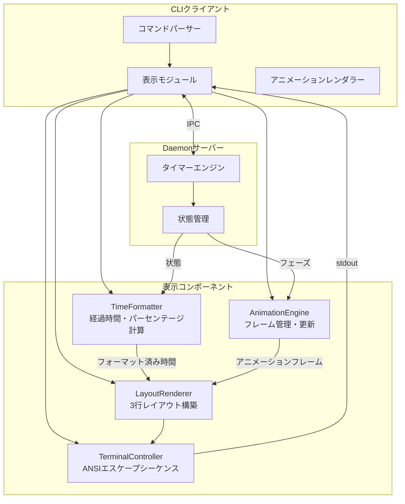
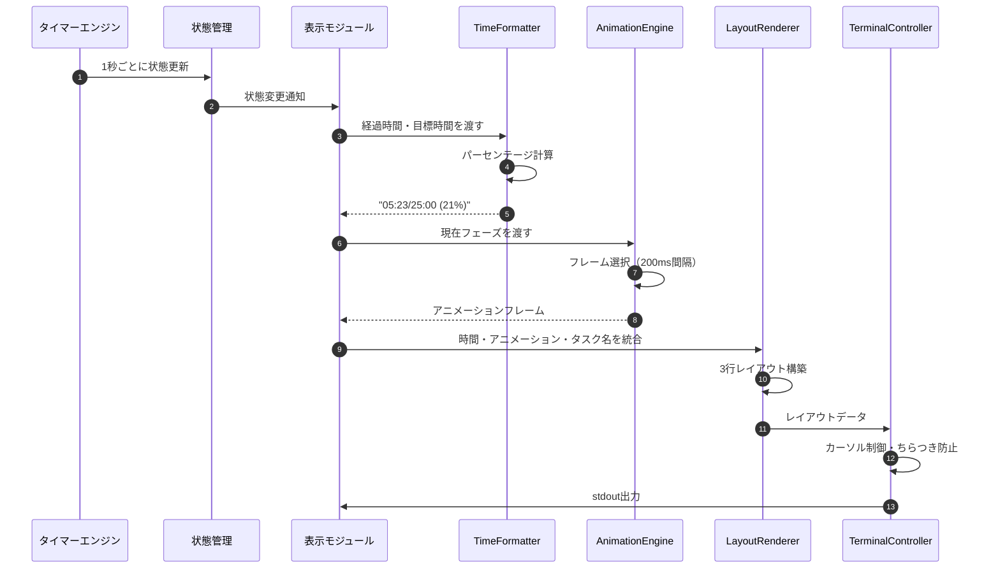
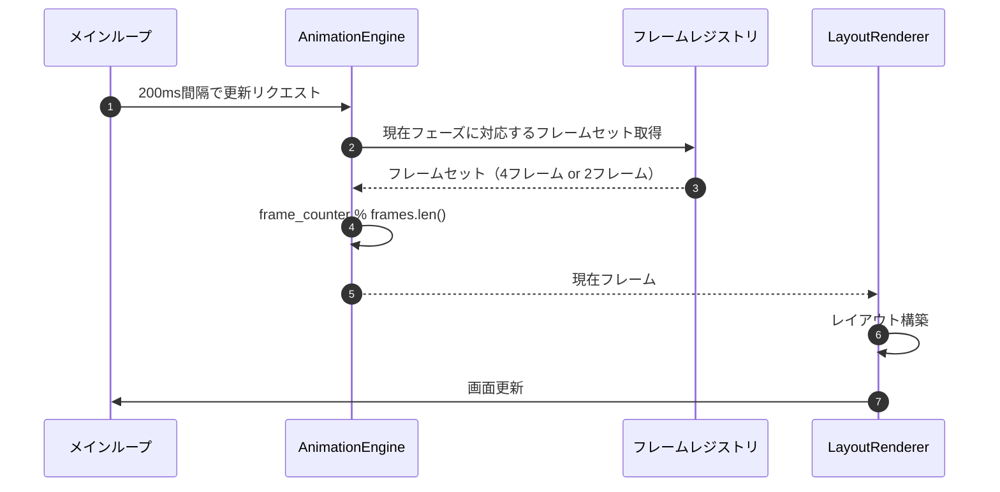
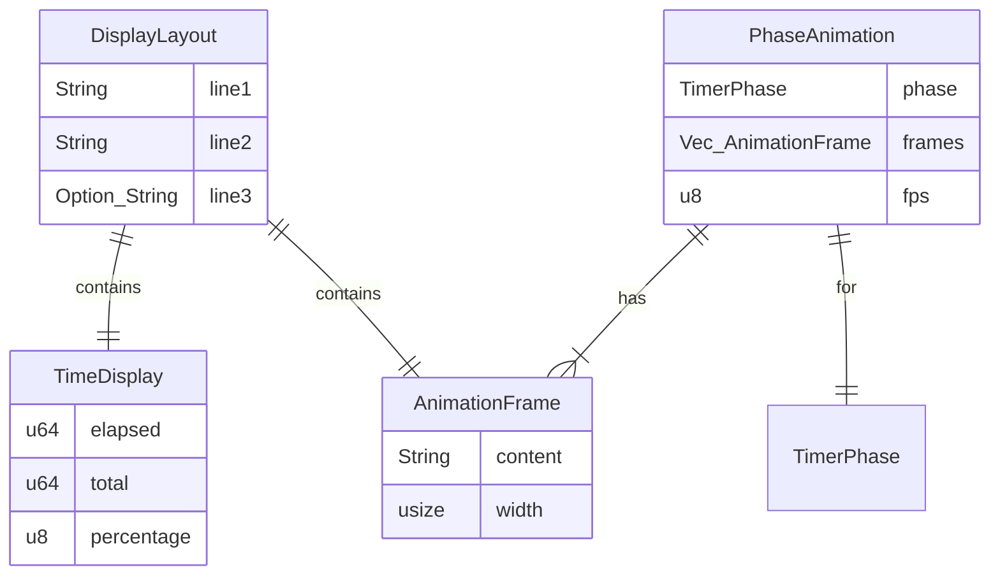

# 表示改善機能 基本設計書

## メタ情報

| 項目 | 内容 |
|------|------|
| ドキュメントID | BASIC-CLI-004 |
| 対応要件 | REQ-CLI-004 |
| 親設計書 | BASIC-CLI-001, BASIC-CLI-002 |
| バージョン | 1.0.0 |
| ステータス | ドラフト |
| 作成日 | 2026-01-10 |
| 最終更新日 | 2026-01-10 |
| 作成者 | - |
| レビュアー | - |
| 関連設計書 | [詳細設計書インデックス](../detailed/visual-enhancement/README.md) |

---

## 1. 概要

### 1.1 目的

本設計書は、macOS専用ポモドーロタイマーCLI（BASIC-CLI-001, BASIC-CLI-002）の表示機能を改善し、ユーザー体験を向上させるための基本設計を定義する。具体的には、時間表示フォーマットの改善、フェーズ別ASCIIアニメーション、統合レイアウトを実現する。

### 1.2 背景

既存のポモドーロタイマーCLI（REQ-CLI-001, REQ-CLI-002）では、残り時間の表示は基本的なプログレスバーと`MM:SS / MM:SS`形式で提供されている。ユーザーからのフィードバックにより、以下の改善要望が寄せられた：

1. **時間表示フォーマットの改善**: 経過時間/目標時間（パーセンテージ%）形式で、進捗をより直感的に把握したい
2. **視覚的なフェーズ表現**: 作業中/休憩中/長期休憩中の状態を、アニメーションで動的に表現したい
3. **統合レイアウト**: すべての情報を整理された1つのビューで確認したい

これらの要望に対応するため、REQ-CLI-004で定義された表示改善機能を実装する。

### 1.3 スコープ

#### スコープ内（Phase 1）
- 時間表示フォーマットの改善（`mm:ss/mm:ss (pp%)`形式）（F-035）
- フェーズ別ASCIIアニメーション（作業中/休憩中/長期休憩中）（F-036）
- 統合レイアウト（インジケーター＋時間＋アニメーション＋タスク名の3行表示）（F-037）
- ちらつき防止処理（ANSIエスケープシーケンス）

#### スコープ外（Phase 2以降）
- アニメーションのカスタマイズ（ユーザー定義アニメーション）
- アニメーション速度の調整オプション
- カラースキームのカスタマイズ
- アニメーション無効化オプション

### 1.4 用語定義

| 用語 | 定義 |
|------|------|
| ASCIIアート | 文字や記号を使って絵を描く表現手法 |
| アニメーションフレーム | アニメーションを構成する1コマ |
| FPS | Frames Per Second（1秒あたりのフレーム数） |
| インプレース更新 | 同じ位置を上書きして表示を更新する方式 |
| ANSIエスケープシーケンス | ターミナルの色やカーソル位置を制御する特殊文字列 |
| 全角文字 | 表示幅が2文字分の文字（日本語、絵文字等） |
| 半角文字 | 表示幅が1文字分の文字（ASCII文字等） |

---

## 2. システムアーキテクチャ

### 2.1 全体構成（差分）

BASIC-CLI-001, BASIC-CLI-002のアーキテクチャをベースに、以下の拡張を行う。



### 2.2 コンポーネント拡張

| コンポーネント | 既存/新規 | 拡張内容 | 技術スタック |
|---------------|----------|---------|--------------|
| **表示モジュール** | 既存(拡張) | 時間フォーマット、アニメーション統合 | indicatif, colored |
| **TimeFormatter** | 新規 | 経過時間・目標時間・パーセンテージ計算 | 標準ライブラリ |
| **AnimationEngine** | 新規 | フレーム管理、FPS制御（5 FPS） | tokio::time::interval |
| **LayoutRenderer** | 新規 | 3行レイアウト構築、ちらつき防止 | ANSIエスケープシーケンス |
| **TerminalController** | 新規 | カーソル制御、画面クリア | ANSIエスケープシーケンス |

### 2.3 データフロー

#### 2.3.1 表示更新フロー



#### 2.3.2 アニメーションフレーム更新フロー



### 2.4 技術スタック

BASIC-CLI-001, BASIC-CLI-002のスタックに加え、以下を明記・拡張する。

| カテゴリ | 技術 | バージョン | 選定理由 | 用途 |
|---------|------|-----------|---------|------|
| **プログレスバー** | indicatif | 0.18+ | MSRV 1.71対応、`set_elapsed`対応 | インジケーター表示 |
| **カラー出力** | colored | 3.0+ | シンプル、ANSI対応 | フェーズ別色分け |
| **非同期タイマー** | tokio::time | 1.48+ | アニメーション更新（200ms間隔） | FPS制御 |
| **文字幅計算** | unicode-width | 0.2+ | 絵文字・全角文字の正確な幅計算 | レイアウト調整 |
| **ANSI制御** | 標準ライブラリ | - | 軽量、外部依存なし | カーソル制御 |

### 2.5 外部システム連携

既存の連携（BASIC-CLI-001参照）に加え、以下を明記。

| システム名 | 連携内容 | 方式 | 頻度 |
|-----------|---------|------|------|
| ターミナルエミュレータ | ANSIエスケープシーケンス出力 | stdout | 1秒ごと（状態更新）、200msごと（アニメーション） |

---

## 3. 機能一覧

### 3.1 機能概要

| 機能ID | 機能名 | 概要 | 優先度 | 親機能 | 対応コンポーネント |
|--------|--------|------|--------|--------|--------------------|
| F-035 | 時間表示フォーマット改善 | 経過時間/目標時間（パーセンテージ%）形式で表示 | 必須 | F-024 | TimeFormatter |
| F-036 | フェーズ別アニメーション | 作業中/休憩中/長期休憩中でASCIIアニメーションを表示 | 必須 | F-024 | AnimationEngine |
| F-037 | 統合レイアウト | インジケーター、時間、アニメーション、タスク名を統合表示 | 必須 | F-024 | LayoutRenderer |

### 3.2 機能詳細

#### 3.2.1 F-035: 時間表示フォーマット改善

**実現方式**:
- 経過秒数と目標秒数を受け取り、`MM:SS/MM:SS (PP%)`形式にフォーマット
- パーセンテージは `(elapsed / total) * 100` で計算、0-100に制限
- `format!("{:02}:{:02}/{:02}:{:02} ({}%)", ...)` で整形

**主要フロー**:
```rust
pub fn format_time_display(elapsed_secs: u64, total_secs: u64) -> String {
    let elapsed_mm = elapsed_secs / 60;
    let elapsed_ss = elapsed_secs % 60;
    let total_mm = total_secs / 60;
    let total_ss = total_secs % 60;
    let percent = if total_secs > 0 {
        ((elapsed_secs * 100) / total_secs).min(100)
    } else {
        0
    };
    
    format!("{:02}:{:02}/{:02}:{:02} ({}%)", 
            elapsed_mm, elapsed_ss, total_mm, total_ss, percent)
}
```

**ビジネスルール**:
- BR-090: 時間表示は常に`MM:SS/MM:SS (PP%)`形式とする
- BR-091: パーセンテージは0-100の整数値で表示（小数点なし）
- BR-092: 経過時間が目標時間を超えた場合は100%と表示
- BR-093: 分は2桁でゼロパディング、秒も2桁でゼロパディング

#### 3.2.2 F-036: フェーズ別アニメーション

**実現方式**:
- アニメーションフレームを定数配列として定義（各フェーズごと）
- `tokio::time::interval(Duration::from_millis(200))` で5 FPS更新
- `frame_counter % frames.len()` でループ再生

**アニメーション定義**:

##### 作業中アニメーション（4フレーム）
```rust
const WORK_FRAMES: [&str; 4] = [
    "🏃💨 ─────────────────────────────",
    " 🏃💨 ────────────────────────────",
    "  🏃💨 ───────────────────────────",
    "   🏃💨 ──────────────────────────",
];
```

##### 休憩中アニメーション（4フレーム）
```rust
const BREAK_FRAMES: [&str; 4] = [
    "🧘 ～～～ ゆっくり休憩中 ～～～",
    "🧘  ～～～ ゆっくり休憩中 ～～～",
    "🧘 ～～～  ゆっくり休憩中 ～～～",
    "🧘  ～～～ ゆっくり休憩中  ～～～",
];
```

##### 長期休憩中アニメーション（2フレーム）
```rust
const LONG_BREAK_FRAMES: [&str; 2] = [
    "😴💤 zzz... ───────────────────",
    "😴💤  zzz... ──────────────────",
];
```

**ビジネスルール**:
- BR-094: アニメーションは200ms間隔で更新（5 FPS）
- BR-095: 作業中アニメーションは4フレームでループ
- BR-096: 休憩中アニメーションは4フレームでループ
- BR-097: 長期休憩中アニメーションは2フレームでループ
- BR-098: アニメーションの横幅は30-40文字を使用
- BR-099: アニメーションはターミナル幅に収まるように調整（最小幅80文字想定）

**制約事項**:
- ターミナル幅が80文字未満の場合はアニメーションを簡略化
- 絵文字非対応ターミナルでは代替ASCII文字を使用

#### 3.2.3 F-037: 統合レイアウト

**実現方式**:
- 3行構成のレイアウトを構築
- ANSIエスケープシーケンスでちらつき防止
- `indicatif`のProgressBarと統合（または独自実装）

**レイアウト構造**:
```
1行目: [フェーズアイコン] ステータス [インジケーター] [時間表示]
2行目: [アニメーションフレーム]
3行目: タスク: [タスク名]（設定されている場合のみ）
```

**表示例**:
```
🍅 作業中 ████████░░░░░░░░░░░░ 05:23/25:00 (21%)
🏃💨 ─────────────────────────────
タスク: 書類作成
```

**ちらつき防止処理**:
```
更新手順:
1. カーソル位置を保存 (\x1b[s)
2. カーソルを非表示に (\x1b[?25l)
3. カーソルを3行上に移動 (\x1b[3A)
4. 1行目をクリア＋描画 (\x1b[2K + 内容)
5. 2行目をクリア＋描画 (\x1b[2K + 内容)
6. 3行目をクリア＋描画（タスク名がある場合）
7. カーソル位置を復元 (\x1b[u)
8. カーソルを表示 (\x1b[?25h)
```

**ビジネスルール**:
- BR-100: 1行目は常に表示（フェーズ＋インジケーター＋時間）
- BR-101: 2行目はアニメーション専用行
- BR-102: 3行目はタスク名がある場合のみ表示
- BR-103: 各行の更新は独立して行い、ちらつきを防止
- BR-104: カーソル位置を保存・復元してスムーズな更新を実現

**制約事項**:
- 最小ターミナル幅: 80文字
- 最小ターミナル高さ: 5行
- ANSIエスケープシーケンス対応必須

---

## 4. 画面一覧

| 画面ID | 画面名 | 概要 | 対応機能 | 実装方式 |
|--------|--------|------|---------|---------|
| SCR-004 | 拡張ターミナルUI（統合レイアウト） | 時間・アニメーション・タスク名を3行で表示 | F-035, F-036, F-037 | indicatif + colored + ANSIエスケープシーケンス |

### 4.1 SCR-004: 拡張ターミナルUI（統合レイアウト）

**表示例（作業中）**:
```
🍅 作業中 ████████░░░░░░░░░░░░ 05:23/25:00 (21%)
🏃💨 ─────────────────────────────
タスク: 書類作成
```

**表示例（休憩中）**:
```
☕ 休憩中 ██████░░░░░░░░░░░░░░ 02:30/05:00 (50%)
🧘 ～～～ ゆっくり休憩中 ～～～
```

**表示例（長期休憩中）**:
```
🛏️ 長期休憩中 ████████░░░░░░░░░░░░ 07:30/15:00 (50%)
😴💤 zzz... ───────────────────
```

**表示例（一時停止中）**:
```
⏸️ 一時停止 ████████░░░░░░░░░░░░ 05:23/25:00 (21%)
   （一時停止中）
タスク: 書類作成
```

**実装方式**:
- `LayoutRenderer`で3行のレイアウトを構築
- `TerminalController`でANSIエスケープシーケンスを出力
- 1秒ごとに時間・インジケーター更新
- 200msごとにアニメーションフレーム更新

**色分け**（BASIC-CLI-002との整合性）:
- 作業中: 赤色（`colored::Colorize::red()`）
- 休憩中: 緑色（`colored::Colorize::green()`）
- 長期休憩中: 青色（`colored::Colorize::blue()`）
- 一時停止: 黄色（`colored::Colorize::yellow()`）

---

## 5. データモデル概要

### 5.1 主要エンティティ

| エンティティ | 説明 | 属性 |
|-------------|------|------|
| AnimationFrame | アニメーションの1フレーム | content: String, width: usize |
| DisplayLayout | 3行レイアウトの構造 | line1: String, line2: String, line3: Option&lt;String&gt; |
| TimeDisplay | 時間表示情報 | elapsed: u64, total: u64, percentage: u8 |
| PhaseAnimation | フェーズ別アニメーション設定 | phase: TimerPhase, frames: Vec&lt;AnimationFrame&gt;, fps: u8 |

### 5.2 データモデル詳細

#### 5.2.1 AnimationFrame

```rust
pub struct AnimationFrame {
    /// フレームの内容（ASCIIアート文字列）
    pub content: String,
    /// 表示幅（全角文字考慮後）
    pub width: usize,
}

impl AnimationFrame {
    pub fn new(content: &str) -> Self {
        let width = unicode_width::UnicodeWidthStr::width(content);
        Self {
            content: content.to_string(),
            width,
        }
    }
}
```

#### 5.2.2 DisplayLayout

```rust
pub struct DisplayLayout {
    /// 1行目: フェーズ＋インジケーター＋時間
    pub line1: String,
    /// 2行目: アニメーション
    pub line2: String,
    /// 3行目: タスク名（オプション）
    pub line3: Option<String>,
}
```

#### 5.2.3 TimeDisplay

```rust
pub struct TimeDisplay {
    /// 経過時間（秒）
    pub elapsed: u64,
    /// 目標時間（秒）
    pub total: u64,
    /// パーセンテージ（0-100）
    pub percentage: u8,
}

impl TimeDisplay {
    pub fn new(elapsed: u64, total: u64) -> Self {
        let percentage = if total > 0 {
            ((elapsed * 100) / total).min(100) as u8
        } else {
            0
        };
        Self { elapsed, total, percentage }
    }

    pub fn format(&self) -> String {
        let elapsed_mm = self.elapsed / 60;
        let elapsed_ss = self.elapsed % 60;
        let total_mm = self.total / 60;
        let total_ss = self.total % 60;
        format!("{:02}:{:02}/{:02}:{:02} ({}%)", 
                elapsed_mm, elapsed_ss, total_mm, total_ss, self.percentage)
    }
}
```

#### 5.2.4 PhaseAnimation

```rust
pub struct PhaseAnimation {
    /// フェーズ（Working/Breaking/LongBreaking）
    pub phase: TimerPhase,
    /// アニメーションフレーム（4フレーム or 2フレーム）
    pub frames: Vec<AnimationFrame>,
    /// 更新頻度（FPS）
    pub fps: u8,
}

impl PhaseAnimation {
    pub fn work_animation() -> Self {
        Self {
            phase: TimerPhase::Working,
            frames: vec![
                AnimationFrame::new("🏃💨 ─────────────────────────────"),
                AnimationFrame::new(" 🏃💨 ────────────────────────────"),
                AnimationFrame::new("  🏃💨 ───────────────────────────"),
                AnimationFrame::new("   🏃💨 ──────────────────────────"),
            ],
            fps: 5,
        }
    }

    pub fn break_animation() -> Self {
        Self {
            phase: TimerPhase::Breaking,
            frames: vec![
                AnimationFrame::new("🧘 ～～～ ゆっくり休憩中 ～～～"),
                AnimationFrame::new("🧘  ～～～ ゆっくり休憩中 ～～～"),
                AnimationFrame::new("🧘 ～～～  ゆっくり休憩中 ～～～"),
                AnimationFrame::new("🧘  ～～～ ゆっくり休憩中  ～～～"),
            ],
            fps: 5,
        }
    }

    pub fn long_break_animation() -> Self {
        Self {
            phase: TimerPhase::LongBreaking,
            frames: vec![
                AnimationFrame::new("😴💤 zzz... ───────────────────"),
                AnimationFrame::new("😴💤  zzz... ──────────────────"),
            ],
            fps: 5,
        }
    }
}
```

### 5.3 ER図（概要）



---

## 6. 既存設計への影響

### 6.1 BASIC-CLI-001への影響

| 影響箇所 | 影響内容 | 対応方針 |
|---------|---------|---------|
| SCR-001（ターミナルUI） | SCR-004で置き換え・拡張 | 既存のindicatifベースの表示を保持しつつ、新規レイアウトを追加 |
| TimerState | 表示用のデータ提供 | 影響なし（既存APIで対応可能） |

### 6.2 BASIC-CLI-002への影響

| 影響箇所 | 影響内容 | 対応方針 |
|---------|---------|---------|
| F-024（インジケーター表示） | F-035〜F-037で拡張 | `indicatif`の既存実装を活用し、カスタムテンプレートで対応 |
| F-027（色分け表示） | F-037で統合 | `colored`による色分けを継続使用 |
| 表示モジュール | 新規コンポーネント追加 | `TimeFormatter`, `AnimationEngine`, `LayoutRenderer`を追加 |

### 6.3 移行計画

1. **Phase 0**: 設計レビュー完了
2. **Phase 1**: `TimeFormatter`実装（F-035）
3. **Phase 2**: `AnimationEngine`実装（F-036）
4. **Phase 3**: `LayoutRenderer`実装（F-037）
5. **Phase 4**: 統合テスト・ちらつき防止調整
6. **Phase 5**: デプロイ

---

## 7. 非機能要件への対応

### 7.1 性能要件

| 要件ID | 要件 | 目標値 | 対応方針 |
|--------|------|--------|---------|
| NFR-P-020 | アニメーション更新頻度 | 5 FPS（200ms間隔） | `tokio::time::interval(Duration::from_millis(200))`使用 |
| NFR-P-021 | アニメーション時CPU追加負荷 | 1%以下 | 軽量な文字列操作のみ、重い処理なし |
| NFR-P-022 | 画面更新遅延 | 50ms以内 | ANSIエスケープシーケンスの最適化、バッファリング |
| NFR-P-023 | メモリ追加使用量 | 1MB以下 | 静的文字列配列使用、動的メモリ確保を最小限に |

**実装方針**:
- アニメーションフレームは定数配列（`const`）として定義
- `tokio::time::interval`の`MissedTickBehavior::Skip`でドリフト防止
- ANSIエスケープシーケンスのバッチ出力でシステムコール削減

### 7.2 ユーザビリティ要件

| 要件ID | 要件 | 詳細 | 対応方針 |
|--------|------|------|---------|
| NFR-U-020 | ちらつき防止 | ダブルバッファリングまたはカーソル制御 | ANSIエスケープシーケンスによるカーソル制御実装 |
| NFR-U-021 | 文字幅計算 | 全角文字（絵文字含む）と半角文字の正確な計算 | `unicode-width`クレート使用 |
| NFR-U-022 | フォールバック表示 | 絵文字非対応ターミナルで代替ASCII文字 | 絵文字検出ロジック＋ASCII代替マッピング |
| NFR-U-023 | ターミナル幅対応 | 80文字未満で簡略表示 | ターミナル幅取得＋レスポンシブレイアウト |

**実装方針**:
- **ちらつき防止**: カーソル保存・復元、カーソル非表示、行クリア＋描画の組み合わせ
- **文字幅計算**: `unicode_width::UnicodeWidthStr::width()`で正確な幅を計算
- **フォールバック**: 環境変数`TERM`や絵文字表示テストで判定
- **レスポンシブ**: `terminal_size`クレートでターミナル幅取得、80文字未満でアニメーション簡略化

### 7.3 保守性要件

| 要件ID | 要件 | 詳細 | 対応方針 |
|--------|------|------|---------|
| NFR-M-005 | アニメーションのテスタビリティ | フレームのユニットテスト | フレーム生成ロジックを純粋関数として分離 |
| NFR-M-006 | レイアウトのテスタビリティ | レイアウト構築のユニットテスト | `DisplayLayout`の構築ロジックをテスト |

**実装方針**:
- `AnimationEngine::get_frame(phase, counter)`を純粋関数として実装
- `LayoutRenderer::build_layout(state, animation, task)`を純粋関数として実装
- 各コンポーネントのユニットテスト（カバレッジ80%以上）

---

## 8. 技術調査レポートからの知見反映

### 8.1 indicatif 0.18+ (TECH-FE-001)

**適用事項**:
- [x] MSRV 1.71対応確認済み
- [x] `set_elapsed`メソッドで経過時間の手動制御が可能
- [x] カスタムテンプレートで時間表示フォーマット変更可能

**実装方針**:
- `ProgressBar::with_template()`でカスタムテンプレート設定
- `set_position()`と`set_length()`で進捗管理
- `set_message()`でタスク名表示

**検討事項**:
- indicatifのProgressBarをそのまま使うか、独自の3行レイアウトで置き換えるか
  - **方針**: indicatifの機能を活用しつつ、カスタムテンプレートで対応。複雑な場合は独自実装

### 8.2 colored 3.0+ (TECH-FE-002)

**適用事項**:
- [x] フェーズ別の色分け実装
- [x] `Colorize` traitでメソッドチェーン可能

**実装方針**:
```rust
use colored::Colorize;

match phase {
    TimerPhase::Working => format!("🍅 作業中").red(),
    TimerPhase::Breaking => format!("☕ 休憩中").green(),
    TimerPhase::LongBreaking => format!("🛏️ 長期休憩中").blue(),
    TimerPhase::Paused => format!("⏸️ 一時停止").yellow(),
}
```

### 8.3 ANSIエスケープシーケンス

**使用するシーケンス**:

| シーケンス | 説明 | 用途 |
|-----------|------|------|
| `\x1b[s` | カーソル位置保存 | ちらつき防止 |
| `\x1b[u` | カーソル位置復元 | ちらつき防止 |
| `\x1b[?25l` | カーソル非表示 | ちらつき防止 |
| `\x1b[?25h` | カーソル表示 | ちらつき防止 |
| `\x1b[<n>A` | カーソルをn行上に移動 | 複数行更新 |
| `\x1b[2K` | 現在行をクリア | 古い表示の消去 |
| `\x1b[<n>G` | カーソルをn列目に移動 | 列位置調整 |

**実装例**:
```rust
fn render_layout(layout: &DisplayLayout) {
    print!("\x1b[s");        // カーソル位置保存
    print!("\x1b[?25l");     // カーソル非表示
    print!("\x1b[3A");       // 3行上に移動
    print!("\x1b[2K{}\n", layout.line1); // 1行目クリア＋描画
    print!("\x1b[2K{}\n", layout.line2); // 2行目クリア＋描画
    if let Some(line3) = &layout.line3 {
        print!("\x1b[2K{}\n", line3);    // 3行目クリア＋描画
    }
    print!("\x1b[u");        // カーソル位置復元
    print!("\x1b[?25h");     // カーソル表示
}
```

---

## 9. 未解決課題

### 9.1 要件定義書から継承

| ID | 課題 | 対応方針 | 期限 | ステータス |
|----|------|---------|------|-----------|
| I-020 | 絵文字幅計算の検証（iTerm2, Terminal.app） | `unicode-width`での検証、必要に応じてターミナル別調整 | 2026-01-15 | 未着手 |
| I-021 | アニメーションFPS最適値の検証 | 5 FPSで実装後、ユーザーテストでフィードバック取得 | 2026-01-15 | 未着手 |
| I-022 | indicatifとの統合方式の検討 | カスタムテンプレートで対応可能か検証 | 2026-01-12 | 未着手 |

### 9.2 基本設計で新たに発生した課題

| ID | 課題 | 対応方針 | 期限 | ステータス |
|----|------|---------|------|-----------|
| I-023 | ターミナル幅の動的取得方法 | `terminal_size`クレート使用、リサイズイベント対応は Phase 2 | 2026-01-12 | 未着手 |
| I-024 | 絵文字非対応ターミナルの検出方法 | 環境変数`TERM`チェック、または絵文字表示テストで判定 | 2026-01-13 | 未着手 |
| I-025 | アニメーション更新とタイマー更新の同期方法 | 別々の`tokio::interval`を使用、状態共有は`Arc<Mutex<T>>`で対応 | 2026-01-14 | 未着手 |
| I-026 | ちらつき防止の実機検証 | iTerm2, Terminal.app, Alacrittyで動作確認 | 2026-01-15 | 未着手 |
| I-027 | indicatifとの競合解消 | indicatifのProgressBarを使わず、独自実装に切り替えるか検討 | 2026-01-12 | 未着手 |

---

## 10. 詳細設計への引き継ぎ事項

> **詳細設計書フォルダ**: [docs/designs/detailed/visual-enhancement/](../detailed/visual-enhancement/README.md)

### 10.1 詳細設計書の作成が必要な項目

以下の項目について、詳細設計書を作成する必要がある：

| # | 詳細設計書名 | 対象機能 | 優先度 | 備考 |
|---|-------------|---------|--------|------|
| 1 | TimeFormatter詳細設計 | F-035 | 高 | 時間フォーマット、パーセンテージ計算 |
| 2 | AnimationEngine詳細設計 | F-036 | 高 | フレーム管理、FPS制御、フレーム定義 |
| 3 | LayoutRenderer詳細設計 | F-037 | 高 | 3行レイアウト構築、ちらつき防止 |
| 4 | TerminalController詳細設計 | F-037 | 高 | ANSIエスケープシーケンス、カーソル制御 |
| 5 | 統合テスト仕様書 | F-035, F-036, F-037 | 高 | エンドツーエンドテスト、視覚的確認 |

### 10.2 実装時の注意事項

1. **MSRV統一**: Rust 1.71に統一（`Cargo.toml`の`rust-version = "1.71"`）
2. **エラーハンドリング**: ANSIエスケープシーケンス出力失敗時のフォールバック実装
3. **テスト**: ユニットテスト、統合テスト、視覚的確認テスト（手動）
4. **ドキュメント**: 各コンポーネントにdoc commentを記述
5. **パフォーマンス**: アニメーション更新のCPU負荷を継続的に監視

### 10.3 技術的検証が必要な項目

| 項目 | 検証内容 | 期限 |
|------|---------|------|
| indicatifとの統合 | カスタムテンプレートで3行レイアウトが実現可能か | 2026-01-12 |
| unicode-width | 絵文字（🏃💨等）の幅が正確に計算できるか | 2026-01-11 |
| ANSIエスケープシーケンス | iTerm2, Terminal.app, Alacrittyでちらつきなく動作するか | 2026-01-15 |
| tokio::time::interval | 200ms間隔のアニメーション更新でドリフトが発生しないか | 2026-01-13 |
| ターミナル幅取得 | `terminal_size`クレートでリアルタイム取得が可能か | 2026-01-12 |

### 10.4 詳細設計で明確化すべき仕様

1. **indicatifとの統合方式**: カスタムテンプレートで対応するか、独自実装に切り替えるか
2. **絵文字フォールバック**: ASCII代替文字のマッピングテーブル
3. **ターミナル幅対応**: 80文字未満時の簡略表示の具体的なレイアウト
4. **アニメーション更新タイミング**: タイマー更新（1秒）とアニメーション更新（200ms）の同期方法
5. **エラーハンドリング**: ANSIエスケープシーケンス出力失敗時の挙動

---

## 11. 制約事項・前提条件

### 11.1 技術的制約

| 制約 | 詳細 | 理由 |
|------|------|------|
| ターミナル | ANSIエスケープシーケンス対応必須 | カーソル制御・色分けのため |
| 最小ターミナル幅 | 80文字以上 | アニメーション表示のため |
| 最小ターミナル高さ | 5行以上 | 3行レイアウト＋バッファのため |
| 絵文字サポート | Unicode対応ターミナル推奨 | フェーズアイコン・アニメーション表示のため |
| 依存クレート | indicatif 0.18+, colored 3.0+, unicode-width 0.2+ | 既存依存関係との整合性、MSRV統一 |

### 11.2 ビジネス制約

BASIC-CLI-001 セクション11.2を参照。追加の制約なし。

### 11.3 前提条件

- BASIC-CLI-001, BASIC-CLI-002の基本機能（F-024）が実装済み
- ターミナルがANSIエスケープシーケンスに対応している
- ターミナルがUnicode（絵文字）表示に対応している（推奨）
- ターミナル幅が80文字以上、高さが5行以上

---

## 12. リスクと対策

### 12.1 リスク一覧

| ID | リスク | 影響度 | 発生確率 | 対策 | ステータス |
|----|--------|--------|---------|------|-----------|-
| R-010 | ターミナル互換性問題 | 中 | 中 | Terminal.app, iTerm2, Alacrittyでの動作確認優先 | 未対応 |
| R-011 | 絵文字表示の文字幅計算誤り | 中 | 中 | `unicode-width`クレート使用、実機検証 | 未対応 |
| R-012 | アニメーションによるCPU負荷増加 | 低 | 低 | FPSを5に制限、軽量な文字列操作のみ実装 | 対策中 |
| R-013 | 画面のちらつき | 高 | 中 | ANSIエスケープシーケンスのカーソル制御実装 | 対策中 |
| R-014 | indicatifとの競合 | 中 | 中 | カスタムテンプレートで対応、必要なら独自実装に切り替え | 未対応 |
| R-015 | ターミナルリサイズ時の表示崩れ | 中 | 低 | Phase 1では静的幅対応、Phase 2でリサイズイベント対応 | 未対応 |

---

## 13. 変更履歴

| 日付 | バージョン | 変更内容 | 担当者 |
|:---|:---|:---|:---|
| 2026-01-10 | 1.0.0 | 初版作成（要件定義書REQ-CLI-004 v1.0.0を基に作成、BASIC-CLI-001/002と整合性を確保） | - |

---

## 付録A: 実装ガイドライン

### A.1 アニメーション更新ループ

```rust
// 擬似コード
const ANIMATION_INTERVAL_MS: u64 = 200; // 5 FPS

async fn animation_loop(state: Arc<Mutex<TimerState>>) {
    let mut frame_counter: usize = 0;
    let mut interval = tokio::time::interval(Duration::from_millis(ANIMATION_INTERVAL_MS));
    interval.set_missed_tick_behavior(tokio::time::MissedTickBehavior::Skip);
    
    loop {
        interval.tick().await;
        
        let state = state.lock().await;
        let phase = state.phase;
        drop(state); // ロック解放
        
        let frames = get_animation_frames(phase);
        let current_frame = &frames[frame_counter % frames.len()];
        
        render_animation_line(current_frame);
        frame_counter = frame_counter.wrapping_add(1);
    }
}
```

### A.2 時間フォーマット関数

```rust
// 擬似コード
fn format_time_display(elapsed_secs: u64, total_secs: u64) -> String {
    let elapsed_mm = elapsed_secs / 60;
    let elapsed_ss = elapsed_secs % 60;
    let total_mm = total_secs / 60;
    let total_ss = total_secs % 60;
    let percent = if total_secs > 0 {
        ((elapsed_secs * 100) / total_secs).min(100)
    } else {
        0
    };
    
    format!("{:02}:{:02}/{:02}:{:02} ({}%)", 
            elapsed_mm, elapsed_ss, total_mm, total_ss, percent)
}
```

### A.3 ちらつき防止レンダリング

```rust
// 擬似コード
fn render_layout(layout: &DisplayLayout) -> std::io::Result<()> {
    use std::io::Write;
    
    let mut stdout = std::io::stdout();
    
    // カーソル制御開始
    write!(stdout, "\x1b[s")?;       // カーソル位置保存
    write!(stdout, "\x1b[?25l")?;    // カーソル非表示
    
    // 3行上に移動（既存表示を上書き）
    write!(stdout, "\x1b[3A")?;
    
    // 1行目: クリア＋描画
    write!(stdout, "\x1b[2K{}\n", layout.line1)?;
    
    // 2行目: クリア＋描画
    write!(stdout, "\x1b[2K{}\n", layout.line2)?;
    
    // 3行目: タスク名（オプション）
    if let Some(line3) = &layout.line3 {
        write!(stdout, "\x1b[2K{}\n", line3)?;
    } else {
        write!(stdout, "\x1b[2K\n")?;
    }
    
    // カーソル制御終了
    write!(stdout, "\x1b[u")?;       // カーソル位置復元
    write!(stdout, "\x1b[?25h")?;    // カーソル表示
    
    stdout.flush()?;
    Ok(())
}
```

---

## 付録B: 表示サンプル（全フェーズ）

### B.1 作業中の表示

```
🍅 作業中 ████████░░░░░░░░░░░░ 05:23/25:00 (21%)
🏃💨 ─────────────────────────────
タスク: 書類作成
```

### B.2 休憩中の表示

```
☕ 休憩中 ██████░░░░░░░░░░░░░░ 02:30/05:00 (50%)
🧘 ～～～ ゆっくり休憩中 ～～～
```

### B.3 長期休憩中の表示

```
🛏️ 長期休憩中 ████████░░░░░░░░░░░░ 07:30/15:00 (50%)
😴💤 zzz... ───────────────────
```

### B.4 一時停止中の表示

```
⏸️ 一時停止 ████████░░░░░░░░░░░░ 05:23/25:00 (21%)
   （一時停止中）
タスク: 書類作成
```

### B.5 アニメーションフレーム遷移（作業中）

```
フレーム1:
🍅 作業中 ████████░░░░░░░░░░░░ 05:23/25:00 (21%)
🏃💨 ─────────────────────────────
タスク: 書類作成

↓ 200ms後

フレーム2:
🍅 作業中 ████████░░░░░░░░░░░░ 05:23/25:00 (21%)
 🏃💨 ────────────────────────────
タスク: 書類作成

↓ 200ms後

フレーム3:
🍅 作業中 ████████░░░░░░░░░░░░ 05:23/25:00 (21%)
  🏃💨 ───────────────────────────
タスク: 書類作成

↓ 200ms後

フレーム4:
🍅 作業中 ████████░░░░░░░░░░░░ 05:23/25:00 (21%)
   🏃💨 ──────────────────────────
タスク: 書類作成

↓ 200ms後（ループ）

フレーム1に戻る...
```

---

**基本設計書の作成完了**

このドキュメントは、詳細設計フェーズで更新される可能性があります。変更がある場合は、変更履歴セクションに記録してください。
