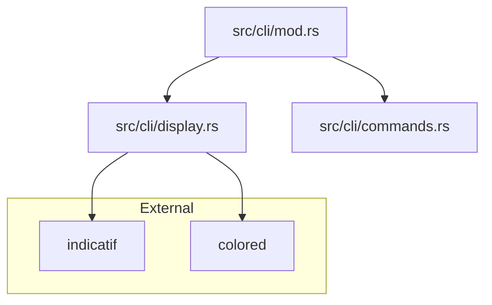

# インジケーター表示・色分け詳細設計

## メタ情報

| 項目 | 内容 |
|------|------|
| ドキュメントID | DETAIL-CLI-002-UI |
| 親設計書 | [BASIC-CLI-002_display-and-sound-enhancement.md](../../basic/BASIC-CLI-002_display-and-sound-enhancement.md) |
| 対応要件 | F-024 (インジケーター表示), F-027 (色分け表示) |
| バージョン | 1.0.0 |

---

## 1. 概要

本機能は、CLI上でのタイマー残り時間表示を強化し、視覚的なインジケーターとフェーズに応じた色分けを提供する。`indicatif` と `colored` クレートを使用し、既存のプログレスバー表示を拡張する。

### 1.1 変更の目的
- ユーザーが一目で残り時間と現在のフェーズ（作業中/休憩中）を識別できるようにする。
- ターミナルUIのデザイン性を向上させる。

---

## 2. アーキテクチャ

### 2.1 モジュール構成



### 2.2 既存実装への変更点

- **`src/cli/display.rs`**:
  - `progress_bar` のスタイル設定ロジックを更新。
  - フェーズに応じた `ProgressStyle` の動的切り替え機能を追加。
  - 色分けロジックの実装。

---

## 3. 実装詳細

### 3.1 表示仕様

#### 3.1.1 カラースキーム (F-027)

| フェーズ | 色 | `colored` 指定 | 意味 |
|---------|---|--------------|------|
| 作業中 (Working) | 赤/オレンジ | `red` / `truecolor(255, 69, 58)` | 集中 |
| 短い休憩 (Breaking) | 緑 | `green` | リラックス |
| 長い休憩 (LongBreaking) | 青 | `blue` | 深いリラックス |
| 一時停止 (Paused) | 黄 | `yellow` | 待機 |

#### 3.1.2 インジケーターテンプレート (F-024)

`indicatif` のテンプレート機能を拡張し、以下のフォーマットを採用する。

```text
{prefix} {bar:40.color_scheme} {pos}/{len} ({percent}%)
{msg}
```

- **Prefix**: フェーズ名とアイコン（例: `🍅 作業中`）
- **Bar**: 塗りつぶし文字 `█`, 未塗りつぶし文字 `░`
- **Msg**: タスク名

### 3.2 コード設計

#### 3.2.1 `src/cli/display.rs`

```rust
use indicatif::{ProgressBar, ProgressStyle};
use colored::*;
use crate::types::TimerPhase;

pub fn create_progress_style(phase: TimerPhase) -> ProgressStyle {
    let (color_code, icon, label) = match phase {
        TimerPhase::Working => ("red", "🍅", "作業中"),
        TimerPhase::Breaking => ("green", "☕", "休憩中"),
        TimerPhase::LongBreaking => ("blue", "💤", "長期休憩"),
        TimerPhase::Paused => ("yellow", "⏸", "一時停止"),
        _ => ("white", "⏹", "停止"),
    };

    let template = format!(
        "{{prefix:.bold}} [{{bar:40.{}}}] {{elapsed_precise}} ({{percent}}%)\n{{msg}}",
        color_code
    );

    ProgressStyle::with_template(&template)
        .unwrap()
        .progress_chars("█░")
        .with_key("prefix", move |_: &crate::types::TimerState| {
            format!("{} {}", icon, label).color(color_code).to_string()
        })
}
```

> **Note**: `indicatif` の色指定文字列はコンパイル時に確定する必要があるため、テンプレート文字列の生成時に色名を埋め込む方式とする。

---

## 4. エラーハンドリング

### 4.1 非対応ターミナル
- `colored` の `NO_COLOR` 環境変数サポートにより自動的に無効化される。
- `indicatif` はターミナル幅が極端に狭い場合、バーを非表示にする等の自動調整を行う。

---

## 5. テスト計画

### 5.1 単体テスト

- [ ] `create_progress_style` がフェーズごとに正しいテンプレート文字列を返すこと。
- [ ] 異なるフェーズで色が正しく設定されていること（テンプレート内の色指定文字列の検証）。

### 5.2 視覚確認
- [ ] 実際のターミナルで赤、緑、青、黄色の表示が機能すること。
- [ ] バーのアニメーションが滑らかであること。

---

## 6. 依存関係

- `indicatif = "0.18"`
- `colored = "3.0"`
