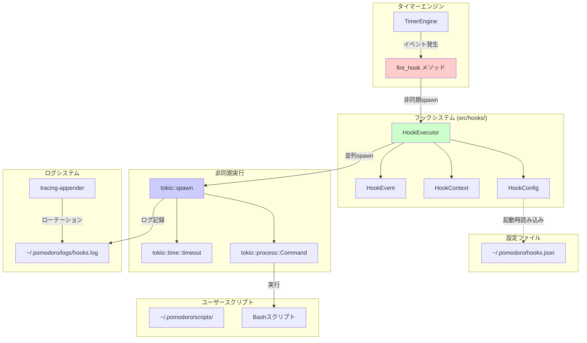
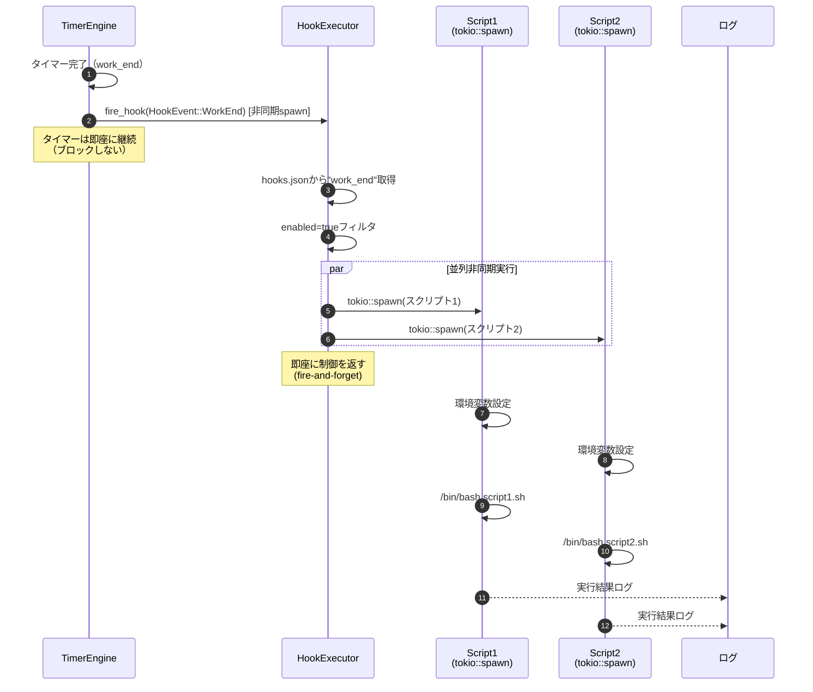

# イベントフック機能 詳細設計

## 概要

ポモドーロタイマーCLIにイベントフック機能を追加し、タイマーイベント（作業開始、作業終了、休憩開始等）に対してユーザー定義のBashスクリプトを非同期実行することで、外部システム連携やカスタム処理を実現する。

**重要**: すべてのフック実行は**非同期（fire-and-forget）**で行われ、タイマーをブロックしない。

## 関連ドキュメント

| ドキュメント | パス |
|-------------|------|
| 要件定義書 | [REQ-CLI-003](../../../requirements/REQ-CLI-003_event-hooks.md) |
| 基本設計書 | [BASIC-CLI-003](../../basic/BASIC-CLI-003_event-hooks.md) |
| 親基本設計書 | [BASIC-CLI-001](../../basic/BASIC-CLI-001_pomodoro-timer.md) |

## サブ機能一覧

| # | サブ機能名 | 含まれる機能ID | 概要 |
|---|-----------|---------------|------|
| 1 | [HookExecutor](./hook-executor/) | F-028, F-030, F-032, F-033, F-034 | フック実行エンジン（非同期実行、タイムアウト制御、エラーハンドリング） |
| 2 | [Config Manager](./config-manager/) | F-029 | フック設定の読み込み・検証・管理 |
| 3 | [Timer Extension](./timer-extension/) | F-028, F-031 | タイマーエンジンへのイベント発火機構追加 |

## 共通設計

| 設計書 | 説明 |
|--------|------|
| [セキュリティ設計書](./共通/セキュリティ設計書.md) | スクリプトパス検証、環境変数サニタイズ、ログファイル権限 |
| [テスト仕様書](./test-specification.md) | 全サブ機能のテスト項目 |

## アーキテクチャ概要



## 技術スタック

| カテゴリ | 技術 | バージョン | 用途 |
|---------|------|-----------|------|
| 非同期実行 | tokio::spawn | 1.48+ | フック並列実行 |
| プロセス実行 | tokio::process::Command | 1.48+ | Bashスクリプト起動 |
| タイムアウト制御 | tokio::time::timeout | 1.48+ | スクリプト実行時間制限 |
| 設定ファイル | serde_json | 1.0+ | hooks.json解析 |
| ログ | tracing | 0.1+ | 構造化ログ |
| ログローテーション | tracing-appender | 0.2+ | ログファイル管理 |

## モジュール構成

```
src/
├── hooks/                    # 新規追加
│   ├── mod.rs               # モジュールエクスポート
│   ├── executor.rs          # HookExecutor実装
│   ├── config.rs            # HookConfig、設定読み込み
│   └── context.rs           # HookContext、環境変数生成
├── daemon/
│   └── timer.rs             # 既存（fire_hookメソッド追加）
└── types/
    └── mod.rs               # 既存（HookEvent追加）
```

## データフロー（非同期実行）



## 環境変数一覧

| 環境変数名 | 説明 | 値の例 | 必須 |
|-----------|------|--------|------|
| `POMODORO_EVENT` | イベント種別 | `work_end`, `break_start` | ✓ |
| `POMODORO_TASK_NAME` | タスク名 | `API実装` | - |
| `POMODORO_PHASE` | 現在のフェーズ | `working`, `breaking` | ✓ |
| `POMODORO_DURATION_SECS` | フェーズ総時間（秒） | `1500` | ✓ |
| `POMODORO_ELAPSED_SECS` | 経過時間（秒） | `900` | ✓ |
| `POMODORO_REMAINING_SECS` | 残り時間（秒） | `600` | ✓ |
| `POMODORO_CYCLE` | 現在のサイクル番号 | `2` | ✓ |
| `POMODORO_TOTAL_CYCLES` | 総サイクル数 | `4` | ✓ |
| `POMODORO_TIMESTAMP` | ISO8601タイムスタンプ | `2026-01-06T10:30:00Z` | ✓ |
| `POMODORO_SESSION_ID` | セッションID（UUID） | `a1b2c3d4-...` | ✓ |
| `POMODORO_HOOK_NAME` | フック名 | `Slack通知` | ✓ |

## エラーコード一覧

| コード | HTTPステータス | 説明 | 対処法 |
|--------|---------------|------|--------|
| E030 | - | フック設定ファイルが見つかりません | `~/.pomodoro/hooks.json`を作成 |
| E031 | - | フック設定ファイルの解析に失敗しました | JSON構文を確認 |
| E032 | - | スクリプトファイルが見つかりません | スクリプトパスを確認 |
| E033 | - | スクリプトに実行権限がありません | `chmod +x`で実行権限を付与 |
| E034 | - | スクリプトの実行に失敗しました | スクリプトのログを確認 |
| E035 | - | スクリプトがタイムアウトしました | タイムアウト時間を延長 |

## 変更履歴

| 日付 | バージョン | 変更内容 | 担当者 |
|:---|:---|:---|:---|
| 2026-01-06 | 1.0.0 | 初版作成（REQ-CLI-003 v1.1.0、BASIC-CLI-003 v1.0.0を基に作成） | - |
