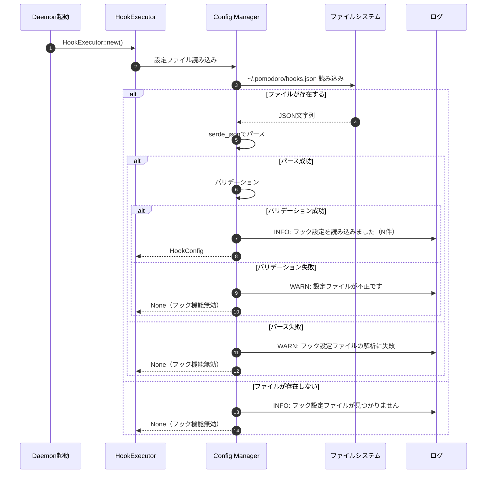

# Config Manager 詳細設計書

## メタ情報

| 項目 | 内容 |
|------|------|
| 親機能 | イベントフック機能 |
| 含まれる機能ID | F-029 |
| 関連基本設計書 | BASIC-CLI-003 |
| 関連要件定義書 | REQ-CLI-003 |

## 1. 概要

Config Managerは、フック設定ファイル（`~/.pomodoro/hooks.json`）の読み込み、検証、管理を担当するモジュールである。

### 1.1 処理フロー概要



## 2. 機能要件

### 2.1 対象機能

| 機能ID | 機能名 | 概要 | 優先度 |
|--------|--------|------|--------|
| F-029 | フック登録 | 設定ファイルでフックスクリプトを登録 | 必須 |

### 2.2 ビジネスルール

| ルールID | 内容 |
|---------|------|
| BR-073 | 設定ファイルが存在しない場合はフック機能を無効化 |
| BR-074 | 設定ファイルが破損している場合は警告を出力し、フック機能を無効化 |
| BR-075 | スクリプトパスは絶対パスのみ許可（セキュリティ上の理由） |
| BR-076 | `enabled: false` のフックは実行しない |
| BR-077 | フックは登録順に実行される（ただし並列実行のため完了順序は保証しない） |

## 3. 設計書一覧

| 設計書 | パス | 説明 |
|--------|------|------|
| バックエンド設計書 | ./バックエンド設計書.md | Config Manager実装詳細 |

## 4. データ構造

### 4.1 HookConfig

```rust
/// フック設定
#[derive(Debug, Clone, Serialize, Deserialize)]
pub struct HookConfig {
    /// イベントごとのフック定義
    pub hooks: HashMap<String, Vec<HookDefinition>>,
    /// グローバルタイムアウト（秒）
    #[serde(default = "default_timeout")]
    pub global_timeout: u32,
}

fn default_timeout() -> u32 {
    30
}

impl HookConfig {
    /// 設定ファイルから読み込み
    pub fn load() -> Option<Self> {
        let config_path = dirs::home_dir()
            .expect("ホームディレクトリが取得できません")
            .join(".pomodoro")
            .join("hooks.json");
        
        if !config_path.exists() {
            tracing::info!("フック設定ファイルが見つかりません: {:?}", config_path);
            return None;
        }
        
        match std::fs::read_to_string(&config_path) {
            Ok(content) => match serde_json::from_str::<Self>(&content) {
                Ok(config) => {
                    if let Err(e) = config.validate() {
                        tracing::warn!("フック設定ファイルのバリデーションエラー: {}", e);
                        return None;
                    }
                    Some(config)
                }
                Err(e) => {
                    tracing::warn!("フック設定ファイルの解析に失敗しました: {:?}", e);
                    None
                }
            },
            Err(e) => {
                tracing::warn!("フック設定ファイルの読み込みに失敗しました: {:?}", e);
                None
            }
        }
    }
    
    /// 設定を検証
    pub fn validate(&self) -> Result<(), String> {
        // 1. グローバルタイムアウトの範囲チェック
        if self.global_timeout < 1 || self.global_timeout > 300 {
            return Err("global_timeoutは1-300秒の範囲で指定してください".to_string());
        }
        
        // 2. 各イベントのフック定義を検証
        for (event_name, hooks) in &self.hooks {
            // イベント名の検証
            if !is_valid_event_name(event_name) {
                return Err(format!("無効なイベント名です: {}", event_name));
            }
            
            // フック数の上限チェック
            if hooks.len() > 10 {
                return Err(format!("イベント '{}' のフック数が上限（10個）を超えています", event_name));
            }
            
            // 各フック定義を検証
            for hook in hooks {
                hook.validate()?;
            }
        }
        
        Ok(())
    }
}

/// 有効なイベント名かチェック
fn is_valid_event_name(name: &str) -> bool {
    matches!(
        name,
        "work_start"
            | "work_end"
            | "break_start"
            | "break_end"
            | "long_break_start"
            | "long_break_end"
            | "pause"
            | "resume"
            | "stop"
    )
}
```

### 4.2 HookDefinition

```rust
/// 個別フックの定義
#[derive(Debug, Clone, Serialize, Deserialize)]
pub struct HookDefinition {
    /// フック名（識別用）
    pub name: String,
    /// スクリプトの絶対パス
    pub script: PathBuf,
    /// 有効/無効
    #[serde(default = "default_enabled")]
    pub enabled: bool,
    /// タイムアウト時間（秒）
    pub timeout: Option<u32>,
}

fn default_enabled() -> bool {
    true
}

impl HookDefinition {
    /// フック定義を検証
    pub fn validate(&self) -> Result<(), String> {
        // 1. フック名の長さチェック
        if self.name.is_empty() {
            return Err("フック名は必須です".to_string());
        }
        if self.name.len() > 100 {
            return Err("フック名は100文字以内で指定してください".to_string());
        }
        
        // 2. スクリプトパスの検証
        if !self.script.is_absolute() {
            return Err(format!(
                "スクリプトパスは絶対パスで指定してください: {:?}",
                self.script
            ));
        }
        
        // 3. タイムアウトの範囲チェック
        if let Some(timeout) = self.timeout {
            if timeout < 1 || timeout > 300 {
                return Err("timeoutは1-300秒の範囲で指定してください".to_string());
            }
        }
        
        Ok(())
    }
}
```

## 5. 設定ファイル形式

### 5.1 JSONスキーマ

```json
{
  "$schema": "http://json-schema.org/draft-07/schema#",
  "type": "object",
  "properties": {
    "hooks": {
      "type": "object",
      "patternProperties": {
        "^(work_start|work_end|break_start|break_end|long_break_start|long_break_end|pause|resume|stop)$": {
          "type": "array",
          "items": {
            "type": "object",
            "properties": {
              "name": {
                "type": "string",
                "minLength": 1,
                "maxLength": 100
              },
              "script": {
                "type": "string",
                "pattern": "^/"
              },
              "enabled": {
                "type": "boolean"
              },
              "timeout": {
                "type": "number",
                "minimum": 1,
                "maximum": 300
              }
            },
            "required": ["name", "script"]
          },
          "maxItems": 10
        }
      }
    },
    "global_timeout": {
      "type": "number",
      "minimum": 1,
      "maximum": 300
    }
  },
  "required": ["hooks"]
}
```

### 5.2 設定ファイル例

```json
{
  "hooks": {
    "work_end": [
      {
        "name": "Slack通知",
        "script": "/Users/user/.pomodoro/scripts/notify-slack.sh",
        "enabled": true,
        "timeout": 10
      },
      {
        "name": "統計記録",
        "script": "/Users/user/.pomodoro/scripts/record-stats.sh",
        "enabled": true,
        "timeout": 5
      }
    ],
    "break_start": [
      {
        "name": "音楽再生",
        "script": "/Users/user/.pomodoro/scripts/play-music.sh",
        "enabled": false,
        "timeout": 5
      }
    ]
  },
  "global_timeout": 30
}
```

## 6. エラーハンドリング

### 6.1 エラー種別と対処

| エラー種別 | エラーコード | 対処 | ログレベル |
|-----------|-------------|------|-----------|
| ファイル不存在 | E030 | フック機能を無効化 | INFO |
| JSON解析エラー | E031 | フック機能を無効化 | WARN |
| バリデーションエラー | E031 | フック機能を無効化 | WARN |
| 無効なイベント名 | E031 | フック機能を無効化 | WARN |
| フック数上限超過 | E031 | フック機能を無効化 | WARN |
| 無効なスクリプトパス | E031 | フック機能を無効化 | WARN |

## 7. 関連サブ機能

- [HookExecutor](../hook-executor/詳細設計書.md) - フック実行エンジン

---

## 変更履歴

| 日付 | バージョン | 変更内容 | 担当者 |
|:---|:---|:---|:---|
| 2026-01-06 | 1.0.0 | 初版作成 | - |
