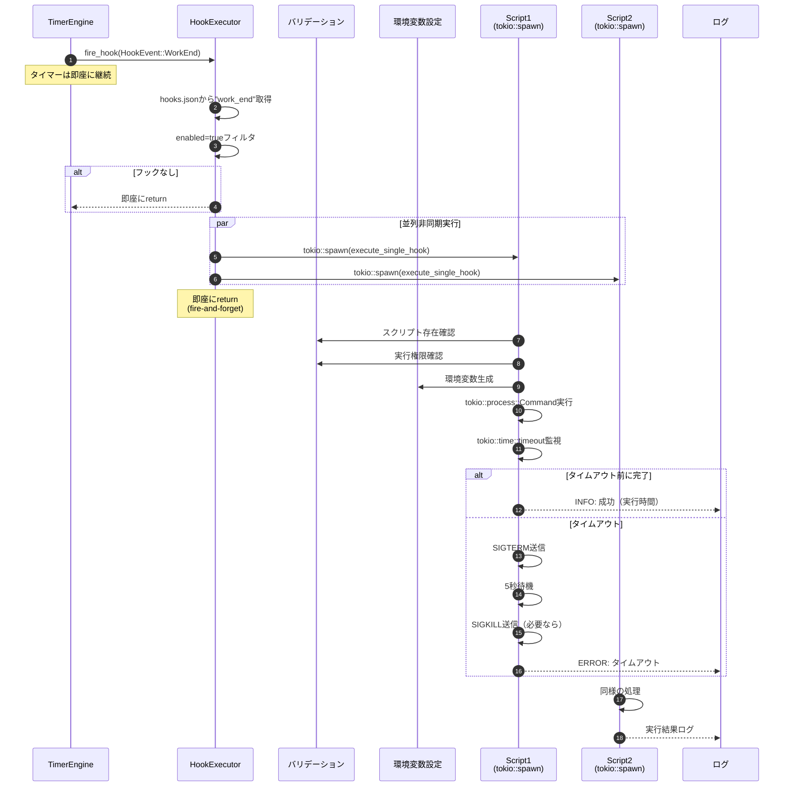

# HookExecutor 詳細設計書

## メタ情報

| 項目 | 内容 |
|------|------|
| 親機能 | イベントフック機能 |
| 含まれる機能ID | F-028, F-030, F-032, F-033, F-034 |
| 関連基本設計書 | BASIC-CLI-003 |
| 関連要件定義書 | REQ-CLI-003 |

## 1. 概要

HookExecutorは、タイマーイベント発生時に登録されたBashスクリプトを**非同期（fire-and-forget）**で実行するモジュールである。タイマーエンジンをブロックせず、複数のフックを並列実行し、タイムアウト制御とエラーハンドリングを提供する。

### 1.1 処理フロー概要



## 2. 機能要件

### 2.1 対象機能

| 機能ID | 機能名 | 概要 | 優先度 |
|--------|--------|------|--------|
| F-028 | イベント定義 | 9種類のイベント種別を定義 | 必須 |
| F-030 | スクリプト実行 | Bashスクリプトを非同期実行 | 必須 |
| F-032 | 複数フック対応 | 1イベントに複数スクリプトを並列実行 | 重要 |
| F-033 | タイムアウト制御 | スクリプト実行のタイムアウト設定 | 重要 |
| F-034 | エラーハンドリング | スクリプト失敗時の処理とログ記録 | 必須 |

### 2.2 ビジネスルール

| ルールID | 内容 |
|---------|------|
| BR-071 | イベントは非同期的に処理される（タイマーをブロックしない） |
| BR-072 | イベント処理中もタイマーは継続する（UX最優先） |
| BR-078 | スクリプトは `/bin/bash` で実行される |
| BR-079 | スクリプトの終了コード0を成功、それ以外を失敗とする |
| BR-080 | タイムアウト時はプロセスを強制終了（SIGTERM → SIGKILL） |
| BR-081 | スクリプトは非同期実行され、タイマーをブロックしない（UX最優先） |
| BR-082 | 標準出力・標準エラー出力は最大10KBまでログに記録 |
| BR-086 | フックは並列で非同期実行される（実行順序は保証しない） |
| BR-087 | 1つのフックの失敗は他のフックに影響しない（独立実行） |
| BR-089 | すべてのフックの実行結果をログに記録 |
| BR-090 | タイムアウト時間は1-300秒の範囲で設定可能 |
| BR-091 | タイムアウト発生時はエラーとして扱う |
| BR-092 | タイムアウト時はプロセスを強制終了 |
| BR-093 | すべてのエラーはログファイル（`~/.pomodoro/logs/hooks.log`）に記録 |
| BR-094 | エラー発生時もタイマーは継続する |
| BR-096 | スクリプトエラー時は該当フックのみスキップ |

## 3. 設計書一覧

| 設計書 | パス | 説明 |
|--------|------|------|
| バックエンド設計書 | ./バックエンド設計書.md | HookExecutor実装詳細 |

## 4. 共通設計への参照

| 設計書 | パス |
|--------|------|
| セキュリティ設計 | [../共通/セキュリティ設計書.md](../共通/セキュリティ設計書.md) |

## 5. データ構造

### 5.1 HookExecutor

```rust
/// フック実行モジュール
pub struct HookExecutor {
    /// フック設定
    config: Option<HookConfig>,
    /// フック機能の有効/無効
    enabled: bool,
}

impl HookExecutor {
    /// 新規作成（起動時に設定ファイルを読み込み）
    pub fn new() -> Self {
        // ~/.pomodoro/hooks.json を読み込み
        // パース失敗時は enabled = false
    }
    
    /// フックを非同期実行（fire-and-forget）
    pub async fn execute(&self, context: HookContext) -> Result<()> {
        if !self.enabled {
            return Ok(());
        }
        
        let event_name = context.event.as_str();
        let hooks = self.config.as_ref()
            .and_then(|c| c.hooks.get(event_name))
            .cloned()
            .unwrap_or_default();
        
        // enabled=trueのフックのみフィルタ
        let enabled_hooks: Vec<_> = hooks.into_iter()
            .filter(|h| h.enabled)
            .collect();
        
        if enabled_hooks.is_empty() {
            return Ok(());
        }
        
        tracing::info!("イベント '{}' のフックを非同期実行開始 ({}件)", 
            event_name, enabled_hooks.len());
        
        // すべてのフックを並列非同期実行
        for hook in enabled_hooks {
            let hook_clone = hook.clone();
            let context_clone = context.clone();
            let global_timeout = self.config.as_ref()
                .map(|c| c.global_timeout)
                .unwrap_or(30);
            
            tokio::spawn(async move {
                execute_single_hook(&hook_clone, &context_clone, global_timeout).await;
            });
        }
        
        Ok(())
    }
}
```

### 5.2 execute_single_hook関数

```rust
/// 単一フックの実行
async fn execute_single_hook(
    hook: &HookDefinition,
    context: &HookContext,
    global_timeout: u32,
) {
    let start_time = std::time::Instant::now();
    
    tracing::info!("フック '{}' を非同期実行中...", hook.name);
    
    // 1. バリデーション
    if let Err(e) = validate_script(&hook.script) {
        tracing::error!("フック '{}' のバリデーションエラー: {:?}", hook.name, e);
        return;
    }
    
    // 2. 環境変数設定
    let env_vars = context.to_env_vars();
    let mut env_vars_with_hook_name = env_vars.clone();
    env_vars_with_hook_name.insert("POMODORO_HOOK_NAME".to_string(), hook.name.clone());
    
    // 3. タイムアウト時間決定
    let timeout_secs = hook.timeout.unwrap_or(global_timeout);
    let timeout_duration = Duration::from_secs(timeout_secs as u64);
    
    // 4. プロセス実行
    let mut cmd = tokio::process::Command::new("/bin/bash");
    cmd.arg(&hook.script);
    cmd.envs(&env_vars_with_hook_name);
    cmd.current_dir(dirs::home_dir().unwrap().join(".pomodoro"));
    cmd.stdout(std::process::Stdio::piped());
    cmd.stderr(std::process::Stdio::piped());
    
    let child = match cmd.spawn() {
        Ok(child) => child,
        Err(e) => {
            tracing::error!("フック '{}' の起動に失敗しました: {:?}", hook.name, e);
            return;
        }
    };
    
    // 5. タイムアウト監視
    match tokio::time::timeout(timeout_duration, child.wait_with_output()).await {
        Ok(Ok(output)) => {
            let elapsed = start_time.elapsed();
            
            if output.status.success() {
                tracing::info!(
                    "フック '{}' が成功しました (実行時間: {:.2}秒)",
                    hook.name,
                    elapsed.as_secs_f64()
                );
                
                // 標準出力・標準エラー出力をログに記録（最大10KB）
                log_output(&hook.name, &output.stdout, &output.stderr);
            } else {
                tracing::error!(
                    "フック '{}' が失敗しました (終了コード: {:?}, 実行時間: {:.2}秒)",
                    hook.name,
                    output.status.code(),
                    elapsed.as_secs_f64()
                );
                log_output(&hook.name, &output.stdout, &output.stderr);
            }
        }
        Ok(Err(e)) => {
            tracing::error!("フック '{}' の実行エラー: {:?}", hook.name, e);
        }
        Err(_) => {
            tracing::error!(
                "フック '{}' がタイムアウトしました (タイムアウト: {}秒)",
                hook.name,
                timeout_secs
            );
            
            // タイムアウト時はプロセスを強制終了
            // Note: tokio::process::Childはタイムアウト時に自動的にkillされる
        }
    }
}
```

### 5.3 バリデーション関数

```rust
/// スクリプトファイルのバリデーション
fn validate_script(script_path: &std::path::PathBuf) -> Result<()> {
    // 1. 絶対パスチェック
    if !script_path.is_absolute() {
        anyhow::bail!("スクリプトパスは絶対パスである必要があります: {:?}", script_path);
    }
    
    // 2. ファイル存在チェック
    if !script_path.exists() {
        anyhow::bail!("スクリプトファイルが見つかりません: {:?}", script_path);
    }
    
    // 3. 実行権限チェック
    let metadata = std::fs::metadata(script_path)
        .context("スクリプトファイルのメタデータ取得に失敗")?;
    
    #[cfg(unix)]
    {
        use std::os::unix::fs::PermissionsExt;
        let permissions = metadata.permissions();
        let mode = permissions.mode();
        
        // 実行権限ビット（0o111）をチェック
        if mode & 0o111 == 0 {
            anyhow::bail!("スクリプトに実行権限がありません: {:?}", script_path);
        }
    }
    
    Ok(())
}
```

### 5.4 ログ出力関数

```rust
/// 標準出力・標準エラー出力をログに記録
fn log_output(hook_name: &str, stdout: &[u8], stderr: &[u8]) {
    const MAX_LOG_SIZE: usize = 10 * 1024; // 10KB
    
    if !stdout.is_empty() {
        let stdout_str = String::from_utf8_lossy(stdout);
        let truncated = if stdout_str.len() > MAX_LOG_SIZE {
            format!("{}... (truncated)", &stdout_str[..MAX_LOG_SIZE])
        } else {
            stdout_str.to_string()
        };
        
        tracing::debug!("フック '{}' の標準出力:\n{}", hook_name, truncated);
    }
    
    if !stderr.is_empty() {
        let stderr_str = String::from_utf8_lossy(stderr);
        let truncated = if stderr_str.len() > MAX_LOG_SIZE {
            format!("{}... (truncated)", &stderr_str[..MAX_LOG_SIZE])
        } else {
            stderr_str.to_string()
        };
        
        tracing::warn!("フック '{}' の標準エラー出力:\n{}", hook_name, truncated);
    }
}
```

## 6. エラーハンドリング

### 6.1 エラー種別と対処

| エラー種別 | 検出タイミング | 対処 | ログレベル |
|-----------|---------------|------|-----------|
| スクリプト不存在 | バリデーション時 | 該当フックをスキップ、次のフックを実行 | ERROR |
| 実行権限なし | バリデーション時 | 該当フックをスキップ、次のフックを実行 | ERROR |
| 実行失敗（非0終了コード） | プロセス終了時 | ログに記録、次のフックを実行 | ERROR |
| タイムアウト | timeout経過時 | プロセス強制終了、ログに記録 | ERROR |
| 設定ファイルエラー | 起動時 | フック機能全体を無効化 | WARN |

### 6.2 ログ出力例

```
[2026-01-06 10:30:00] [INFO] イベント 'work_end' のフックを非同期実行開始 (2件)
[2026-01-06 10:30:00] [INFO] フック 'Slack通知' を非同期実行中...
[2026-01-06 10:30:00] [INFO] フック 'メール送信' を非同期実行中...
[2026-01-06 10:30:01] [INFO] フック 'Slack通知' が成功しました (実行時間: 1.23秒)
[2026-01-06 10:30:11] [ERROR] フック 'メール送信' がタイムアウトしました (タイムアウト: 10秒)
```

## 7. 性能要件

| 要件 | 目標値 | 実装方針 |
|------|--------|---------|
| フック実行遅延 | 500ms以内 | tokio::spawnで即座に非同期実行 |
| タイマーへの影響 | 0ms（ブロックしない） | fire-and-forget方式 |
| 並列実行数 | 最大10個 | 設定ファイルで制限 |

## 8. セキュリティ要件

| 要件 | 実装方針 |
|------|---------|
| スクリプトパス検証 | 絶対パスのみ許可、`is_absolute()`でチェック |
| 実行権限確認 | `metadata.permissions().mode()`で実行権限ビット確認 |
| 環境変数サニタイズ | 特殊文字（`$`, `` ` ``, `\`）をエスケープ |
| ログファイル権限 | `Permissions::from_mode(0o600)`で所有者のみ読み書き可 |

## 9. 関連サブ機能

- [Config Manager](../config-manager/詳細設計書.md) - フック設定の読み込み
- [Timer Extension](../timer-extension/詳細設計書.md) - イベント発火

---

## 変更履歴

| 日付 | バージョン | 変更内容 | 担当者 |
|:---|:---|:---|:---|
| 2026-01-06 | 1.0.0 | 初版作成 | - |
