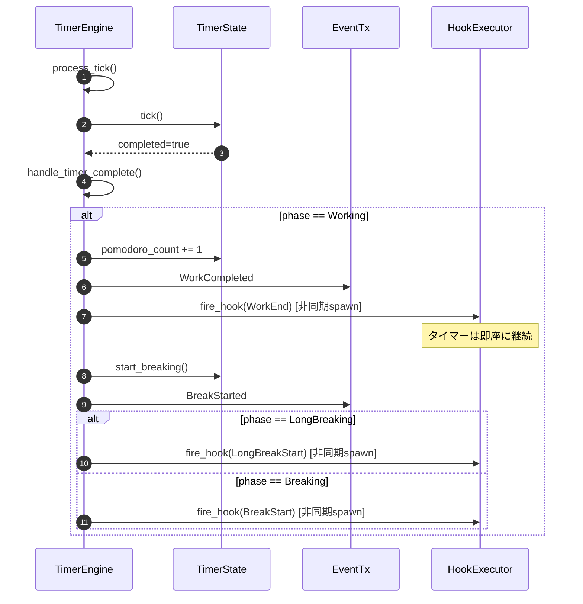
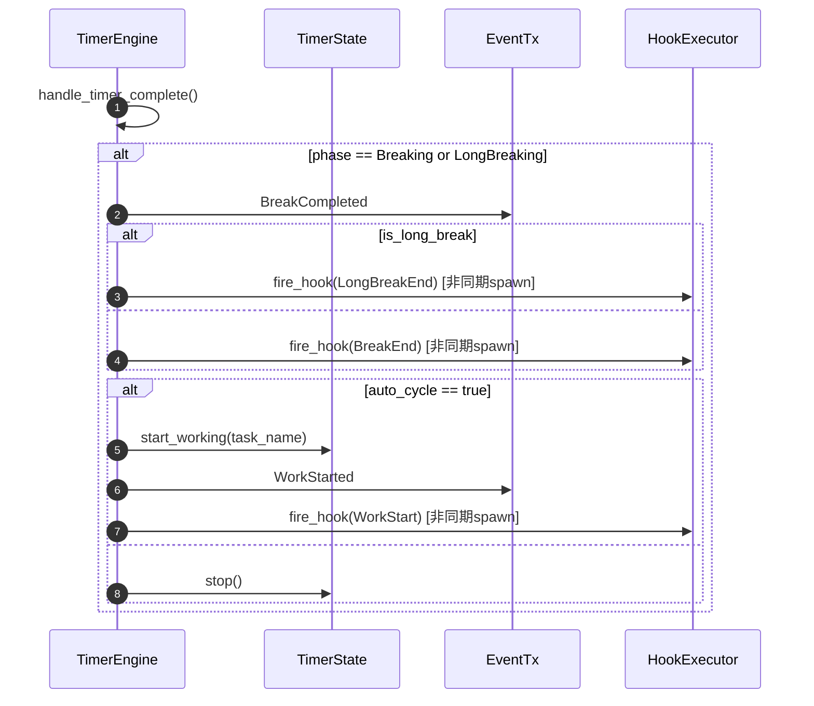

# Timer Extension バックエンド設計書

## 1. モジュール構成

### 1.1 ファイル構成

```
src/
├── daemon/
│   └── timer.rs             # TimerEngine拡張（本設計書）
├── hooks/
│   ├── mod.rs               # モジュールエクスポート
│   ├── executor.rs          # HookExecutor実装
│   ├── config.rs            # HookConfig、HookDefinition
│   └── context.rs           # HookContext、環境変数生成
└── types/
    └── mod.rs               # HookEvent追加
```

### 1.2 依存関係

```rust
// src/daemon/timer.rs

use anyhow::{Context, Result};
use std::sync::Arc;
use tokio::sync::mpsc;
use tokio::time::{interval, Duration, Interval, MissedTickBehavior};

use crate::hooks::executor::HookExecutor;
use crate::hooks::context::HookContext;
use crate::types::{HookEvent, PomodoroConfig, StartParams, TimerPhase, TimerState};
```

## 2. TimerEngine拡張

### 2.1 構造体への追加

```rust
/// タイマーエンジン
///
/// ポモドーロタイマーのコアロジックを担当する。
/// 1秒ごとにティックを発火し、フェーズ完了時にイベントを送信する。
pub struct TimerEngine {
    /// タイマー状態
    state: TimerState,
    /// イベント送信チャネル
    event_tx: mpsc::UnboundedSender<TimerEvent>,
    /// フック実行モジュール（新規追加）
    hook_executor: Arc<HookExecutor>,
}

impl TimerEngine {
    /// 新しいTimerEngineを作成
    ///
    /// # 引数
    /// - `config`: ポモドーロ設定
    /// - `event_tx`: イベント送信チャネル
    ///
    /// # 戻り値
    /// - `Self`: 初期化されたTimerEngine
    pub fn new(
        config: PomodoroConfig,
        event_tx: mpsc::UnboundedSender<TimerEvent>,
    ) -> Self {
        Self {
            state: TimerState::new(config),
            event_tx,
            hook_executor: Arc::new(HookExecutor::new()),  // 新規追加
        }
    }
    
    // ... 既存メソッド ...
}
```

### 2.2 fire_hookメソッド（新規追加）

```rust
impl TimerEngine {
    /// フックイベントを発火（非同期・ノンブロッキング）
    ///
    /// # 引数
    /// - `event`: フックイベント種別
    ///
    /// # 処理フロー
    /// 1. HookContextを生成（現在のタイマー状態から）
    /// 2. HookExecutorをクローン（Arc経由）
    /// 3. tokio::spawnで非同期タスクとして実行
    /// 4. 即座にreturn（fire-and-forget）
    ///
    /// # 重要
    /// - このメソッドはタイマーをブロックしない
    /// - フック実行エラーはログに記録されるが、タイマーには影響しない
    fn fire_hook(&self, event: HookEvent) {
        // 1. HookContextを生成
        let context = HookContext {
            event,
            task_name: self.state.task_name.clone(),
            phase: self.state.phase,
            duration_secs: self.state.total_duration(),
            elapsed_secs: self.state.total_duration() - self.state.remaining_seconds,
            remaining_secs: self.state.remaining_seconds,
            cycle: self.state.pomodoro_count,
            total_cycles: 4, // 固定値（Phase 1）
            timestamp: chrono::Utc::now(),
            session_id: uuid::Uuid::new_v4(),
        };
        
        // 2. フック実行モジュールに非同期で通知（fire-and-forget）
        let executor = self.hook_executor.clone();
        tokio::spawn(async move {
            if let Err(e) = executor.execute(context).await {
                tracing::error!("フック実行エラー: {:?}", e);
            }
        });
    }
}
```

## 3. イベント発火ポイント

### 3.1 start()メソッド

```rust
impl TimerEngine {
    /// タイマーを開始
    ///
    /// # 引数
    /// - `params`: 開始パラメータ（タスク名、カスタム時間等）
    ///
    /// # 戻り値
    /// - `Ok(())`: 開始成功
    /// - `Err(...)`: 既に実行中の場合
    pub fn start(&mut self, params: &StartParams) -> Result<()> {
        if self.state.is_running() {
            anyhow::bail!("タイマーは既に実行中です");
        }

        self.state.config.update_from_params(params);
        self.state.start_working(params.task_name.clone());

        // 既存のイベント送信
        self.event_tx
            .send(TimerEvent::WorkStarted {
                task_name: params.task_name.clone(),
            })
            .context("Failed to send work started event")?;

        // ★フックイベント発火（新規追加）★
        self.fire_hook(HookEvent::WorkStart);

        Ok(())
    }
}
```

### 3.2 process_tick()メソッド（handle_timer_complete内）

```rust
impl TimerEngine {
    /// タイマー完了時の処理
    ///
    /// # 処理フロー
    /// 1. 現在のフェーズを判定
    /// 2. フェーズに応じた処理を実行
    /// 3. イベント送信
    /// 4. ★フックイベント発火（新規追加）★
    /// 5. 次のフェーズへ遷移
    fn handle_timer_complete(&mut self) -> Result<()> {
        match self.state.phase {
            TimerPhase::Working => {
                // ポモドーロカウントを増加
                self.state.pomodoro_count += 1;

                // 作業完了イベントを送信
                self.event_tx
                    .send(TimerEvent::WorkCompleted {
                        pomodoro_count: self.state.pomodoro_count,
                        task_name: self.state.task_name.clone(),
                    })
                    .context("Failed to send work completed event")?;

                // ★フックイベント発火: work_end（新規追加）★
                self.fire_hook(HookEvent::WorkEnd);

                // 休憩を開始
                self.state.start_breaking();

                // 休憩開始イベントを送信
                self.event_tx
                    .send(TimerEvent::BreakStarted {
                        is_long_break: self.state.phase == TimerPhase::LongBreaking,
                    })
                    .context("Failed to send break started event")?;

                // ★フックイベント発火: break_start または long_break_start（新規追加）★
                if self.state.phase == TimerPhase::LongBreaking {
                    self.fire_hook(HookEvent::LongBreakStart);
                } else {
                    self.fire_hook(HookEvent::BreakStart);
                }
            }
            TimerPhase::Breaking | TimerPhase::LongBreaking => {
                let is_long_break = self.state.phase == TimerPhase::LongBreaking;

                // 休憩完了イベントを送信
                self.event_tx
                    .send(TimerEvent::BreakCompleted { is_long_break })
                    .context("Failed to send break completed event")?;

                // ★フックイベント発火: break_end または long_break_end（新規追加）★
                if is_long_break {
                    self.fire_hook(HookEvent::LongBreakEnd);
                } else {
                    self.fire_hook(HookEvent::BreakEnd);
                }

                // 自動サイクルが有効な場合は次の作業を開始
                if self.state.config.auto_cycle {
                    let task_name = self.state.task_name.clone();
                    self.state.start_working(task_name.clone());

                    self.event_tx
                        .send(TimerEvent::WorkStarted { task_name })
                        .context("Failed to send work started event")?;

                    // ★フックイベント発火: work_start（新規追加）★
                    self.fire_hook(HookEvent::WorkStart);
                } else {
                    self.state.stop();
                }
            }
            _ => {}
        }

        Ok(())
    }
}
```

### 3.3 pause()メソッド

```rust
impl TimerEngine {
    /// タイマーを一時停止
    ///
    /// # 戻り値
    /// - `Ok(())`: 一時停止成功
    /// - `Err(...)`: 実行中でない場合
    pub fn pause(&mut self) -> Result<()> {
        if !self.state.is_running() {
            anyhow::bail!("タイマーは実行されていません");
        }

        self.state.pause();

        // 既存のイベント送信
        self.event_tx
            .send(TimerEvent::Paused)
            .context("Failed to send paused event")?;

        // ★フックイベント発火（新規追加）★
        self.fire_hook(HookEvent::Pause);

        Ok(())
    }
}
```

### 3.4 resume()メソッド

```rust
impl TimerEngine {
    /// タイマーを再開
    ///
    /// # 戻り値
    /// - `Ok(())`: 再開成功
    /// - `Err(...)`: 一時停止中でない場合
    pub fn resume(&mut self) -> Result<()> {
        if !self.state.is_paused() {
            anyhow::bail!("タイマーは一時停止していません");
        }

        self.state.resume();

        // 既存のイベント送信
        self.event_tx
            .send(TimerEvent::Resumed)
            .context("Failed to send resumed event")?;

        // ★フックイベント発火（新規追加）★
        self.fire_hook(HookEvent::Resume);

        Ok(())
    }
}
```

### 3.5 stop()メソッド

```rust
impl TimerEngine {
    /// タイマーを停止
    ///
    /// # 戻り値
    /// - `Ok(())`: 停止成功
    /// - `Err(...)`: 実行中でも一時停止中でもない場合
    pub fn stop(&mut self) -> Result<()> {
        if !self.state.is_running() && !self.state.is_paused() {
            anyhow::bail!("タイマーは実行されていません");
        }

        self.state.stop();

        // 既存のイベント送信
        self.event_tx
            .send(TimerEvent::Stopped)
            .context("Failed to send stopped event")?;

        // ★フックイベント発火（新規追加）★
        self.fire_hook(HookEvent::Stop);

        Ok(())
    }
}
```

## 4. イベント発火タイミング一覧

| メソッド | 発火タイミング | 発火イベント | コード位置 |
|---------|---------------|-------------|-----------|
| `start()` | 作業タイマー開始時 | `work_start` | `start()` メソッド末尾 |
| `handle_timer_complete()` | 作業完了時 | `work_end` → `break_start` または `long_break_start` | `TimerPhase::Working` ブランチ |
| `handle_timer_complete()` | 休憩完了時（auto_cycle=true） | `break_end` → `work_start` | `TimerPhase::Breaking` ブランチ |
| `handle_timer_complete()` | 休憩完了時（auto_cycle=false） | `break_end` のみ | `TimerPhase::Breaking` ブランチ |
| `handle_timer_complete()` | 長い休憩完了時（auto_cycle=true） | `long_break_end` → `work_start` | `TimerPhase::LongBreaking` ブランチ |
| `handle_timer_complete()` | 長い休憩完了時（auto_cycle=false） | `long_break_end` のみ | `TimerPhase::LongBreaking` ブランチ |
| `pause()` | 一時停止時 | `pause` | `pause()` メソッド末尾 |
| `resume()` | 再開時 | `resume` | `resume()` メソッド末尾 |
| `stop()` | 停止時 | `stop` | `stop()` メソッド末尾 |

## 5. 処理フロー図

### 5.1 作業完了時のフロー



### 5.2 休憩完了時のフロー（auto_cycle=true）



## 6. エラーハンドリング

### 6.1 フック実行エラーの隔離

```rust
impl TimerEngine {
    fn fire_hook(&self, event: HookEvent) {
        let context = HookContext {
            // ... コンテキスト生成 ...
        };
        
        let executor = self.hook_executor.clone();
        tokio::spawn(async move {
            // ★エラーはログに記録するが、タイマーには影響しない★
            if let Err(e) = executor.execute(context).await {
                tracing::error!("フック実行エラー: {:?}", e);
            }
        });
        
        // ★即座にreturn（fire-and-forget）★
    }
}
```

### 6.2 エラー種別と対処

| エラー種別 | 発生箇所 | 対処 | タイマーへの影響 |
|-----------|---------|------|----------------|
| フック設定読み込み失敗 | `HookExecutor::new()` | フック機能を無効化 | なし（タイマーは正常動作） |
| スクリプト実行失敗 | `execute_single_hook()` | ログに記録 | なし（タイマーは正常動作） |
| タイムアウト | `execute_single_hook()` | プロセス強制終了、ログに記録 | なし（タイマーは正常動作） |
| 環境変数生成エラー | `HookContext::to_env_vars()` | ログに記録 | なし（タイマーは正常動作） |

## 7. テスト方針

### 7.1 単体テスト

```rust
#[cfg(test)]
mod tests {
    use super::*;
    
    #[tokio::test]
    async fn test_fire_hook_does_not_block_timer() {
        let (tx, _rx) = mpsc::unbounded_channel();
        let config = PomodoroConfig::default();
        let engine = TimerEngine::new(config, tx);
        
        let start_time = std::time::Instant::now();
        
        // フックを発火
        engine.fire_hook(HookEvent::WorkStart);
        
        let elapsed = start_time.elapsed();
        
        // fire_hookは即座にreturnする（1ms以内）
        assert!(elapsed.as_millis() < 1);
    }
    
    #[tokio::test]
    async fn test_start_fires_work_start_hook() {
        let (tx, mut rx) = mpsc::unbounded_channel();
        let config = PomodoroConfig::default();
        let mut engine = TimerEngine::new(config, tx);
        
        let params = StartParams {
            task_name: Some("テスト".to_string()),
            ..Default::default()
        };
        
        engine.start(&params).unwrap();
        
        // TimerEventが送信されることを確認
        let event = rx.try_recv().unwrap();
        assert!(matches!(event, TimerEvent::WorkStarted { .. }));
        
        // フックは非同期実行されるため、即座には確認できない
        // （HookExecutorのテストで確認）
    }
    
    #[test]
    fn test_pause_fires_pause_hook() {
        let (tx, mut rx) = mpsc::unbounded_channel();
        let config = PomodoroConfig::default();
        let mut engine = TimerEngine::new(config, tx);
        
        engine.start(&StartParams::default()).unwrap();
        rx.try_recv().unwrap(); // consume WorkStarted
        
        engine.pause().unwrap();
        
        let event = rx.try_recv().unwrap();
        assert_eq!(event, TimerEvent::Paused);
    }
    
    #[test]
    fn test_resume_fires_resume_hook() {
        let (tx, mut rx) = mpsc::unbounded_channel();
        let config = PomodoroConfig::default();
        let mut engine = TimerEngine::new(config, tx);
        
        engine.start(&StartParams::default()).unwrap();
        rx.try_recv().unwrap(); // consume WorkStarted
        engine.pause().unwrap();
        rx.try_recv().unwrap(); // consume Paused
        
        engine.resume().unwrap();
        
        let event = rx.try_recv().unwrap();
        assert_eq!(event, TimerEvent::Resumed);
    }
    
    #[test]
    fn test_stop_fires_stop_hook() {
        let (tx, mut rx) = mpsc::unbounded_channel();
        let config = PomodoroConfig::default();
        let mut engine = TimerEngine::new(config, tx);
        
        engine.start(&StartParams::default()).unwrap();
        rx.try_recv().unwrap(); // consume WorkStarted
        
        engine.stop().unwrap();
        
        let event = rx.try_recv().unwrap();
        assert_eq!(event, TimerEvent::Stopped);
    }
}
```

### 7.2 統合テスト

```rust
// tests/timer_hooks_integration_test.rs

use std::fs;
use tempfile::TempDir;

#[tokio::test]
async fn test_timer_with_hooks_end_to_end() {
    // 1. テスト用設定ファイルを作成
    let temp_dir = TempDir::new().unwrap();
    let config_path = temp_dir.path().join("hooks.json");
    
    let config_json = r#"
    {
      "hooks": {
        "work_start": [
          {
            "name": "テストフック",
            "script": "/tmp/test-hook.sh",
            "enabled": true,
            "timeout": 5
          }
        ]
      },
      "global_timeout": 30
    }
    "#;
    
    fs::write(&config_path, config_json).unwrap();
    
    // 2. テスト用スクリプトを作成
    let script_path = "/tmp/test-hook.sh";
    fs::write(script_path, "#!/bin/bash\necho 'Hook executed'").unwrap();
    fs::set_permissions(script_path, std::fs::Permissions::from_mode(0o755)).unwrap();
    
    // 3. TimerEngineを起動
    let (tx, _rx) = mpsc::unbounded_channel();
    let config = PomodoroConfig::default();
    let mut engine = TimerEngine::new(config, tx);
    
    // 4. タイマーを開始（フックが発火される）
    engine.start(&StartParams::default()).unwrap();
    
    // 5. 少し待機（フックが実行される時間を確保）
    tokio::time::sleep(tokio::time::Duration::from_millis(100)).await;
    
    // 6. ログを確認（実際のテストではログファイルを確認）
    // （省略）
}
```

## 8. 依存クレート

### 8.1 新規追加

| クレート | バージョン | 用途 |
|---------|-----------|------|
| chrono | 0.4+ | ISO8601タイムスタンプ生成 |
| uuid | 1.0+ | セッションID生成 |

### 8.2 Cargo.toml への追加

```toml
[dependencies]
# 既存依存（変更なし）
tokio = { version = "1.48", features = ["rt", "time", "macros", "signal", "process"] }
anyhow = "1.0"
tracing = "0.1"

# 新規追加
chrono = "0.4"
uuid = { version = "1.0", features = ["v4"] }
```

---

## 変更履歴

| 日付 | バージョン | 変更内容 | 担当者 |
|:---|:---|:---|:---|
| 2026-01-06 | 1.0.0 | 初版作成 | - |
