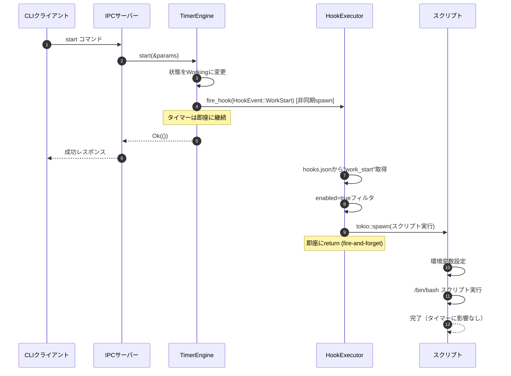
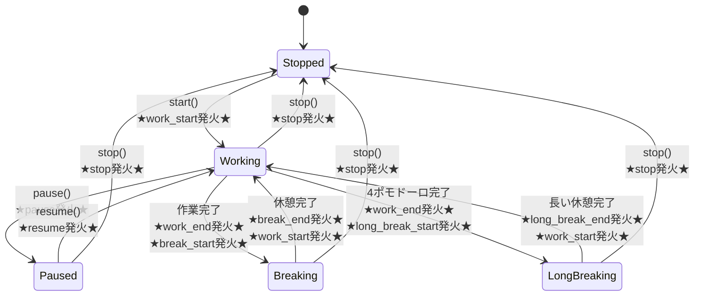

# Timer Extension 詳細設計書

## メタ情報

| 項目 | 内容 |
|------|------|
| 親機能 | イベントフック機能 |
| 含まれる機能ID | F-028, F-031 |
| 関連基本設計書 | BASIC-CLI-003 |
| 関連要件定義書 | REQ-CLI-003 |

## 1. 概要

Timer Extensionは、既存のTimerEngine（`src/daemon/timer.rs`）にイベント発火機構を追加するモジュールである。タイマーの状態遷移時にHookExecutorへイベントを通知し、登録されたフックスクリプトを非同期実行する。

### 1.1 処理フロー概要



## 2. 機能要件

### 2.1 対象機能

| 機能ID | 機能名 | 概要 | 優先度 |
|--------|--------|------|--------|
| F-028 | イベント定義 | 9種類のイベント種別を定義 | 必須 |
| F-031 | 環境変数提供 | スクリプトにコンテキスト情報を渡す | 必須 |

### 2.2 ビジネスルール

| ルールID | 内容 |
|---------|------|
| BR-070 | イベント名は小文字とアンダースコアのみ使用 |
| BR-071 | イベントは非同期的に処理される（タイマーをブロックしない） |
| BR-072 | イベント処理中もタイマーは継続する（UX最優先） |
| BR-081 | スクリプトは非同期実行され、タイマーをブロックしない（UX最優先） |

## 3. 設計書一覧

| 設計書 | パス | 説明 |
|--------|------|------|
| バックエンド設計書 | ./バックエンド設計書.md | TimerEngine拡張実装詳細 |

## 4. 共通設計への参照

| 設計書 | パス |
|--------|------|
| セキュリティ設計 | [../共通/セキュリティ設計書.md](../共通/セキュリティ設計書.md) |

## 5. データ構造

### 5.1 HookEvent（新規追加）

```rust
// src/types/mod.rs

/// フックイベント種別
///
/// タイマーで発生するイベントの種別を定義する。
/// 各イベントは対応する環境変数 POMODORO_EVENT に文字列として渡される。
#[derive(Debug, Clone, Copy, PartialEq, Eq, Serialize, Deserialize)]
#[serde(rename_all = "snake_case")]
pub enum HookEvent {
    /// 作業開始
    WorkStart,
    /// 作業終了
    WorkEnd,
    /// 休憩開始
    BreakStart,
    /// 休憩終了
    BreakEnd,
    /// 長い休憩開始
    LongBreakStart,
    /// 長い休憩終了
    LongBreakEnd,
    /// 一時停止
    Pause,
    /// 再開
    Resume,
    /// 停止
    Stop,
}

impl HookEvent {
    /// イベント名を文字列として取得
    ///
    /// 環境変数 POMODORO_EVENT に設定される値を返す。
    pub fn as_str(&self) -> &'static str {
        match self {
            HookEvent::WorkStart => "work_start",
            HookEvent::WorkEnd => "work_end",
            HookEvent::BreakStart => "break_start",
            HookEvent::BreakEnd => "break_end",
            HookEvent::LongBreakStart => "long_break_start",
            HookEvent::LongBreakEnd => "long_break_end",
            HookEvent::Pause => "pause",
            HookEvent::Resume => "resume",
            HookEvent::Stop => "stop",
        }
    }
}
```

### 5.2 HookContext（新規追加）

```rust
// src/hooks/context.rs

use crate::types::{HookEvent, PomodoroConfig, TimerPhase};
use chrono::{DateTime, Utc};
use std::collections::HashMap;
use uuid::Uuid;

/// フックスクリプトに渡すコンテキスト情報
///
/// タイマーの現在状態をスクリプトに環境変数として提供する。
#[derive(Debug, Clone)]
pub struct HookContext {
    /// イベント種別
    pub event: HookEvent,
    /// タスク名（未設定の場合はNone）
    pub task_name: Option<String>,
    /// 現在のフェーズ
    pub phase: TimerPhase,
    /// フェーズの総時間（秒）
    pub duration_secs: u32,
    /// 経過時間（秒）
    pub elapsed_secs: u32,
    /// 残り時間（秒）
    pub remaining_secs: u32,
    /// 現在のサイクル番号（1-4）
    pub cycle: u32,
    /// 総サイクル数（固定値: 4）
    pub total_cycles: u32,
    /// イベント発生時刻（ISO8601形式）
    pub timestamp: DateTime<Utc>,
    /// セッションID（UUID v4）
    pub session_id: Uuid,
}

impl HookContext {
    /// 環境変数のマップを生成
    ///
    /// # 戻り値
    /// - `HashMap<String, String>`: 環境変数名と値のマップ
    ///
    /// # 環境変数一覧
    /// - `POMODORO_EVENT`: イベント種別（例: "work_end"）
    /// - `POMODORO_TASK_NAME`: タスク名（未設定時は空文字列）
    /// - `POMODORO_PHASE`: 現在のフェーズ（例: "working"）
    /// - `POMODORO_DURATION_SECS`: フェーズ総時間（秒）
    /// - `POMODORO_ELAPSED_SECS`: 経過時間（秒）
    /// - `POMODORO_REMAINING_SECS`: 残り時間（秒）
    /// - `POMODORO_CYCLE`: 現在のサイクル番号
    /// - `POMODORO_TOTAL_CYCLES`: 総サイクル数
    /// - `POMODORO_TIMESTAMP`: ISO8601タイムスタンプ
    /// - `POMODORO_SESSION_ID`: セッションID（UUID）
    pub fn to_env_vars(&self) -> HashMap<String, String> {
        let mut env = HashMap::new();
        
        env.insert("POMODORO_EVENT".to_string(), self.event.as_str().to_string());
        
        env.insert(
            "POMODORO_TASK_NAME".to_string(),
            self.task_name.clone().unwrap_or_default()
        );
        
        env.insert("POMODORO_PHASE".to_string(), self.phase.as_str().to_string());
        env.insert("POMODORO_DURATION_SECS".to_string(), self.duration_secs.to_string());
        env.insert("POMODORO_ELAPSED_SECS".to_string(), self.elapsed_secs.to_string());
        env.insert("POMODORO_REMAINING_SECS".to_string(), self.remaining_secs.to_string());
        env.insert("POMODORO_CYCLE".to_string(), self.cycle.to_string());
        env.insert("POMODORO_TOTAL_CYCLES".to_string(), self.total_cycles.to_string());
        env.insert("POMODORO_TIMESTAMP".to_string(), self.timestamp.to_rfc3339());
        env.insert("POMODORO_SESSION_ID".to_string(), self.session_id.to_string());
        
        env
    }
}
```

### 5.3 TimerPhase拡張

```rust
// src/types/mod.rs

impl TimerPhase {
    /// フェーズ名を文字列として取得
    ///
    /// 環境変数 POMODORO_PHASE に設定される値を返す。
    pub fn as_str(&self) -> &'static str {
        match self {
            TimerPhase::Stopped => "stopped",
            TimerPhase::Working => "working",
            TimerPhase::Breaking => "breaking",
            TimerPhase::LongBreaking => "long_breaking",
            TimerPhase::Paused => "paused",
        }
    }
}
```

## 6. イベント発火ポイント

### 6.1 状態遷移図（イベント発火ポイント）



### 6.2 イベント発火一覧

| メソッド | 発火タイミング | 発火イベント | 備考 |
|---------|---------------|-------------|------|
| `start()` | 作業タイマー開始時 | `work_start` | - |
| `process_tick()` | 作業完了時 | `work_end` → `break_start` または `long_break_start` | 4ポモドーロ目は `long_break_start` |
| `process_tick()` | 休憩完了時 | `break_end` → `work_start`（auto_cycle時） | auto_cycle=falseの場合は `work_start` なし |
| `process_tick()` | 長い休憩完了時 | `long_break_end` → `work_start`（auto_cycle時） | auto_cycle=falseの場合は `work_start` なし |
| `pause()` | 一時停止時 | `pause` | - |
| `resume()` | 再開時 | `resume` | - |
| `stop()` | 停止時 | `stop` | - |

## 7. 環境変数一覧

| 環境変数名 | 説明 | 値の例 | 必須 |
|-----------|------|--------|------|
| `POMODORO_EVENT` | イベント種別 | `work_end`, `break_start` | ✓ |
| `POMODORO_TASK_NAME` | タスク名 | `API実装` | - |
| `POMODORO_PHASE` | 現在のフェーズ | `working`, `breaking`, `long_breaking`, `stopped`, `paused` | ✓ |
| `POMODORO_DURATION_SECS` | フェーズ総時間（秒） | `1500` | ✓ |
| `POMODORO_ELAPSED_SECS` | 経過時間（秒） | `900` | ✓ |
| `POMODORO_REMAINING_SECS` | 残り時間（秒） | `600` | ✓ |
| `POMODORO_CYCLE` | 現在のサイクル番号 | `2` | ✓ |
| `POMODORO_TOTAL_CYCLES` | 総サイクル数 | `4` | ✓ |
| `POMODORO_TIMESTAMP` | ISO8601タイムスタンプ | `2026-01-06T10:30:00Z` | ✓ |
| `POMODORO_SESSION_ID` | セッションID（UUID） | `a1b2c3d4-...` | ✓ |
| `POMODORO_HOOK_NAME` | フック名 | `Slack通知` | ✓ |

**Note**: `POMODORO_HOOK_NAME` はHookExecutor側で追加される。

## 8. スクリプト例

### 8.1 Slack通知スクリプト

```bash
#!/bin/bash
# notify-slack.sh

WEBHOOK_URL="https://hooks.slack.com/services/YOUR/WEBHOOK/URL"

case "$POMODORO_EVENT" in
  work_end)
    MESSAGE="🍅 ポモドーロ #${POMODORO_CYCLE} 完了: ${POMODORO_TASK_NAME}"
    ;;
  break_end)
    MESSAGE="☕ 休憩終了。作業を再開しましょう！"
    ;;
  long_break_end)
    MESSAGE="🎉 長い休憩終了。新しいサイクルを始めましょう！"
    ;;
  *)
    exit 0
    ;;
esac

curl -X POST "$WEBHOOK_URL" \
  -H 'Content-Type: application/json' \
  -d "{\"text\": \"${MESSAGE}\"}" \
  --max-time 10 \
  --silent \
  --show-error
```

### 8.2 統計記録スクリプト

```bash
#!/bin/bash
# record-stats.sh

LOG_FILE="$HOME/.pomodoro/stats.csv"

# CSVヘッダーがなければ作成
if [ ! -f "$LOG_FILE" ]; then
  echo "timestamp,event,task,cycle,phase,duration_secs,elapsed_secs" > "$LOG_FILE"
fi

# イベントを記録
if [ "$POMODORO_EVENT" = "work_end" ]; then
  echo "$POMODORO_TIMESTAMP,$POMODORO_EVENT,$POMODORO_TASK_NAME,$POMODORO_CYCLE,$POMODORO_PHASE,$POMODORO_DURATION_SECS,$POMODORO_ELAPSED_SECS" >> "$LOG_FILE"
fi
```

### 8.3 音楽再生スクリプト

```bash
#!/bin/bash
# play-music.sh

case "$POMODORO_EVENT" in
  break_start)
    # 休憩開始時に音楽を再生
    osascript -e 'tell application "Music" to play playlist "Relax"'
    ;;
  break_end)
    # 休憩終了時に音楽を停止
    osascript -e 'tell application "Music" to pause'
    ;;
  long_break_start)
    # 長い休憩開始時に音楽を再生
    osascript -e 'tell application "Music" to play playlist "Deep Relax"'
    ;;
  long_break_end)
    # 長い休憩終了時に音楽を停止
    osascript -e 'tell application "Music" to pause'
    ;;
esac
```

## 9. 関連サブ機能

- [HookExecutor](../hook-executor/詳細設計書.md) - フック実行エンジン
- [Config Manager](../config-manager/詳細設計書.md) - フック設定の読み込み

---

## 変更履歴

| 日付 | バージョン | 変更内容 | 担当者 |
|:---|:---|:---|:---|
| 2026-01-06 | 1.0.0 | 初版作成 | - |
