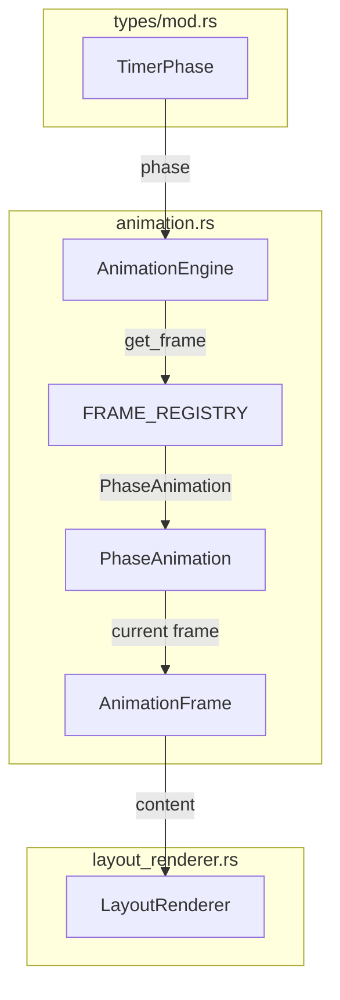
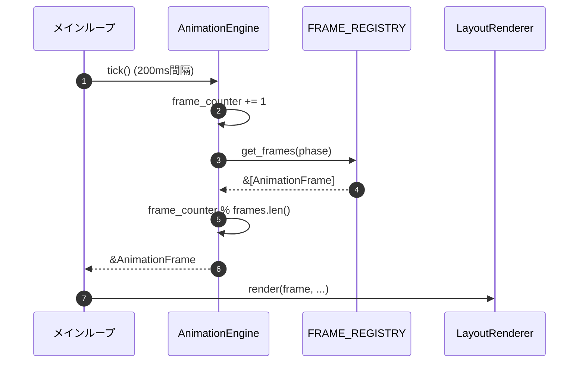

# AnimationEngine 詳細設計書

## メタ情報

| 項目 | 内容 |
|------|------|
| ドキュメントID | DETAIL-CLI-004-AE |
| 親設計書 | [BASIC-CLI-004_visual-enhancement.md](../../basic/BASIC-CLI-004_visual-enhancement.md) |
| 対応要件 | F-036（フェーズ別アニメーション） |
| バージョン | 1.0.0 |
| ステータス | ドラフト |
| 作成日 | 2026-01-10 |

---

## 1. 概要

### 1.1 目的

AnimationEngineは、タイマーの現在フェーズ（作業中/休憩中/長期休憩中）に応じたASCIIアニメーションを管理し、200ms間隔（5 FPS）でフレームを更新する責務を持つ。

### 1.2 スコープ

- フェーズ別アニメーションフレームの定義
- フレームカウンターによるループ再生
- 5 FPS（200ms間隔）でのフレーム更新
- 文字幅計算（unicode-width）によるレイアウト調整

---

## 2. アーキテクチャ

### 2.1 モジュール構成

```
src/cli/
├── display.rs       # 既存：Display構造体
├── time_format.rs   # TimeFormatter
├── animation.rs     # 新規：AnimationEngine、AnimationFrame、PhaseAnimation
└── mod.rs           # animation をpub mod
```

### 2.2 コンポーネント図



### 2.3 シーケンス図



---

## 3. データ型定義

### 3.1 AnimationFrame 構造体

```rust
use unicode_width::UnicodeWidthStr;

/// アニメーションの1フレーム
#[derive(Debug, Clone)]
pub struct AnimationFrame {
    /// フレームの内容（ASCIIアート文字列）
    pub content: String,
    /// 表示幅（全角文字考慮後）
    pub width: usize,
}

impl AnimationFrame {
    /// 新しいAnimationFrameを作成
    /// 
    /// # Arguments
    /// * `content` - フレームの内容
    /// 
    /// # Examples
    /// ```
    /// let frame = AnimationFrame::new("🏃💨 ─────");
    /// assert!(frame.width > 0);
    /// ```
    pub fn new(content: &str) -> Self {
        let width = UnicodeWidthStr::width(content);
        Self {
            content: content.to_string(),
            width,
        }
    }

    /// 指定幅に合わせてパディング
    pub fn padded(&self, target_width: usize) -> String {
        if self.width >= target_width {
            self.content.clone()
        } else {
            format!("{}{}", self.content, " ".repeat(target_width - self.width))
        }
    }
}
```

### 3.2 PhaseAnimation 構造体

```rust
use crate::types::TimerPhase;

/// フェーズ別アニメーション設定
#[derive(Debug, Clone)]
pub struct PhaseAnimation {
    /// フェーズ
    pub phase: TimerPhase,
    /// アニメーションフレーム
    pub frames: Vec<AnimationFrame>,
    /// 更新頻度（FPS）
    pub fps: u8,
}

impl PhaseAnimation {
    /// 作業中アニメーション（4フレーム）
    pub fn work() -> Self {
        Self {
            phase: TimerPhase::Working,
            frames: vec![
                AnimationFrame::new("🏃💨 ─────────────────────────────"),
                AnimationFrame::new(" 🏃💨 ────────────────────────────"),
                AnimationFrame::new("  🏃💨 ───────────────────────────"),
                AnimationFrame::new("   🏃💨 ──────────────────────────"),
            ],
            fps: 5,
        }
    }

    /// 休憩中アニメーション（4フレーム）
    pub fn short_break() -> Self {
        Self {
            phase: TimerPhase::Breaking,
            frames: vec![
                AnimationFrame::new("🧘 ～～～ ゆっくり休憩中 ～～～"),
                AnimationFrame::new("🧘  ～～～ ゆっくり休憩中 ～～～"),
                AnimationFrame::new("🧘 ～～～  ゆっくり休憩中 ～～～"),
                AnimationFrame::new("🧘  ～～～ ゆっくり休憩中  ～～～"),
            ],
            fps: 5,
        }
    }

    /// 長期休憩中アニメーション（2フレーム）
    pub fn long_break() -> Self {
        Self {
            phase: TimerPhase::LongBreaking,
            frames: vec![
                AnimationFrame::new("😴💤 zzz... ───────────────────"),
                AnimationFrame::new("😴💤  zzz... ──────────────────"),
            ],
            fps: 5,
        }
    }

    /// 一時停止中（静的表示）
    pub fn paused() -> Self {
        Self {
            phase: TimerPhase::Paused,
            frames: vec![
                AnimationFrame::new("   （一時停止中）"),
            ],
            fps: 5,
        }
    }

    /// フレーム数を取得
    pub fn frame_count(&self) -> usize {
        self.frames.len()
    }

    /// 指定インデックスのフレームを取得
    pub fn get_frame(&self, index: usize) -> &AnimationFrame {
        &self.frames[index % self.frames.len()]
    }
}
```

### 3.3 AnimationEngine 構造体

```rust
use std::collections::HashMap;
use crate::types::TimerPhase;

/// アニメーションエンジン
pub struct AnimationEngine {
    /// フェーズ別アニメーションレジストリ
    animations: HashMap<TimerPhase, PhaseAnimation>,
    /// 現在のフレームカウンター
    frame_counter: usize,
}

impl AnimationEngine {
    /// 新しいAnimationEngineを作成
    pub fn new() -> Self {
        let mut animations = HashMap::new();
        animations.insert(TimerPhase::Working, PhaseAnimation::work());
        animations.insert(TimerPhase::Breaking, PhaseAnimation::short_break());
        animations.insert(TimerPhase::LongBreaking, PhaseAnimation::long_break());
        animations.insert(TimerPhase::Paused, PhaseAnimation::paused());
        
        Self {
            animations,
            frame_counter: 0,
        }
    }

    /// フレームカウンターを進める
    pub fn tick(&mut self) {
        self.frame_counter = self.frame_counter.wrapping_add(1);
    }

    /// 現在のフレームを取得
    /// 
    /// # Arguments
    /// * `phase` - 現在のタイマーフェーズ
    /// 
    /// # Returns
    /// 現在表示すべきフレーム。該当フェーズがない場合はNone
    pub fn get_current_frame(&self, phase: TimerPhase) -> Option<&AnimationFrame> {
        self.animations.get(&phase).map(|anim| {
            anim.get_frame(self.frame_counter)
        })
    }

    /// フレームカウンターをリセット
    pub fn reset(&mut self) {
        self.frame_counter = 0;
    }

    /// 更新間隔を取得（ミリ秒）
    pub fn interval_ms(&self) -> u64 {
        200 // 5 FPS
    }
}

impl Default for AnimationEngine {
    fn default() -> Self {
        Self::new()
    }
}
```

---

## 4. アニメーション定義

### 4.1 作業中アニメーション（Working）

| フレーム | 内容 | 説明 |
|:--------:|------|------|
| 1 | `🏃💨 ─────────────────────────────` | 走る人が左端 |
| 2 | ` 🏃💨 ────────────────────────────` | 1文字右へ移動 |
| 3 | `  🏃💨 ───────────────────────────` | 2文字右へ移動 |
| 4 | `   🏃💨 ──────────────────────────` | 3文字右へ移動 |

**ループ**: フレーム4の後、フレーム1に戻る

### 4.2 休憩中アニメーション（Breaking）

| フレーム | 内容 | 説明 |
|:--------:|------|------|
| 1 | `🧘 ～～～ ゆっくり休憩中 ～～～` | 波線パターン1 |
| 2 | `🧘  ～～～ ゆっくり休憩中 ～～～` | スペース挿入 |
| 3 | `🧘 ～～～  ゆっくり休憩中 ～～～` | 中央スペース |
| 4 | `🧘  ～～～ ゆっくり休憩中  ～～～` | 両側スペース |

### 4.3 長期休憩中アニメーション（LongBreaking）

| フレーム | 内容 | 説明 |
|:--------:|------|------|
| 1 | `😴💤 zzz... ───────────────────` | zzz表示 |
| 2 | `😴💤  zzz... ──────────────────` | スペース挿入 |

### 4.4 一時停止中（Paused）

| フレーム | 内容 | 説明 |
|:--------:|------|------|
| 1 | `   （一時停止中）` | 静的表示（アニメーションなし） |

---

## 5. ビジネスルール実装

| ルールID | ルール | 実装方法 |
|---------|--------|---------|
| BR-094 | アニメーションは200ms間隔で更新 | `interval_ms() = 200` |
| BR-095 | 作業中アニメーションは4フレームでループ | `PhaseAnimation::work()` |
| BR-096 | 休憩中アニメーションは4フレームでループ | `PhaseAnimation::short_break()` |
| BR-097 | 長期休憩中アニメーションは2フレームでループ | `PhaseAnimation::long_break()` |
| BR-098 | アニメーションの横幅は30-40文字 | 各フレームを30-40文字で定義 |
| BR-099 | ターミナル幅に収まるように調整 | `AnimationFrame::padded()` |

---

## 6. 非同期更新ループ

### 6.1 アニメーション更新ループ

```rust
use tokio::time::{interval, Duration, MissedTickBehavior};
use std::sync::Arc;
use tokio::sync::Mutex;

/// アニメーション更新ループを開始
/// 
/// # Arguments
/// * `engine` - AnimationEngine（共有状態）
/// * `phase` - 現在のフェーズ（共有状態）
/// * `render_fn` - レンダリング関数
pub async fn animation_loop<F>(
    engine: Arc<Mutex<AnimationEngine>>,
    phase: Arc<Mutex<TimerPhase>>,
    mut render_fn: F,
) where
    F: FnMut(&AnimationFrame) + Send + 'static,
{
    let interval_ms = {
        let engine = engine.lock().await;
        engine.interval_ms()
    };
    
    let mut ticker = interval(Duration::from_millis(interval_ms));
    ticker.set_missed_tick_behavior(MissedTickBehavior::Skip);
    
    loop {
        ticker.tick().await;
        
        let frame = {
            let mut engine = engine.lock().await;
            engine.tick();
            
            let phase = *phase.lock().await;
            engine.get_current_frame(phase).cloned()
        };
        
        if let Some(frame) = frame {
            render_fn(&frame);
        }
    }
}
```

---

## 7. テスト設計

### 7.1 単体テスト

```rust
#[cfg(test)]
mod tests {
    use super::*;

    #[test]
    fn test_animation_frame_new() {
        let frame = AnimationFrame::new("🏃💨 ─────");
        assert!(!frame.content.is_empty());
        assert!(frame.width > 0);
    }

    #[test]
    fn test_animation_frame_padded() {
        let frame = AnimationFrame::new("test");
        let padded = frame.padded(10);
        assert_eq!(padded.len(), 10);
    }

    #[test]
    fn test_phase_animation_work() {
        let anim = PhaseAnimation::work();
        assert_eq!(anim.frame_count(), 4);
        assert_eq!(anim.fps, 5);
    }

    #[test]
    fn test_phase_animation_short_break() {
        let anim = PhaseAnimation::short_break();
        assert_eq!(anim.frame_count(), 4);
    }

    #[test]
    fn test_phase_animation_long_break() {
        let anim = PhaseAnimation::long_break();
        assert_eq!(anim.frame_count(), 2);
    }

    #[test]
    fn test_phase_animation_get_frame_loop() {
        let anim = PhaseAnimation::work();
        // フレーム数を超えてもループする
        let frame0 = anim.get_frame(0);
        let frame4 = anim.get_frame(4);
        assert_eq!(frame0.content, frame4.content);
    }

    #[test]
    fn test_animation_engine_new() {
        let engine = AnimationEngine::new();
        assert!(engine.get_current_frame(TimerPhase::Working).is_some());
        assert!(engine.get_current_frame(TimerPhase::Breaking).is_some());
        assert!(engine.get_current_frame(TimerPhase::LongBreaking).is_some());
    }

    #[test]
    fn test_animation_engine_tick() {
        let mut engine = AnimationEngine::new();
        let frame1 = engine.get_current_frame(TimerPhase::Working)
            .map(|f| f.content.clone());
        
        engine.tick();
        
        let frame2 = engine.get_current_frame(TimerPhase::Working)
            .map(|f| f.content.clone());
        
        assert_ne!(frame1, frame2);
    }

    #[test]
    fn test_animation_engine_reset() {
        let mut engine = AnimationEngine::new();
        engine.tick();
        engine.tick();
        engine.reset();
        
        let frame = engine.get_current_frame(TimerPhase::Working)
            .map(|f| f.content.clone());
        let expected = PhaseAnimation::work().get_frame(0).content.clone();
        
        assert_eq!(frame, Some(expected));
    }

    #[test]
    fn test_animation_engine_interval() {
        let engine = AnimationEngine::new();
        assert_eq!(engine.interval_ms(), 200);
    }

    #[test]
    fn test_animation_engine_stopped_phase() {
        let engine = AnimationEngine::new();
        // Stopped フェーズにはアニメーションがない
        assert!(engine.get_current_frame(TimerPhase::Stopped).is_none());
    }
}
```

---

## 8. パフォーマンス要件

| 指標 | 目標値 | 測定方法 |
|------|--------|---------|
| tick()実行時間 | 100ns以内 | `criterion`ベンチマーク |
| get_current_frame()実行時間 | 500ns以内 | `criterion`ベンチマーク |
| メモリ使用量 | 10KB以下 | `dhat`プロファイラ |
| CPU追加負荷 | 1%以下 | `top`コマンドで監視 |

---

## 9. フォールバック対応

### 9.1 絵文字非対応ターミナル

```rust
/// 絵文字対応チェック
pub fn supports_emoji() -> bool {
    // 環境変数でチェック
    std::env::var("TERM").map(|t| {
        t.contains("xterm") || t.contains("256color") || t.contains("kitty")
    }).unwrap_or(false)
}

/// ASCIIフォールバックアニメーション
impl PhaseAnimation {
    pub fn work_ascii() -> Self {
        Self {
            phase: TimerPhase::Working,
            frames: vec![
                AnimationFrame::new("[>] ================================"),
                AnimationFrame::new(" [>] ==============================="),
                AnimationFrame::new("  [>] =============================="),
                AnimationFrame::new("   [>] ============================="),
            ],
            fps: 5,
        }
    }
}
```

---

## 10. 変更履歴

| 日付 | バージョン | 変更内容 | 担当者 |
|:---|:---|:---|:---|
| 2026-01-10 | 1.0.0 | 初版作成 | - |
