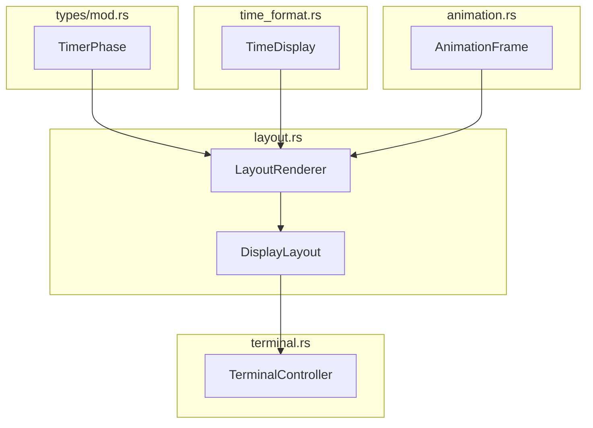

# LayoutRenderer 詳細設計書

## メタ情報

| 項目 | 内容 |
|------|------|
| ドキュメントID | DETAIL-CLI-004-LR |
| 親設計書 | [BASIC-CLI-004_visual-enhancement.md](../../basic/BASIC-CLI-004_visual-enhancement.md) |
| 対応要件 | F-037（統合レイアウト） |
| バージョン | 1.0.0 |
| ステータス | ドラフト |
| 作成日 | 2026-01-10 |

---

## 1. 概要

### 1.1 目的

LayoutRendererは、インジケーター、時間表示、アニメーション、タスク名を3行構成のレイアウトに統合し、一貫性のある表示を提供する責務を持つ。

### 1.2 スコープ

- 3行レイアウトの構築（1行目: ステータス、2行目: アニメーション、3行目: タスク名）
- indicatifとの統合（ProgressBar連携）
- レイアウト情報の構造化

---

## 2. アーキテクチャ

### 2.1 モジュール構成

```
src/cli/
├── display.rs        # 既存：Display構造体
├── time_format.rs    # TimeFormatter
├── animation.rs      # AnimationEngine
├── layout.rs         # 新規：LayoutRenderer、DisplayLayout
├── terminal.rs       # TerminalController
└── mod.rs            # layout をpub mod
```

### 2.2 コンポーネント図



### 2.3 レイアウト構造

```
┌──────────────────────────────────────────────────────────────┐
│ 1行目: [アイコン] [フェーズ名] [プログレスバー] [時間表示]      │
├──────────────────────────────────────────────────────────────┤
│ 2行目: [アニメーションフレーム]                                │
├──────────────────────────────────────────────────────────────┤
│ 3行目: タスク: [タスク名] （オプション）                       │
└──────────────────────────────────────────────────────────────┘
```

---

## 3. データ型定義

### 3.1 DisplayLayout 構造体

```rust
/// 3行レイアウトの構造
#[derive(Debug, Clone)]
pub struct DisplayLayout {
    /// 1行目: フェーズ＋インジケーター＋時間
    pub line1: String,
    /// 2行目: アニメーション
    pub line2: String,
    /// 3行目: タスク名（オプション）
    pub line3: Option<String>,
    /// 行数（2 or 3）
    pub line_count: usize,
}

impl DisplayLayout {
    /// レイアウトを作成
    pub fn new(line1: String, line2: String, line3: Option<String>) -> Self {
        let line_count = if line3.is_some() { 3 } else { 2 };
        Self { line1, line2, line3, line_count }
    }

    /// 全行をベクタで取得
    pub fn lines(&self) -> Vec<&str> {
        let mut result = vec![self.line1.as_str(), self.line2.as_str()];
        if let Some(ref line3) = self.line3 {
            result.push(line3.as_str());
        }
        result
    }

    /// 最大行幅を取得
    pub fn max_width(&self) -> usize {
        use unicode_width::UnicodeWidthStr;
        
        let mut max = UnicodeWidthStr::width(self.line1.as_str());
        max = max.max(UnicodeWidthStr::width(self.line2.as_str()));
        if let Some(ref line3) = self.line3 {
            max = max.max(UnicodeWidthStr::width(line3.as_str()));
        }
        max
    }
}
```

### 3.2 LayoutRenderer 構造体

```rust
use crate::types::TimerPhase;
use crate::cli::time_format::TimeDisplay;
use crate::cli::animation::AnimationFrame;
use colored::Colorize;

/// レイアウトレンダラー
pub struct LayoutRenderer {
    /// ターミナル幅（80文字未満で簡略表示）
    terminal_width: usize,
    /// プログレスバー幅
    bar_width: usize,
}

impl LayoutRenderer {
    /// 新しいLayoutRendererを作成
    pub fn new(terminal_width: usize) -> Self {
        // プログレスバー幅を計算（ターミナル幅の40%、最大40文字）
        let bar_width = ((terminal_width as f32) * 0.4).min(40.0) as usize;
        Self {
            terminal_width,
            bar_width,
        }
    }

    /// デフォルトのターミナル幅（80文字）で作成
    pub fn with_default_width() -> Self {
        Self::new(80)
    }

    /// レイアウトを構築
    /// 
    /// # Arguments
    /// * `phase` - 現在のフェーズ
    /// * `time_display` - 時間表示情報
    /// * `animation_frame` - アニメーションフレーム
    /// * `task_name` - タスク名（オプション）
    /// * `progress_position` - プログレス位置（0-100）
    pub fn build_layout(
        &self,
        phase: TimerPhase,
        time_display: &TimeDisplay,
        animation_frame: Option<&AnimationFrame>,
        task_name: Option<&str>,
        progress_position: u64,
        progress_total: u64,
    ) -> DisplayLayout {
        // 1行目: フェーズ + プログレスバー + 時間
        let line1 = self.build_line1(phase, time_display, progress_position, progress_total);
        
        // 2行目: アニメーション
        let line2 = match animation_frame {
            Some(frame) => frame.content.clone(),
            None => String::new(),
        };
        
        // 3行目: タスク名
        let line3 = task_name.map(|name| format!("タスク: {}", name.cyan()));
        
        DisplayLayout::new(line1, line2, line3)
    }

    /// 1行目を構築
    fn build_line1(
        &self,
        phase: TimerPhase,
        time_display: &TimeDisplay,
        position: u64,
        total: u64,
    ) -> String {
        let (icon, label, color) = Self::phase_style(phase);
        
        // プログレスバーを構築
        let bar = self.build_progress_bar(position, total);
        
        // 時間表示
        let time_str = time_display.format();
        
        // フェーズ表示
        let phase_str = format!("{} {}", icon, label).color(color).to_string();
        
        format!("{} {} {}", phase_str, bar, time_str)
    }

    /// プログレスバーを構築
    fn build_progress_bar(&self, position: u64, total: u64) -> String {
        if total == 0 {
            return format!("[{}]", "░".repeat(self.bar_width));
        }
        
        let filled = ((position as f64 / total as f64) * self.bar_width as f64) as usize;
        let empty = self.bar_width.saturating_sub(filled);
        
        format!("[{}{}]", "█".repeat(filled), "░".repeat(empty))
    }

    /// フェーズのスタイルを取得
    fn phase_style(phase: TimerPhase) -> (&'static str, &'static str, &'static str) {
        match phase {
            TimerPhase::Working => ("🍅", "作業中", "red"),
            TimerPhase::Breaking => ("☕", "休憩中", "green"),
            TimerPhase::LongBreaking => ("🛏️", "長期休憩中", "blue"),
            TimerPhase::Paused => ("⏸️", "一時停止", "yellow"),
            TimerPhase::Stopped => ("⏹", "停止", "white"),
        }
    }

    /// ターミナル幅を更新
    pub fn set_terminal_width(&mut self, width: usize) {
        self.terminal_width = width;
        self.bar_width = ((width as f32) * 0.4).min(40.0) as usize;
    }
}

impl Default for LayoutRenderer {
    fn default() -> Self {
        Self::with_default_width()
    }
}
```

---

## 4. indicatifとの統合

### 4.1 統合方針

indicatifのProgressBarを使用しつつ、カスタムテンプレートで3行レイアウトを実現する。

```rust
use indicatif::{ProgressBar, ProgressStyle};

impl LayoutRenderer {
    /// indicatifのProgressBarを作成
    pub fn create_progress_bar(
        &self,
        phase: TimerPhase,
        total_seconds: u64,
    ) -> ProgressBar {
        let (_, _, color) = Self::phase_style(phase);
        
        // 2行テンプレート（indicatifは改行をサポート）
        let template = format!(
            "{{prefix}} [{{bar:{}.{}}}] {{msg}}\n{{wide_msg}}",
            self.bar_width,
            color
        );
        
        let style = ProgressStyle::with_template(&template)
            .unwrap()
            .progress_chars("█░");
        
        let bar = ProgressBar::new(total_seconds);
        bar.set_style(style);
        bar
    }

    /// ProgressBarを更新
    pub fn update_progress_bar(
        &self,
        bar: &ProgressBar,
        layout: &DisplayLayout,
        position: u64,
    ) {
        bar.set_position(position);
        bar.set_message(layout.line1.clone());
        
        // wide_msgにアニメーションとタスク名を設定
        let wide_msg = match &layout.line3 {
            Some(task) => format!("{}\n{}", layout.line2, task),
            None => layout.line2.clone(),
        };
        bar.set_prefix(wide_msg);
    }
}
```

### 4.2 独自レンダリング（フォールバック）

indicatifとの競合がある場合、独自レンダリングに切り替える。

```rust
impl LayoutRenderer {
    /// 独自レンダリング（indicatif非使用）
    pub fn render_standalone(&self, layout: &DisplayLayout) -> String {
        let mut output = String::new();
        output.push_str(&layout.line1);
        output.push('\n');
        output.push_str(&layout.line2);
        if let Some(ref line3) = layout.line3 {
            output.push('\n');
            output.push_str(line3);
        }
        output
    }
}
```

---

## 5. ビジネスルール実装

| ルールID | ルール | 実装方法 |
|---------|--------|---------|
| BR-100 | 1行目は常に表示 | `build_layout()`で必須生成 |
| BR-101 | 2行目はアニメーション専用 | `line2`にAnimationFrame.content |
| BR-102 | 3行目はタスク名がある場合のみ | `Option<String>`で表現 |
| BR-103 | 各行の更新は独立 | `DisplayLayout`で構造化 |
| BR-104 | カーソル位置の保存・復元 | `TerminalController`で実装 |

---

## 6. テスト設計

### 6.1 単体テスト

```rust
#[cfg(test)]
mod tests {
    use super::*;
    use crate::cli::time_format::TimeDisplay;
    use crate::cli::animation::AnimationFrame;

    #[test]
    fn test_display_layout_new_with_task() {
        let layout = DisplayLayout::new(
            "line1".to_string(),
            "line2".to_string(),
            Some("line3".to_string()),
        );
        assert_eq!(layout.line_count, 3);
    }

    #[test]
    fn test_display_layout_new_without_task() {
        let layout = DisplayLayout::new(
            "line1".to_string(),
            "line2".to_string(),
            None,
        );
        assert_eq!(layout.line_count, 2);
    }

    #[test]
    fn test_display_layout_lines() {
        let layout = DisplayLayout::new(
            "a".to_string(),
            "b".to_string(),
            Some("c".to_string()),
        );
        let lines = layout.lines();
        assert_eq!(lines, vec!["a", "b", "c"]);
    }

    #[test]
    fn test_layout_renderer_new() {
        let renderer = LayoutRenderer::new(80);
        assert_eq!(renderer.terminal_width, 80);
        assert_eq!(renderer.bar_width, 32); // 80 * 0.4 = 32
    }

    #[test]
    fn test_layout_renderer_build_layout() {
        let renderer = LayoutRenderer::new(80);
        let time_display = TimeDisplay::new(323, 1500);
        let frame = AnimationFrame::new("🏃💨 ─────");
        
        let layout = renderer.build_layout(
            TimerPhase::Working,
            &time_display,
            Some(&frame),
            Some("テストタスク"),
            323,
            1500,
        );
        
        assert!(layout.line1.contains("作業中"));
        assert!(layout.line2.contains("🏃"));
        assert!(layout.line3.is_some());
    }

    #[test]
    fn test_layout_renderer_build_progress_bar() {
        let renderer = LayoutRenderer::new(80);
        
        let bar = renderer.build_progress_bar(50, 100);
        assert!(bar.contains("█"));
        assert!(bar.contains("░"));
    }

    #[test]
    fn test_layout_renderer_phase_style() {
        let (icon, label, color) = LayoutRenderer::phase_style(TimerPhase::Working);
        assert_eq!(icon, "🍅");
        assert_eq!(label, "作業中");
        assert_eq!(color, "red");
    }

    #[test]
    fn test_layout_renderer_render_standalone() {
        let renderer = LayoutRenderer::new(80);
        let layout = DisplayLayout::new(
            "line1".to_string(),
            "line2".to_string(),
            Some("line3".to_string()),
        );
        
        let output = renderer.render_standalone(&layout);
        assert!(output.contains("line1"));
        assert!(output.contains("line2"));
        assert!(output.contains("line3"));
    }
}
```

---

## 7. パフォーマンス要件

| 指標 | 目標値 | 測定方法 |
|------|--------|---------|
| build_layout()実行時間 | 10μs以内 | `criterion`ベンチマーク |
| render_standalone()実行時間 | 5μs以内 | `criterion`ベンチマーク |
| メモリ割り当て | 3回以下（String生成） | `dhat`プロファイラ |

---

## 8. 変更履歴

| 日付 | バージョン | 変更内容 | 担当者 |
|:---|:---|:---|:---|
| 2026-01-10 | 1.0.0 | 初版作成 | - |
