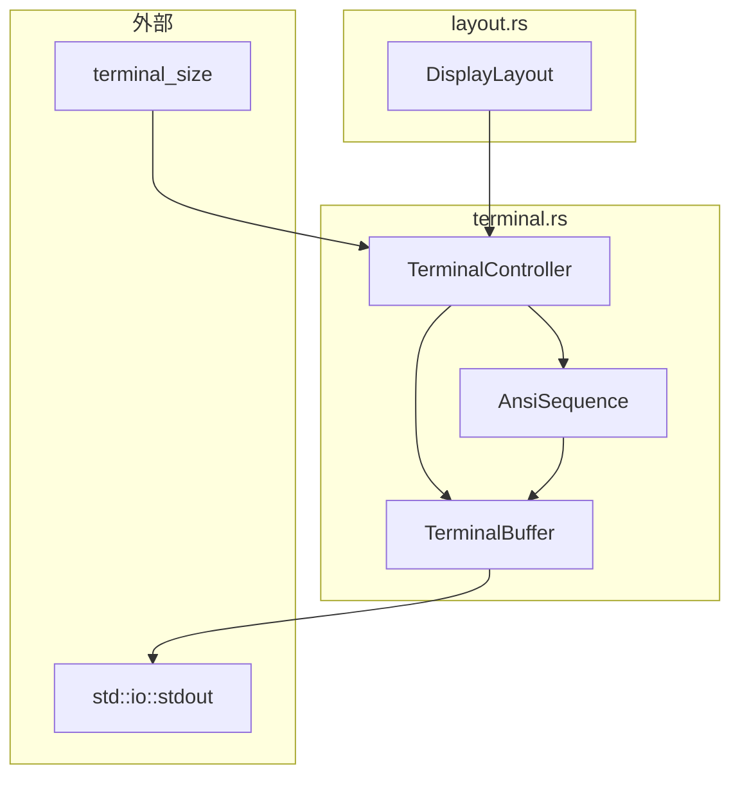
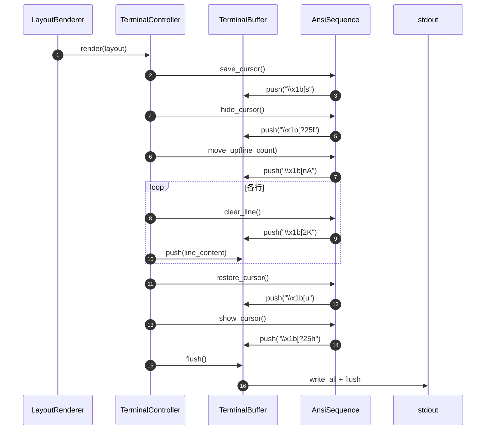

# TerminalController 詳細設計書

## メタ情報

| 項目 | 内容 |
|------|------|
| ドキュメントID | DETAIL-CLI-004-TC |
| 親設計書 | [BASIC-CLI-004_visual-enhancement.md](../../basic/BASIC-CLI-004_visual-enhancement.md) |
| 対応要件 | F-037（統合レイアウト） |
| バージョン | 1.0.0 |
| ステータス | ドラフト |
| 作成日 | 2026-01-10 |

---

## 1. 概要

### 1.1 目的

TerminalControllerは、ANSIエスケープシーケンスを使用してターミナルのカーソル制御、画面クリア、ちらつき防止を実現する責務を持つ。LayoutRendererから受け取ったDisplayLayoutを、ちらつきなく滑らかにターミナルへ出力する。

### 1.2 スコープ

- ANSIエスケープシーケンスによるカーソル制御
- カーソル位置の保存・復元
- 行単位のクリアと描画
- ちらつき防止処理（バッファリング出力）
- ターミナル幅の取得

---

## 2. アーキテクチャ

### 2.1 モジュール構成

```
src/cli/
├── display.rs        # 既存：Display構造体
├── time_format.rs    # TimeFormatter
├── animation.rs      # AnimationEngine
├── layout.rs         # LayoutRenderer、DisplayLayout
├── terminal.rs       # 新規：TerminalController、AnsiSequence
└── mod.rs            # terminal をpub mod
```

### 2.2 コンポーネント図



### 2.3 データフロー



---

## 3. データ型定義

### 3.1 AnsiSequence 列挙型

```rust
/// ANSIエスケープシーケンス定義
pub enum AnsiSequence {
    /// カーソル位置を保存
    SaveCursor,
    /// カーソル位置を復元
    RestoreCursor,
    /// カーソルを非表示
    HideCursor,
    /// カーソルを表示
    ShowCursor,
    /// カーソルをn行上に移動
    MoveUp(u16),
    /// カーソルをn行下に移動
    MoveDown(u16),
    /// カーソルをn列目に移動（1-indexed）
    MoveToColumn(u16),
    /// 現在行をクリア
    ClearLine,
    /// 行末までクリア
    ClearToEndOfLine,
    /// 画面クリア
    ClearScreen,
}

impl AnsiSequence {
    /// エスケープシーケンスを文字列として取得
    pub fn as_str(&self) -> &'static str {
        match self {
            Self::SaveCursor => "\x1b[s",
            Self::RestoreCursor => "\x1b[u",
            Self::HideCursor => "\x1b[?25l",
            Self::ShowCursor => "\x1b[?25h",
            Self::ClearLine => "\x1b[2K",
            Self::ClearToEndOfLine => "\x1b[K",
            Self::ClearScreen => "\x1b[2J",
            // 動的パラメータを持つものは別メソッドで処理
            _ => "",
        }
    }

    /// 動的パラメータを含むシーケンスを文字列として取得
    pub fn to_string(&self) -> String {
        match self {
            Self::MoveUp(n) => format!("\x1b[{}A", n),
            Self::MoveDown(n) => format!("\x1b[{}B", n),
            Self::MoveToColumn(n) => format!("\x1b[{}G", n),
            _ => self.as_str().to_string(),
        }
    }
}

impl std::fmt::Display for AnsiSequence {
    fn fmt(&self, f: &mut std::fmt::Formatter<'_>) -> std::fmt::Result {
        write!(f, "{}", self.to_string())
    }
}
```

### 3.2 TerminalBuffer 構造体

```rust
use std::io::{self, Write};

/// 出力バッファ（バッチ出力によるちらつき防止）
pub struct TerminalBuffer {
    /// 内部バッファ
    buffer: Vec<u8>,
    /// 容量（デフォルト4KB）
    capacity: usize,
}

impl TerminalBuffer {
    /// 新しいバッファを作成（デフォルト容量）
    pub fn new() -> Self {
        Self::with_capacity(4096)
    }

    /// 指定容量でバッファを作成
    pub fn with_capacity(capacity: usize) -> Self {
        Self {
            buffer: Vec::with_capacity(capacity),
            capacity,
        }
    }

    /// 文字列をバッファに追加
    pub fn push(&mut self, s: &str) {
        self.buffer.extend_from_slice(s.as_bytes());
    }

    /// ANSIシーケンスをバッファに追加
    pub fn push_sequence(&mut self, seq: AnsiSequence) {
        self.push(&seq.to_string());
    }

    /// 改行を追加
    pub fn push_newline(&mut self) {
        self.buffer.push(b'\n');
    }

    /// バッファをstdoutにフラッシュ
    pub fn flush(&mut self) -> io::Result<()> {
        let mut stdout = io::stdout().lock();
        stdout.write_all(&self.buffer)?;
        stdout.flush()?;
        self.buffer.clear();
        Ok(())
    }

    /// バッファをクリア（フラッシュせず）
    pub fn clear(&mut self) {
        self.buffer.clear();
    }

    /// 現在のバッファサイズ
    pub fn len(&self) -> usize {
        self.buffer.len()
    }

    /// バッファが空かどうか
    pub fn is_empty(&self) -> bool {
        self.buffer.is_empty()
    }
}

impl Default for TerminalBuffer {
    fn default() -> Self {
        Self::new()
    }
}
```

### 3.3 TerminalController 構造体

```rust
use crate::cli::layout::DisplayLayout;

/// ターミナル制御
pub struct TerminalController {
    /// 出力バッファ
    buffer: TerminalBuffer,
    /// ターミナル幅
    width: u16,
    /// ターミナル高さ
    height: u16,
    /// 前回レンダリングした行数
    last_line_count: u16,
    /// カーソルが非表示かどうか
    cursor_hidden: bool,
}

impl TerminalController {
    /// 新しいTerminalControllerを作成
    pub fn new() -> Self {
        let (width, height) = Self::get_terminal_size();
        Self {
            buffer: TerminalBuffer::new(),
            width,
            height,
            last_line_count: 0,
            cursor_hidden: false,
        }
    }

    /// ターミナルサイズを取得
    fn get_terminal_size() -> (u16, u16) {
        terminal_size::terminal_size()
            .map(|(w, h)| (w.0, h.0))
            .unwrap_or((80, 24)) // デフォルト: 80x24
    }

    /// ターミナル幅を取得
    pub fn width(&self) -> u16 {
        self.width
    }

    /// ターミナル高さを取得
    pub fn height(&self) -> u16 {
        self.height
    }

    /// ターミナルサイズを更新
    pub fn refresh_size(&mut self) {
        let (width, height) = Self::get_terminal_size();
        self.width = width;
        self.height = height;
    }

    /// DisplayLayoutをレンダリング
    pub fn render(&mut self, layout: &DisplayLayout) -> io::Result<()> {
        let line_count = layout.line_count as u16;

        // 初回レンダリング時は改行でスペース確保
        if self.last_line_count == 0 {
            self.initialize_display(line_count)?;
        }

        // ちらつき防止レンダリング開始
        self.buffer.push_sequence(AnsiSequence::SaveCursor);
        self.buffer.push_sequence(AnsiSequence::HideCursor);

        // 前回の行数分だけ上に移動
        if self.last_line_count > 0 {
            self.buffer.push_sequence(AnsiSequence::MoveUp(self.last_line_count));
        }

        // 各行をクリア＋描画
        for line in layout.lines() {
            self.buffer.push_sequence(AnsiSequence::ClearLine);
            self.buffer.push(line);
            self.buffer.push_newline();
        }

        // 行数が減った場合、残りの行もクリア
        if line_count < self.last_line_count {
            for _ in 0..(self.last_line_count - line_count) {
                self.buffer.push_sequence(AnsiSequence::ClearLine);
                self.buffer.push_newline();
            }
        }

        // ちらつき防止レンダリング終了
        self.buffer.push_sequence(AnsiSequence::RestoreCursor);
        self.buffer.push_sequence(AnsiSequence::ShowCursor);

        // バッファをフラッシュ
        self.buffer.flush()?;

        // 状態更新
        self.last_line_count = line_count.max(self.last_line_count);

        Ok(())
    }

    /// 初回表示時のスペース確保
    fn initialize_display(&mut self, line_count: u16) -> io::Result<()> {
        for _ in 0..line_count {
            self.buffer.push_newline();
        }
        self.buffer.flush()
    }

    /// 表示をクリアしてリセット
    pub fn clear(&mut self) -> io::Result<()> {
        if self.last_line_count > 0 {
            self.buffer.push_sequence(AnsiSequence::SaveCursor);
            self.buffer.push_sequence(AnsiSequence::MoveUp(self.last_line_count));
            for _ in 0..self.last_line_count {
                self.buffer.push_sequence(AnsiSequence::ClearLine);
                self.buffer.push_newline();
            }
            self.buffer.push_sequence(AnsiSequence::RestoreCursor);
            self.buffer.flush()?;
        }
        self.last_line_count = 0;
        Ok(())
    }

    /// カーソルを非表示にする
    pub fn hide_cursor(&mut self) -> io::Result<()> {
        if !self.cursor_hidden {
            self.buffer.push_sequence(AnsiSequence::HideCursor);
            self.buffer.flush()?;
            self.cursor_hidden = true;
        }
        Ok(())
    }

    /// カーソルを表示する
    pub fn show_cursor(&mut self) -> io::Result<()> {
        if self.cursor_hidden {
            self.buffer.push_sequence(AnsiSequence::ShowCursor);
            self.buffer.flush()?;
            self.cursor_hidden = false;
        }
        Ok(())
    }

    /// 終了時のクリーンアップ（Drop用）
    pub fn cleanup(&mut self) -> io::Result<()> {
        // カーソルを確実に表示状態に
        if self.cursor_hidden {
            self.show_cursor()?;
        }
        Ok(())
    }
}

impl Default for TerminalController {
    fn default() -> Self {
        Self::new()
    }
}

impl Drop for TerminalController {
    fn drop(&mut self) {
        // エラーは無視（Dropでpanicしない）
        let _ = self.cleanup();
    }
}
```

---

## 4. ANSIエスケープシーケンス仕様

### 4.1 使用するシーケンス一覧

| シーケンス | コード | 説明 | 用途 |
|-----------|--------|------|------|
| CSI s | `\x1b[s` | カーソル位置保存 | 更新前の位置を記憶 |
| CSI u | `\x1b[u` | カーソル位置復元 | 更新後に元の位置へ |
| CSI ?25l | `\x1b[?25l` | カーソル非表示 | 更新中のちらつき防止 |
| CSI ?25h | `\x1b[?25h` | カーソル表示 | 更新完了後に表示 |
| CSI nA | `\x1b[nA` | カーソルをn行上へ | 既存行の上書き |
| CSI nB | `\x1b[nB` | カーソルをn行下へ | 行移動 |
| CSI nG | `\x1b[nG` | カーソルをn列目へ | 列位置調整 |
| CSI 2K | `\x1b[2K` | 現在行をクリア | 古い内容の消去 |
| CSI K | `\x1b[K` | 行末までクリア | 部分クリア |
| CSI 2J | `\x1b[2J` | 画面全体クリア | リセット時 |

### 4.2 ちらつき防止の仕組み

```
1. カーソル位置保存（ユーザーのカーソル位置を保持）
2. カーソル非表示（カーソルの点滅を一時停止）
3. カーソルをn行上へ移動（既存表示の先頭へ）
4. 各行をクリア＋新内容描画（上から順に更新）
5. カーソル位置復元（元の位置へ戻す）
6. カーソル表示（カーソルの点滅を再開）
7. 一括フラッシュ（全変更を一度に出力）
```

### 4.3 バッファリング出力

```rust
/// 非効率な出力（システムコール多発）
fn bad_render(layout: &DisplayLayout) {
    print!("\x1b[s");    // syscall
    print!("\x1b[?25l"); // syscall
    print!("\x1b[3A");   // syscall
    print!("{}", layout.line1); // syscall
    // ... 合計10回以上のsyscall
}

/// 効率的な出力（バッファリング）
fn good_render(layout: &DisplayLayout) {
    let mut buf = TerminalBuffer::new();
    buf.push_sequence(AnsiSequence::SaveCursor);
    buf.push_sequence(AnsiSequence::HideCursor);
    buf.push_sequence(AnsiSequence::MoveUp(3));
    buf.push(&layout.line1);
    // ... すべてバッファに追加
    buf.flush(); // 1回のsyscallで全出力
}
```

---

## 5. ビジネスルール実装

| ルールID | ルール | 実装方法 |
|---------|--------|------------|
| BR-104 | カーソル位置を保存・復元 | `render()`で`SaveCursor`/`RestoreCursor`使用 |
| BR-105 | 更新中はカーソル非表示 | `render()`で`HideCursor`/`ShowCursor`使用 |
| BR-106 | 行単位でクリア後に描画 | `ClearLine` + 内容描画の順序を保証 |
| BR-107 | バッチ出力でちらつき防止 | `TerminalBuffer`で一括フラッシュ |
| BR-108 | 終了時はカーソルを表示状態に | `Drop`トレイトで`cleanup()`呼び出し |

---

## 6. エラーハンドリング

### 6.1 エラー種別

| エラー | 発生条件 | 対処方法 |
|--------|---------|----------|
| `io::Error` | stdout書き込み失敗 | `Result`で伝播、呼び出し元で処理 |
| ターミナルサイズ取得失敗 | 非TTY環境、パイプ出力 | デフォルト80x24を使用 |

### 6.2 フォールバック動作

```rust
impl TerminalController {
    /// 安全なレンダリング（エラー時はシンプル出力）
    pub fn render_safe(&mut self, layout: &DisplayLayout) {
        if self.render(layout).is_err() {
            // フォールバック: シンプルな出力
            for line in layout.lines() {
                println!("{}", line);
            }
        }
    }
}
```

### 6.3 非TTY環境対応

```rust
impl TerminalController {
    /// TTY環境かどうかを確認
    pub fn is_tty() -> bool {
        use std::io::IsTerminal;
        std::io::stdout().is_terminal()
    }

    /// TTYに応じたレンダリング
    pub fn render_adaptive(&mut self, layout: &DisplayLayout) -> io::Result<()> {
        if Self::is_tty() {
            self.render(layout)
        } else {
            // パイプ出力: ANSIシーケンスなし
            for line in layout.lines() {
                println!("{}", line);
            }
            Ok(())
        }
    }
}
```

---

## 7. テスト設計

### 7.1 単体テスト

```rust
#[cfg(test)]
mod tests {
    use super::*;

    #[test]
    fn test_ansi_sequence_save_cursor() {
        assert_eq!(AnsiSequence::SaveCursor.to_string(), "\x1b[s");
    }

    #[test]
    fn test_ansi_sequence_restore_cursor() {
        assert_eq!(AnsiSequence::RestoreCursor.to_string(), "\x1b[u");
    }

    #[test]
    fn test_ansi_sequence_hide_cursor() {
        assert_eq!(AnsiSequence::HideCursor.to_string(), "\x1b[?25l");
    }

    #[test]
    fn test_ansi_sequence_show_cursor() {
        assert_eq!(AnsiSequence::ShowCursor.to_string(), "\x1b[?25h");
    }

    #[test]
    fn test_ansi_sequence_move_up() {
        assert_eq!(AnsiSequence::MoveUp(3).to_string(), "\x1b[3A");
        assert_eq!(AnsiSequence::MoveUp(1).to_string(), "\x1b[1A");
        assert_eq!(AnsiSequence::MoveUp(10).to_string(), "\x1b[10A");
    }

    #[test]
    fn test_ansi_sequence_move_down() {
        assert_eq!(AnsiSequence::MoveDown(2).to_string(), "\x1b[2B");
    }

    #[test]
    fn test_ansi_sequence_move_to_column() {
        assert_eq!(AnsiSequence::MoveToColumn(1).to_string(), "\x1b[1G");
        assert_eq!(AnsiSequence::MoveToColumn(80).to_string(), "\x1b[80G");
    }

    #[test]
    fn test_ansi_sequence_clear_line() {
        assert_eq!(AnsiSequence::ClearLine.to_string(), "\x1b[2K");
    }

    #[test]
    fn test_terminal_buffer_push() {
        let mut buf = TerminalBuffer::new();
        buf.push("hello");
        assert_eq!(buf.len(), 5);
    }

    #[test]
    fn test_terminal_buffer_push_sequence() {
        let mut buf = TerminalBuffer::new();
        buf.push_sequence(AnsiSequence::SaveCursor);
        assert_eq!(buf.len(), 3); // "\x1b[s" = 3 bytes
    }

    #[test]
    fn test_terminal_buffer_push_newline() {
        let mut buf = TerminalBuffer::new();
        buf.push_newline();
        assert_eq!(buf.len(), 1);
    }

    #[test]
    fn test_terminal_buffer_clear() {
        let mut buf = TerminalBuffer::new();
        buf.push("test");
        buf.clear();
        assert!(buf.is_empty());
    }

    #[test]
    fn test_terminal_controller_default_size() {
        // 注意: 実際のテストではモックが必要
        // ここでは構造体の生成のみ確認
        let tc = TerminalController::new();
        assert!(tc.width() > 0);
        assert!(tc.height() > 0);
    }

    #[test]
    fn test_terminal_controller_is_tty() {
        // CI環境では false になることが多い
        let _ = TerminalController::is_tty();
    }
}
```

### 7.2 統合テスト

```rust
#[cfg(test)]
mod integration_tests {
    use super::*;
    use crate::cli::layout::DisplayLayout;

    #[test]
    fn test_render_two_line_layout() {
        let layout = DisplayLayout::new(
            "Line 1: Status".to_string(),
            "Line 2: Animation".to_string(),
            None,
        );

        let mut tc = TerminalController::new();
        // 注意: 実際のターミナル出力はCIで検証困難
        // モックを使用するか、出力をキャプチャする
        let result = tc.render(&layout);
        // 非TTY環境ではエラーになる可能性があるため、結果のみ確認
        let _ = result;
    }

    #[test]
    fn test_render_three_line_layout() {
        let layout = DisplayLayout::new(
            "Line 1: Status".to_string(),
            "Line 2: Animation".to_string(),
            Some("Line 3: Task".to_string()),
        );

        let mut tc = TerminalController::new();
        let _ = tc.render(&layout);
    }

    #[test]
    fn test_clear_after_render() {
        let layout = DisplayLayout::new(
            "Test".to_string(),
            "Test".to_string(),
            None,
        );

        let mut tc = TerminalController::new();
        let _ = tc.render(&layout);
        let _ = tc.clear();
    }
}
```

---

## 8. パフォーマンス要件

| 指標 | 目標値 | 測定方法 |
|------|--------|---------| 
| render()実行時間 | 1ms以内 | `criterion`ベンチマーク |
| バッファフラッシュ | 1回/render | システムコールカウント |
| メモリ使用量 | 8KB以下（バッファ含む） | `dhat`プロファイラ |

### 8.1 ベンチマーク

```rust
#[cfg(test)]
mod benchmarks {
    use super::*;
    use criterion::{black_box, Criterion};

    pub fn benchmark_render(c: &mut Criterion) {
        let layout = DisplayLayout::new(
            "🍅 作業中 ████████░░░░░░░░ 05:23/25:00 (21%)".to_string(),
            "🏃💨 ─────────────────────────────".to_string(),
            Some("タスク: テスト".to_string()),
        );

        c.bench_function("terminal_controller_render", |b| {
            let mut tc = TerminalController::new();
            b.iter(|| {
                let _ = tc.render(black_box(&layout));
            })
        });
    }
}
```

---

## 9. ターミナル互換性

### 9.1 対応ターミナル

| ターミナル | サポート状況 | 備考 |
|-----------|-------------|------|
| iTerm2 | 完全対応 | 推奨環境 |
| Terminal.app | 完全対応 | macOS標準 |
| Alacritty | 完全対応 | 高速ターミナル |
| Kitty | 完全対応 | GPU加速 |
| VS Code Terminal | 完全対応 | 開発環境 |

### 9.2 非対応・制限環境

| 環境 | 制限事項 | 対処 |
|------|---------|------|
| パイプ出力 | ANSIシーケンス無効 | `render_adaptive()`使用 |
| Windows CMD | 一部シーケンス非対応 | macOS専用のためスコープ外 |
| リモートSSH | 遅延による表示乱れ | バッファリングで軽減 |

---

## 10. 依存関係

### 10.1 外部クレート

| クレート | バージョン | 用途 |
|---------|-----------|------|
| terminal_size | 0.4+ | ターミナルサイズ取得 |

### 10.2 内部依存

| モジュール | 依存先 | 用途 |
|-----------|--------|------|
| terminal.rs | layout.rs | DisplayLayout型 |
| terminal.rs | std::io | stdout出力 |

---

## 11. 変更履歴

| 日付 | バージョン | 変更内容 | 担当者 |
|:---|:---|:---|:---|
| 2026-01-10 | 1.0.0 | 初版作成 | - |
