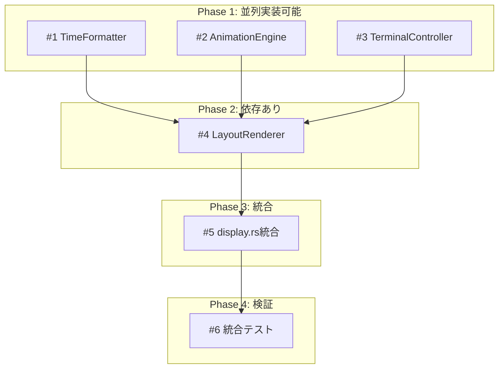

# Issue計画書（REQ-CLI-004）

## メタ情報

| 項目 | 内容 |
|------|------|
| ドキュメントID | DETAIL-CLI-004-ISSUE |
| 親設計書 | [BASIC-CLI-004_visual-enhancement.md](../../../basic/BASIC-CLI-004_visual-enhancement.md) |
| 対応要件 | REQ-CLI-004 |
| バージョン | 1.0.0 |
| ステータス | ドラフト |
| 作成日 | 2026-01-10 |

---

## 1. 概要

### 1.1 目的

本計画書は、表示改善機能（REQ-CLI-004）の実装をGitHub Issueとして分解し、依存関係と実行順序を定義する。

### 1.2 分割方針

- 各Issueは**200行以下**の実装に収める
- 依存関係を明確にし、並列実行可能なIssueを特定
- テストコードは実装Issueに含める（TDD）

---

## 2. Epic Issue

### 2.1 Epic概要

| 項目 | 内容 |
|------|------|
| GitHub Issue | [#121](https://github.com/takemo101/agent-bench/issues/121) |
| タイトル | [Epic] 表示改善機能（REQ-CLI-004） |
| ラベル | `epic`, `enhancement`, `cli`, `ui` |
| マイルストーン | v0.4.0 |
| 見積もり | 5-7日 |

### 2.2 Epic本文テンプレート

```markdown
## 概要

REQ-CLI-004で定義された表示改善機能を実装する。

## 対象機能

- [ ] F-035: 時間表示フォーマット改善（`MM:SS/MM:SS (PP%)`形式）
- [ ] F-036: フェーズ別ASCIIアニメーション
- [ ] F-037: 統合レイアウト（3行表示）

## 設計書

- 基本設計: [BASIC-CLI-004](docs/designs/basic/BASIC-CLI-004_visual-enhancement.md)
- 詳細設計: [visual-enhancement/](docs/designs/detailed/visual-enhancement/)

## 子Issue一覧

| # | Issue | 対象機能 | 依存 | 見積もり |
|---|-------|---------|------|---------|
| 1 | #XXX TimeFormatter実装 | F-035 | なし | 2h |
| 2 | #XXX AnimationEngine実装 | F-036 | なし | 3h |
| 3 | #XXX TerminalController実装 | F-037 | なし | 3h |
| 4 | #XXX LayoutRenderer実装 | F-037 | #1, #2, #3 | 4h |
| 5 | #XXX display.rs統合 | F-035, F-036, F-037 | #4 | 3h |
| 6 | #XXX 統合テスト | F-035, F-036, F-037 | #5 | 2h |

## 完了条件

- [ ] 全子Issueがクローズ
- [ ] 統合テストがパス
- [ ] 視覚的確認テスト完了
- [ ] パフォーマンス目標達成
```

---

## 3. 子Issue一覧

### 3.1 Issue #122: TimeFormatter実装

| 項目 | 内容 |
|------|------|
| GitHub Issue | [#122](https://github.com/takemo101/agent-bench/issues/122) |
| タイトル | [F-035] TimeFormatter: 時間表示フォーマット実装 |
| ラベル | `enhancement`, `cli`, `subtask` |
| 依存 | なし |
| 見積もり | 2時間 |
| 行数見積もり | 80行 |

**実装スコープ:**
- `src/cli/time_format.rs` 新規作成
- `TimeDisplay`構造体
- `format()`メソッド
- 単体テスト

**受け入れ条件:**
- [ ] `TimeDisplay::new(323, 1500)` → percentage=21
- [ ] `format()` → "05:23/25:00 (21%)"
- [ ] `cargo test time_format` が全てパス

### 3.2 Issue #123: AnimationEngine実装

| 項目 | 内容 |
|------|------|
| GitHub Issue | [#123](https://github.com/takemo101/agent-bench/issues/123) |
| タイトル | [F-036] AnimationEngine: フェーズ別アニメーション実装 |
| ラベル | `enhancement`, `cli`, `subtask` |
| 依存 | なし |
| 見積もり | 3時間 |
| 行数見積もり | 150行 |

**実装スコープ:**
- `src/cli/animation.rs` 新規作成
- `AnimationFrame`構造体
- `AnimationEngine`構造体
- フェーズ別フレーム定数
- 単体テスト

**受け入れ条件:**
- [ ] 作業中: 4フレームループ
- [ ] 休憩中: 4フレームループ
- [ ] 長期休憩: 2フレームループ
- [ ] `cargo test animation` が全てパス

### 3.3 Issue #124: TerminalController実装

| 項目 | 内容 |
|------|------|
| GitHub Issue | [#124](https://github.com/takemo101/agent-bench/issues/124) |
| タイトル | [F-037] TerminalController: ANSIエスケープシーケンス制御 |
| ラベル | `enhancement`, `cli`, `subtask` |
| 依存 | なし |
| 見積もり | 3時間 |
| 行数見積もり | 180行 |

**実装スコープ:**
- `src/cli/terminal.rs` 新規作成
- `AnsiSequence`列挙型
- `TerminalBuffer`構造体
- `TerminalController`構造体
- 単体テスト

**受け入れ条件:**
- [ ] `AnsiSequence::MoveUp(3)` → "\x1b[3A"
- [ ] `TerminalBuffer`でバッチ出力
- [ ] `cargo test terminal` が全てパス

### 3.4 Issue #125: LayoutRenderer実装

| 項目 | 内容 |
|------|------|
| GitHub Issue | [#125](https://github.com/takemo101/agent-bench/issues/125) |
| タイトル | [F-037] LayoutRenderer: 3行レイアウト構築 |
| ラベル | `enhancement`, `cli`, `subtask` |
| 依存 | #122, #123, #124 |
| 見積もり | 4時間 |
| 行数見積もり | 200行 |

**実装スコープ:**
- `src/cli/layout.rs` 新規作成
- `DisplayLayout`構造体
- `LayoutRenderer`構造体
- `build_layout()`メソッド
- indicatif統合（または独自実装）
- 単体テスト

**受け入れ条件:**
- [ ] 3行レイアウト構築成功
- [ ] タスク名なしで2行レイアウト
- [ ] `cargo test layout` が全てパス

### 3.5 Issue #126: display.rs統合

| 項目 | 内容 |
|------|------|
| GitHub Issue | [#126](https://github.com/takemo101/agent-bench/issues/126) |
| タイトル | [F-035/036/037] display.rs: 表示モジュール統合 |
| ラベル | `enhancement`, `cli`, `subtask` |
| 依存 | #125 |
| 見積もり | 3時間 |
| 行数見積もり | 100行（差分） |

**実装スコープ:**
- `src/cli/display.rs` 修正
- `src/cli/mod.rs` 修正（pub mod追加）
- 既存表示ロジックの置き換え
- アニメーションループ統合

**受け入れ条件:**
- [ ] `pomodoro start` で新レイアウト表示
- [ ] アニメーションが200ms間隔で更新
- [ ] 既存機能に回帰なし

### 3.6 Issue #127: 統合テスト

| 項目 | 内容 |
|------|------|
| GitHub Issue | [#127](https://github.com/takemo101/agent-bench/issues/127) |
| タイトル | [F-035/036/037] 統合テスト・視覚的確認 |
| ラベル | `test`, `cli`, `subtask` |
| 依存 | #126 |
| 見積もり | 2時間 |
| 行数見積もり | 80行 |

**実装スコープ:**
- `tests/visual_enhancement.rs` 新規作成
- 結合テスト追加
- 視覚的確認テスト実行（手動）

**受け入れ条件:**
- [ ] `cargo test --test visual_enhancement` パス
- [ ] VIS-001〜VIS-008 全てPASS
- [ ] パフォーマンス目標達成

---

## 4. 依存関係図



---

## 5. 実行順序

### 5.1 推奨実行順序

| 日 | 作業内容 | 見積もり |
|---|---------|---------|
| Day 1 | #1, #2, #3 を並列実装 | 8h |
| Day 2 | #4 LayoutRenderer実装 | 4h |
| Day 3 | #5 display.rs統合 | 3h |
| Day 4 | #6 統合テスト・視覚的確認 | 2h |
| Day 5 | バッファ（修正対応） | - |

### 5.2 並列実行の可能性

| Issue | 並列実行可能 | 備考 |
|-------|-------------|------|
| #1, #2, #3 | Yes | 相互依存なし |
| #4 | No | #1, #2, #3 完了後 |
| #5 | No | #4 完了後 |
| #6 | No | #5 完了後 |

---

## 6. リスクと対策

| リスク | 影響度 | 対策 |
|-------|--------|------|
| indicatifとの競合 | 中 | 独自実装へのフォールバック準備 |
| ターミナル互換性問題 | 中 | 早期に3ターミナルでテスト |
| パフォーマンス未達 | 低 | ベンチマークを#4完了時点で実行 |

---

## 7. Issue本文テンプレート

### 7.1 実装Issue

```markdown
## 概要

[機能概要を1-2文で記述]

## 関連設計書

- 詳細設計: [設計書へのリンク]

## 実装スコープ

- [ ] [実装項目1]
- [ ] [実装項目2]
- [ ] [単体テスト]

## 技術仕様

[コードスニペット、データ型定義など]

## 受け入れ条件

- [ ] [条件1]
- [ ] [条件2]
- [ ] テストがパスすること

## 見積もり

- 実装: Xh
- テスト: Xh
- 合計: Xh

## 依存関係

- 依存: #XXX, #XXX
- ブロック: #XXX

## 備考

[特記事項があれば]
```

### 7.2 テストIssue

```markdown
## 概要

[テスト概要を1-2文で記述]

## テストスコープ

- [ ] [テスト項目1]
- [ ] [テスト項目2]

## 手動確認項目

- [ ] VIS-XXX: [確認項目]
- [ ] VIS-XXX: [確認項目]

## 合格基準

- [ ] 自動テストが全てパス
- [ ] 手動確認が全てPASS
- [ ] パフォーマンス目標達成

## 依存関係

- 依存: #XXX
```

---

## 8. 変更履歴

| 日付 | バージョン | 変更内容 | 担当者 |
|:---|:---|:---|:---|
| 2026-01-10 | 1.0.0 | 初版作成 | - |
