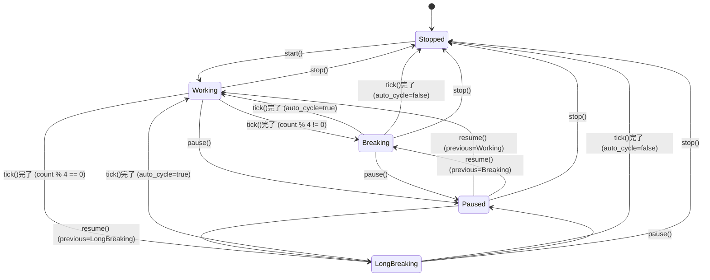
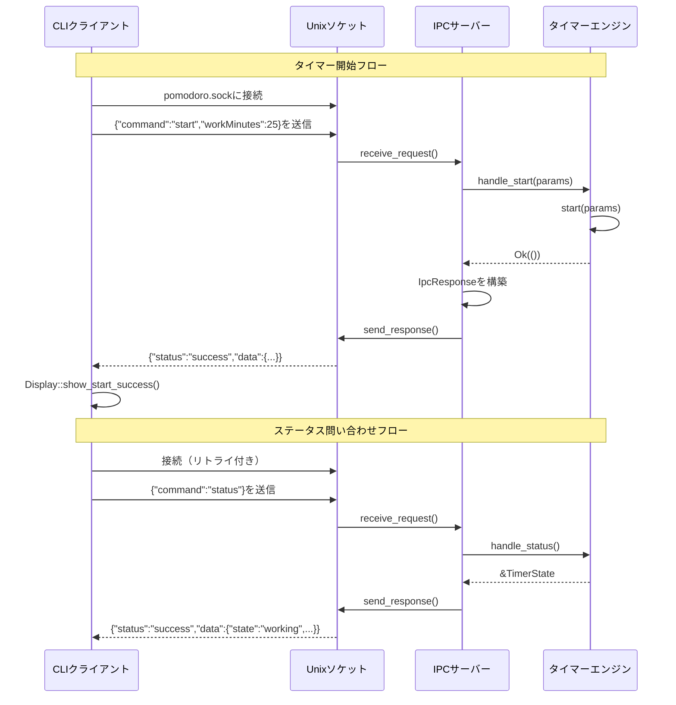

# ポモドーロタイマーCLI - リバースエンジニアリング設計書

## メタ情報

| 項目 | 内容 |
|------|------|
| プロジェクト | macOS向けポモドーロタイマーCLI |
| 言語 | Rust (Edition 2021, rust-version 1.71) |
| ライセンス | MIT OR Apache-2.0 |
| 生成元 | 実装コード分析（リバースエンジニアリング） |
| 分析日 | 2026-01-05 |
| 分析対象ソースファイル | `src/` 配下 35ファイル |
| テストファイル | `tests/` 配下 13ファイル |

---

## 1. 概要

本書は、ポモドーロタイマーCLIアプリケーションの**現在の実装状態**を、ソースコードのリバースエンジニアリングによって記述したものです。`docs/designs/detailed/pomodoro-timer/` にある実装前の設計書とは異なり、実際に構築されたコードの構造を反映しています。

### 主要特性

- **アーキテクチャ**: Unix Domain Socket IPCによるデーモン・クライアントモデル
- **対応プラットフォーム**: macOS専用 (Big Sur 11.0以上)
- **主要機能**: タイマーエンジン、ネイティブ通知、メニューバーUI、サウンド再生、フォーカスモード連携、LaunchAgentによる自動起動
- **テストカバレッジ**: 246以上のユニットテスト、13の統合/E2Eテストファイル

---

## 2. モジュール構成

```
src/
├── main.rs                    # エントリポイント（デーモンモード）
├── lib.rs                     # 公開モジュールの再エクスポート
├── types/                     # コアデータ型定義
│   └── mod.rs                 # TimerPhase, TimerState, PomodoroConfig, IPC型
├── cli/                       # CLIクライアント実装
│   ├── mod.rs                 # モジュールエクスポート
│   ├── commands.rs            # Cli, Commands, StartArgs
│   ├── display.rs             # 表示フォーマット
│   ├── ipc.rs                 # IpcClient
│   └── completions.rs         # シェル補完生成
├── daemon/                    # デーモンサーバー実装
│   ├── mod.rs                 # モジュールエクスポート
│   ├── timer.rs               # TimerEngine, TimerEvent
│   └── ipc.rs                 # IpcServer, リクエストハンドラ
├── notification/              # macOSネイティブ通知
│   ├── mod.rs                 # モジュールエクスポート, validate_task_name
│   ├── error.rs               # NotificationError (7種類)
│   ├── manager.rs             # NotificationManager
│   ├── center.rs              # NotificationCenter (objc2ラッパー)
│   ├── delegate.rs            # NotificationDelegate, NotificationActionEvent
│   ├── content.rs             # NotificationContentBuilder
│   ├── request.rs             # NotificationRequest, NotificationRequestId
│   └── actions.rs             # アクション/カテゴリ生成関数
├── menubar/                   # メニューバー/トレイアイコンUI
│   ├── mod.rs                 # TrayIconManager, MenubarError
│   ├── icon.rs                # IconManager
│   ├── menu.rs                # MenuBuilder, MenuItemIds
│   └── event.rs               # EventHandler, MenuAction
├── sound/                     # サウンド再生
│   ├── mod.rs                 # SoundPlayerトレイト, create_sound_player
│   ├── player.rs              # RodioSoundPlayer
│   ├── source.rs              # SoundSource列挙型
│   ├── embedded.rs            # WAV生成定数
│   └── error.rs               # SoundError
├── focus/                     # フォーカスモード連携
│   └── mod.rs                 # FocusModeConfig, Shortcuts.app関数
└── launchagent/               # macOS LaunchAgent管理
    ├── mod.rs                 # パスユーティリティ関数
    ├── error.rs               # LaunchAgentError (11種類)
    ├── plist.rs               # PomodoroLaunchAgent (plist生成)
    ├── launchctl.rs           # launchctlコマンドラッパー
    ├── installer.rs           # install/uninstall関数
    └── status.rs              # ServiceStatus, is_running
```

---

## 3. コアデータ型 (`src/types/mod.rs`)

### 3.1 TimerPhase (列挙型)

```rust
pub enum TimerPhase {
    Stopped,      // 停止中
    Working,      // 作業中
    Breaking,     // 短い休憩中
    LongBreaking, // 長い休憩中
    Paused,       // 一時停止中
}
```

**メソッド:**
- `as_str(&self) -> &'static str` - フェーズ名を取得
- `is_active(&self) -> bool` - タイマーが実行中の場合trueを返す

**状態遷移図:**



### 3.2 TimerState (構造体)

```rust
pub struct TimerState {
    pub phase: TimerPhase,                    // 現在のフェーズ
    pub remaining_seconds: u32,               // 残り時間（秒）
    pub pomodoro_count: u32,                  // 完了したポモドーロ回数
    pub task_name: Option<String>,            // 現在のタスク名
    pub config: PomodoroConfig,               // タイマー設定
    pub previous_phase: Option<TimerPhase>,   // 一時停止前のフェーズ
}
```

**コンストラクタ:**
- `new() -> Self` - デフォルト設定で停止状態のタイマーを作成

**メソッド:**
- `start_working(&mut self)` - 作業フェーズを開始
- `start_breaking(&mut self)` - 休憩フェーズを開始（pomodoro_countに基づき通常/長い休憩を判定）
- `pause(&mut self)` - タイマーを一時停止
- `resume(&mut self)` - 一時停止から再開
- `stop(&mut self)` - タイマーを完全停止
- `tick(&mut self) -> bool` - タイマーを1秒減算、フェーズ完了時にtrueを返す
- `is_running(&self) -> bool`
- `is_paused(&self) -> bool`

### 3.3 PomodoroConfig (構造体)

```rust
pub struct PomodoroConfig {
    pub work_minutes: u32,         // デフォルト: 25, 範囲: 1-120
    pub break_minutes: u32,        // デフォルト: 5, 範囲: 1-60
    pub long_break_minutes: u32,   // デフォルト: 15, 範囲: 1-120
    pub auto_cycle: bool,          // デフォルト: false
    pub focus_mode: bool,          // デフォルト: true
}
```

**メソッド:**
- `validate(&self) -> Result<(), String>` - 範囲を検証
- `update_from_params(&mut self, params: &StartParams)` - 開始パラメータをマージ

### 3.4 IPC型

```rust
pub enum IpcRequest {
    Start(StartParams),
    Pause,
    Resume,
    Stop,
    Status,
}

pub struct StartParams {
    pub work_minutes: Option<u32>,
    pub break_minutes: Option<u32>,
    pub long_break_minutes: Option<u32>,
    pub task_name: Option<String>,
    pub auto_cycle: Option<bool>,
    pub focus_mode: Option<bool>,
}

pub struct IpcResponse {
    pub status: String,      // "success" または "error"
    pub message: String,
    pub data: Option<ResponseData>,
}

pub struct ResponseData {
    pub state: String,
    pub remaining_seconds: Option<u32>,
    pub pomodoro_count: Option<u32>,
    pub task_name: Option<String>,
}
```

**ユニットテスト:** シリアライズ、検証、状態遷移をカバーする34テスト

---

## 4. デーモンモジュール (`src/daemon/`)

### 4.1 TimerEngine (`timer.rs`)

```rust
pub struct TimerEngine {
    state: TimerState,
    event_tx: Option<mpsc::UnboundedSender<TimerEvent>>,
}

pub enum TimerEvent {
    WorkComplete,      // 作業完了
    BreakComplete,     // 休憩完了
    LongBreakComplete, // 長い休憩完了
    StateChanged,      // 状態変更
}
```

**設計上の重要決定:** 外部ティッカーパターン（内部実行ループではない）

**コンストラクタ:**
- `new() -> Self` - イベントチャネルなしで作成
- `create_ticker() -> tokio::time::Interval` - 1秒間隔を返す

**メソッド:**
- `start(&mut self, params: StartParams) -> Result<(), String>`
- `pause(&mut self) -> Result<(), String>`
- `resume(&mut self) -> Result<(), String>`
- `stop(&mut self) -> Result<(), String>`
- `get_state(&self) -> &TimerState`
- `process_tick(&mut self)` - 毎秒外部から呼び出される
- `handle_timer_complete(&mut self)` - フェーズ遷移ロジック

**ユニットテスト:** 完全なサイクルシミュレーションを含む31テスト

### 4.2 IpcServer (`ipc.rs`)

```rust
pub struct IpcServer {
    listener: UnixListener,
    socket_path: PathBuf,
}

const CONNECTION_TIMEOUT_SECS: u64 = 5;
const REQUEST_BUFFER_SIZE: usize = 4096;
```

**コンストラクタ:**
- `new(socket_path: impl AsRef<Path>) -> io::Result<Self>`
  - 既存のソケットファイルがあれば削除
  - 必要に応じて親ディレクトリを作成

**メソッド:**
- `accept(&self) -> io::Result<UnixStream>`
- `socket_path(&self) -> &Path`
- `receive_request(stream: &UnixStream) -> io::Result<IpcRequest>` (関連関数)
- `send_response(stream: &UnixStream, response: &IpcResponse) -> io::Result<()>` (関連関数)

**リクエストハンドラ:**
- `handle_request(request: IpcRequest, engine: &mut TimerEngine) -> IpcResponse`
- `handle_start(params: StartParams, engine: &mut TimerEngine) -> IpcResponse`
- `handle_pause(engine: &mut TimerEngine) -> IpcResponse`
- `handle_resume(engine: &mut TimerEngine) -> IpcResponse`
- `handle_stop(engine: &mut TimerEngine) -> IpcResponse`
- `handle_status(engine: &TimerEngine) -> IpcResponse`

**Drop実装:** シャットダウン時にソケットファイルを自動削除

**ユニットテスト:** 完全なIPCフローを含む22テスト

---

## 5. CLIモジュール (`src/cli/`)

### 5.1 Commands (`commands.rs`)

```rust
#[derive(Parser)]
pub struct Cli {
    #[command(subcommand)]
    pub command: Commands,
    
    #[arg(short, long, global = true)]
    pub verbose: bool,
}

#[derive(Subcommand)]
pub enum Commands {
    Start(StartArgs),
    Pause,
    Resume,
    Stop,
    Status,
    Completions { shell: clap_complete::Shell },
    Install,
    Uninstall,
}

pub struct StartArgs {
    #[arg(short, long, value_parser = clap::value_parser!(u32).range(1..=120))]
    pub work: Option<u32>,
    
    #[arg(short, long, value_parser = clap::value_parser!(u32).range(1..=60))]
    pub break_time: Option<u32>,
    
    #[arg(short, long, value_parser = clap::value_parser!(u32).range(1..=120))]
    pub long_break: Option<u32>,
    
    #[arg(short, long, value_parser = validate_task_name)]
    pub task: Option<String>,
    
    #[arg(short, long)]
    pub auto_cycle: bool,
    
    #[arg(short, long)]
    pub focus_mode: bool,
    
    #[arg(long)]
    pub no_sound: bool,
}
```

**検証関数:**
- `validate_task_name(s: &str) -> Result<String, String>` - 最大50文字、制御文字禁止

### 5.2 Display (`display.rs`)

```rust
pub struct Display;  // ゼロサイズ型
```

**メソッド:**
- `new() -> Self`
- `show_success(&self, message: &str)`
- `show_start_success(&self, response: &IpcResponse)`
- `show_pause_success(&self)`
- `show_resume_success(&self)`
- `show_stop_success(&self)`
- `show_status(&self, response: &IpcResponse)`
- `show_error(&self, message: &str)`
- `show_install_success(&self)`
- `show_install_failure(&self, error: &str)`
- `show_uninstall_success(&self)`
- `show_uninstall_failure(&self, error: &str)`

### 5.3 IpcClient (`ipc.rs`)

```rust
pub struct IpcClient {
    socket_path: PathBuf,
}

const CONNECTION_TIMEOUT_SECS: u64 = 5;
const REQUEST_BUFFER_SIZE: usize = 4096;
const INITIAL_RETRY_DELAY_MS: u64 = 100;
const MAX_RETRY_DELAY_MS: u64 = 2000;
```

**コンストラクタ:**
- `new() -> Self` - デフォルトソケットパスを使用
- `with_socket_path(path: impl Into<PathBuf>) -> Self`
- `default() -> Self`

**メソッド:**
- `send_request(&self, request: &IpcRequest) -> anyhow::Result<IpcResponse>`
- `send_request_with_retry(&self, request: &IpcRequest, max_retries: u32) -> anyhow::Result<IpcResponse>`
- `start(&self, args: &StartArgs) -> anyhow::Result<IpcResponse>`
- `pause(&self) -> anyhow::Result<IpcResponse>`
- `resume(&self) -> anyhow::Result<IpcResponse>`
- `stop(&self) -> anyhow::Result<IpcResponse>`
- `status(&self) -> anyhow::Result<IpcResponse>`

**ヘルパー関数:**
- `get_socket_path() -> PathBuf` - `$XDG_RUNTIME_DIR/pomodoro.sock` または `/tmp/pomodoro.sock`

### 5.4 Completions (`completions.rs`)

```rust
pub fn generate_completions(shell: clap_complete::Shell) -> String
```

bash, zsh, fish, powershell, elvish用のシェル補完を生成。

---

## 6. 通知モジュール (`src/notification/`)

### 6.1 NotificationError (`error.rs`)

```rust
pub enum NotificationError {
    AuthorizationFailed(String),   // 認証失敗
    SendFailed(String),            // 送信失敗
    PermissionDenied,              // 権限拒否
    UnsignedBinary,                // 未署名バイナリ
    InitializationFailed(String),  // 初期化失敗
    InvalidInput(String),          // 無効な入力
    NoBundleContext,               // バンドルコンテキストなし（元設計にない）
}
```

**備考:** `NoBundleContext`バリアントは、アプリバンドル外でバイナリが実行される場合に対応するため、実装中に追加されました。

### 6.2 NotificationManager (`manager.rs`)

```rust
pub struct NotificationManager {
    center: NotificationCenter,
    _delegate: Retained<NotificationDelegate>,
    action_receiver: mpsc::UnboundedReceiver<NotificationActionEvent>,
}
```

**コンストラクタ:**
- `new() -> Result<Self, NotificationError>`

**メソッド:**
- `send_work_complete_notification(&self, task_name: Option<&str>) -> Result<(), NotificationError>`
- `send_break_complete_notification(&self, task_name: Option<&str>) -> Result<(), NotificationError>`
- `send_long_break_complete_notification(&self, task_name: Option<&str>) -> Result<(), NotificationError>`
- `try_recv_action(&mut self) -> Option<NotificationActionEvent>`
- `recv_action(&mut self) -> impl Future<Output = Option<NotificationActionEvent>>`
- `is_authorized(&self) -> bool`

### 6.3 NotificationCenter (`center.rs`)

`objc2_user_notifications::UNUserNotificationCenter`のラッパー。

```rust
pub struct NotificationCenter {
    inner: Retained<UNUserNotificationCenter>,
}

// 手動実装のスレッドセーフティマーカー
unsafe impl Send for NotificationCenter {}
unsafe impl Sync for NotificationCenter {}
```

**コンストラクタ:**
- `try_shared() -> Result<Self, NotificationError>` - `NoBundleContext`で失敗する可能性あり

**メソッド:**
- `request_authorization(&self) -> impl Future<Output = Result<bool, NotificationError>>`
- `set_notification_categories(&self, categories: &NSSet<UNNotificationCategory>)`
- `set_delegate(&self, delegate: &ProtocolObject<dyn UNUserNotificationCenterDelegate>)`
- `add_notification_request(&self, request: &UNNotificationRequest) -> impl Future<Output = Result<(), NotificationError>>`
- `get_notification_settings(&self) -> impl Future<Output = UNNotificationSettings>`
- `is_authorized_sync(&self) -> bool`

### 6.4 NotificationDelegate (`delegate.rs`)

```rust
pub enum NotificationActionEvent {
    Pause(String),   // Stringは通知ID
    Stop(String),
    Unknown(String, String),  // (notification_id, action_identifier)
}

pub struct NotificationDelegateIvars {
    action_sender: mpsc::UnboundedSender<NotificationActionEvent>,
}
```

`objc2`の`declare_class!`マクロを使用して`UNUserNotificationCenterDelegate`を実装。

### 6.5 NotificationContentBuilder (`content.rs`)

通知コンテンツのビルダーパターン。

```rust
pub struct NotificationContentBuilder {
    content: Retained<UNMutableNotificationContent>,
}
```

**メソッド（チェーン可能）:**
- `new() -> Self`
- `title(self, title: &str) -> Self`
- `subtitle(self, subtitle: &str) -> Self`
- `body(self, body: &str) -> Self`
- `category_identifier(self, identifier: &str) -> Self`
- `with_default_sound(self) -> Self`
- `build(self) -> Retained<UNNotificationContent>`

**ファクトリ関数:**
- `create_work_complete_content(task_name: Option<&str>) -> Retained<UNNotificationContent>`
- `create_break_complete_content(task_name: Option<&str>) -> Retained<UNNotificationContent>`
- `create_long_break_complete_content(task_name: Option<&str>) -> Retained<UNNotificationContent>`

### 6.6 NotificationRequest (`request.rs`)

```rust
pub struct NotificationRequestId(String);

pub struct NotificationRequest {
    pub id: NotificationRequestId,
    pub title: String,
    pub subtitle: Option<String>,
    pub body: String,
    pub category_id: Option<String>,
    pub play_sound: bool,
}
```

### 6.7 Actions (`actions.rs`)

```rust
pub fn create_pause_action() -> Retained<UNNotificationAction>
pub fn create_stop_action() -> Retained<UNNotificationAction>
pub fn create_actions() -> Retained<NSArray<UNNotificationAction>>
pub fn create_category() -> Retained<UNNotificationCategory>
pub fn create_categories() -> Retained<NSSet<UNNotificationCategory>>
```

### 6.8 モジュール定数

```rust
// カテゴリID
pub mod category_ids {
    pub const TIMER_CATEGORY: &str = "TIMER_CATEGORY";
}

// アクションID
pub mod action_ids {
    pub const PAUSE_ACTION: &str = "PAUSE_ACTION";
    pub const STOP_ACTION: &str = "STOP_ACTION";
}

// 制限
pub mod limits {
    pub const MAX_TASK_NAME_LENGTH: usize = 50;
}
```

---

## 7. メニューバーモジュール (`src/menubar/`)

### 7.1 TrayIconManager (`mod.rs`)

```rust
pub struct TrayIconManager {
    tray_icon: TrayIcon,
    icon_manager: IconManager,
    menu_builder: MenuBuilder,
    event_handler: EventHandler,
}

pub enum MenubarError {
    IconCreationFailed(String),    // アイコン作成失敗
    TrayCreationFailed(String),    // トレイ作成失敗
    MenuCreationFailed(String),    // メニュー作成失敗
}
```

**コンストラクタ:**
- `new() -> Result<Self, MenubarError>`

**メソッド:**
- `initialize(&mut self) -> Result<(), MenubarError>`
- `update_state(&mut self, state: &TimerState) -> Result<(), MenubarError>`
- `check_events(&mut self) -> Option<MenuAction>`
- `shutdown(&mut self)`

### 7.2 IconManager (`icon.rs`)

```rust
pub struct IconManager {
    working_icon: Icon,
    breaking_icon: Icon,
    stopped_icon: Icon,
}
```

**コンストラクタ:**
- `new() -> Result<Self, MenubarError>`

**メソッド:**
- `get_icon(&self, phase: &TimerPhase) -> &Icon`

**関連関数:**
- `generate_title(phase: &TimerPhase, remaining_seconds: u32) -> String`
  - フォーマット: 作業中は"25:00"、休憩中は"05:00"、一時停止中は"(25:00)"
- `create_default_icon(r: u8, g: u8, b: u8) -> Result<Icon, MenubarError>`

### 7.3 MenuBuilder (`menu.rs`)

```rust
pub struct MenuItemIds {
    pub pause: MenuId,
    pub resume: MenuId,
    pub stop: MenuId,
    pub quit: MenuId,
}

pub struct MenuBuilder {
    menu: Menu,
    item_ids: MenuItemIds,
}
```

**コンストラクタ:**
- `new() -> Self`

**メソッド:**
- `menu(&self) -> &Menu`
- `item_ids(&self) -> &MenuItemIds`
- `build(&self) -> Menu`

### 7.4 EventHandler (`event.rs`)

```rust
pub enum MenuAction {
    Pause,
    Resume,
    Stop,
    Quit,
}

pub struct EventHandler;  // ゼロサイズ型
```

**コンストラクタ:**
- `new() -> Self`

**メソッド:**
- `check_events(&self, item_ids: &MenuItemIds) -> Option<MenuAction>`

---

## 8. サウンドモジュール (`src/sound/`)

### 8.1 SoundPlayerトレイト (`mod.rs`)

```rust
pub trait SoundPlayer: Send + Sync {
    fn play(&self, source: &SoundSource) -> Result<(), SoundError>;
    fn is_available(&self) -> bool;
}

pub fn create_sound_player() -> Box<dyn SoundPlayer>
```

### 8.2 RodioSoundPlayer (`player.rs`)

```rust
pub struct RodioSoundPlayer {
    stream_handle: OutputStreamHandle,
    _keep_alive: OutputStream,
    disabled: bool,
}
```

**コンストラクタ:**
- `new() -> Result<Self, SoundError>`

**実装:** `SoundPlayer`

### 8.3 SoundSource (`source.rs`)

```rust
pub enum SoundSource {
    SystemSound(PathBuf),  // システムサウンドファイル
    Embedded,              // 埋め込みサウンド
}
```

**関連関数:**
- `discover_system_sounds() -> Vec<PathBuf>`
- `get_default_source() -> SoundSource`

### 8.4 埋め込みサウンド生成 (`embedded.rs`)

```rust
pub const SAMPLE_RATE: u32 = 44100;
pub const FREQUENCY: f32 = 440.0;      // A4音
pub const DURATION_MS: u32 = 300;
pub const NUM_SAMPLES: usize = 13230;  // SAMPLE_RATE * DURATION_MS / 1000
pub const FADE_SAMPLES: usize = 441;   // 10msフェード
pub const WAV_HEADER_SIZE: usize = 44;
pub const WAV_FILE_SIZE: usize = 26504; // HEADER + NUM_SAMPLES * 2

pub static DEFAULT_SOUND_DATA: Lazy<Vec<u8>> = Lazy::new(generate_beep_wav);

pub fn generate_beep_wav() -> Vec<u8>
```

コンパイル時に440Hzのサイン波ビープ音（フェードイン/アウト付き）をWAVファイルとして生成。

### 8.5 SoundError (`error.rs`)

```rust
pub enum SoundError {
    OutputStreamFailed(String),  // 出力ストリーム失敗
    DecodeFailed(String),        // デコード失敗
    PlaybackFailed(String),      // 再生失敗
    FileNotFound(PathBuf),       // ファイルが見つからない
}
```

---

## 9. フォーカスモジュール (`src/focus/mod.rs`)

### 9.1 FocusModeConfig

```rust
pub struct FocusModeConfig {
    pub enabled: bool,
    pub enable_shortcut_name: String,   // デフォルト: "Enable Focus"
    pub disable_shortcut_name: String,  // デフォルト: "Disable Focus"
}
```

### 9.2 FocusModeError

```rust
pub enum FocusModeError {
    ShortcutsNotFound,                   // Shortcuts.appが見つからない
    ShortcutNotFound(String),            // ショートカットが見つからない
    ExecutionTimeout(String, u64),       // (ショートカット名, タイムアウト秒)
    ExecutionFailed(String, String),     // (ショートカット名, エラーメッセージ)
    Other(String),                       // その他のエラー
}
```

### 9.3 関数

```rust
pub fn shortcuts_exists() -> bool
pub async fn enable_focus(shortcut_name: &str) -> Result<(), FocusModeError>
pub async fn disable_focus(shortcut_name: &str) -> Result<(), FocusModeError>
async fn execute_shortcut(shortcut_name: &str) -> Result<(), FocusModeError>
```

`/usr/bin/shortcuts` CLIを使用してShortcuts.appの自動化を実行。

**タイムアウト**: ブロッキングを防ぐため、ショートカット実行ごとに5秒。

---

## 10. LaunchAgentモジュール (`src/launchagent/`)

### 10.1 モジュール関数 (`mod.rs`)

```rust
pub fn get_plist_path() -> PathBuf          // ~/Library/LaunchAgents/com.pomodoro.daemon.plist
pub fn get_log_dir() -> PathBuf             // ~/Library/Logs/Pomodoro
pub fn get_launch_agents_dir() -> PathBuf   // ~/Library/LaunchAgents
pub fn is_installed() -> bool
```

### 10.2 LaunchAgentError (`error.rs`)

```rust
pub enum LaunchAgentError {
    BinaryPathResolution(String),    // バイナリパス解決エラー
    HomeDirectoryNotFound,           // ホームディレクトリが見つからない
    PlistSerialization(String),      // plistシリアライズエラー
    PlistDeserialization(String),    // plistデシリアライズエラー
    PlistFileWrite(io::Error),       // plistファイル書き込みエラー
    PlistFileRead(io::Error),        // plistファイル読み込みエラー
    PlistFileDelete(io::Error),      // plistファイル削除エラー
    LaunchctlExecution(io::Error),   // launchctl実行エラー
    ServiceLoad(String),             // サービス読み込みエラー
    ServiceUnload(String),           // サービスアンロードエラー
    DirectoryCreation(io::Error),    // ディレクトリ作成エラー
}

pub type Result<T> = std::result::Result<T, LaunchAgentError>;
```

### 10.3 PomodoroLaunchAgent (`plist.rs`)

```rust
pub const DEFAULT_LABEL: &str = "com.pomodoro.daemon";

#[derive(Serialize, Deserialize)]
pub struct PomodoroLaunchAgent {
    #[serde(rename = "Label")]
    pub label: String,
    
    #[serde(rename = "ProgramArguments")]
    pub program_arguments: Vec<String>,
    
    #[serde(rename = "RunAtLoad")]
    pub run_at_load: bool,
    
    #[serde(rename = "KeepAlive")]
    pub keep_alive: bool,
    
    #[serde(rename = "StandardOutPath", skip_serializing_if = "Option::is_none")]
    pub standard_out_path: Option<String>,
    
    #[serde(rename = "StandardErrorPath", skip_serializing_if = "Option::is_none")]
    pub standard_error_path: Option<String>,
    
    #[serde(rename = "WorkingDirectory", skip_serializing_if = "Option::is_none")]
    pub working_directory: Option<String>,
    
    #[serde(rename = "EnvironmentVariables", skip_serializing_if = "Option::is_none")]
    pub environment_variables: Option<HashMap<String, String>>,
}
```

**コンストラクタ:**
- `new(binary_path: &str, log_dir: &str) -> Self`

**ビルダーメソッド:**
- `with_label(self, label: &str) -> Self`
- `with_working_directory(self, path: &str) -> Self`
- `with_environment_variables(self, vars: HashMap<String, String>) -> Self`
- `without_keep_alive(self) -> Self`

**シリアライズ:**
- `to_xml(&self) -> Result<String>`
- `from_xml(xml: &str) -> Result<Self>`

### 10.4 Launchctlラッパー (`launchctl.rs`)

```rust
pub fn load(plist_path: &Path) -> Result<()>
pub fn unload(plist_path: &Path) -> Result<()>
pub fn bootstrap(domain: &str, plist_path: &Path) -> Result<()>
pub fn bootout(domain: &str, service_label: &str) -> Result<()>
pub fn list(service_label: &str) -> Result<String>
pub fn get_user_domain() -> String  // "gui/{uid}"を返す
```

### 10.5 インストーラー (`installer.rs`)

```rust
pub fn resolve_binary_path() -> Result<PathBuf>
pub fn install() -> Result<()>
pub fn uninstall() -> Result<()>
```

### 10.6 ServiceStatus (`status.rs`)

```rust
pub struct ServiceStatus {
    pub running: bool,
    pub pid: Option<u32>,
    pub status_code: Option<i32>,
}

pub fn is_running() -> bool
pub fn get_status() -> Result<ServiceStatus>
fn parse_launchctl_output(output: &str) -> ServiceStatus
fn extract_field(output: &str, field: &str) -> Option<String>
```

---

## 11. 依存関係

### ランタイム依存

| クレート | バージョン | 用途 |
|---------|-----------|------|
| tokio | 1.48 | 非同期ランタイム (rt, time, signal, sync, io-util, net) |
| clap | 4.5 | CLI引数パース (derive) |
| clap_complete | 4.5 | シェル補完生成 |
| serde | 1.0 | シリアライズ (derive) |
| serde_json | 1.0 | IPC用JSONシリアライズ |
| anyhow | 1.0 | エラーハンドリング |
| thiserror | 1.0 | エラーderiveマクロ |
| uuid | 1.0 | UUID v4生成 |
| tracing | 0.1 | ロギングフレームワーク |
| tracing-subscriber | 0.3 | ログサブスクライバー |
| colored | 2.1 | ターミナルカラー |
| rodio | 0.20 | オーディオ再生 (symphonia-all) |
| async-trait | 0.1 | 非同期トレイトサポート |
| tray-icon | 0.19 | システムトレイ統合 |
| image | 0.25 | アイコン画像生成 |
| plist | 1.6 | プロパティリストシリアライズ |
| dirs | 5.0 | プラットフォームディレクトリ |

### macOS専用依存

| クレート | バージョン | 用途 |
|---------|-----------|------|
| block2 | 0.6 | Objective-Cブロック |
| objc2 | 0.6 | Objective-C FFI |
| objc2-foundation | 0.3 | Foundationフレームワークバインディング |
| objc2-user-notifications | 0.3 | UserNotificationsフレームワーク |

### 開発依存

| クレート | バージョン | 用途 |
|---------|-----------|------|
| tempfile | 3.15 | テスト用一時ファイル |

---

## 12. テストカバレッジ

### モジュール別ユニットテスト

| モジュール | テスト数 | 主なカバレッジ領域 |
|-----------|---------|-------------------|
| types | 34 | シリアライズ、検証、状態遷移 |
| daemon/timer | 31 | TimerEngine操作、完全サイクルシミュレーション |
| daemon/ipc | 22 | IpcServer操作、リクエスト処理 |
| cli/commands | 12 | 引数パース、検証 |
| cli/display | 14 | 出力フォーマット |
| cli/ipc | 11 | IpcClient操作 |
| cli/completions | 5 | シェル補完生成 |
| notification/* | 40以上 | 全通知コンポーネント |
| menubar/* | 16 | アイコン、メニュー、イベント処理 |
| sound/* | 8 | WAV生成、再生 |
| focus | 5 | ショートカット連携 |
| launchagent/* | 30以上 | plist、launchctl、インストーラー |

### 統合テスト (`tests/`)

| ファイル | 目的 |
|---------|------|
| test_integration.rs | モジュール間統合 |
| test_e2e.rs | エンドツーエンドシナリオ |
| integration/daemon_cli.rs | デーモン-CLI通信 |
| integration/timer_notification.rs | タイマー-通知統合 |
| e2e/scenarios.rs | 完全なユーザーシナリオ |
| e2e/performance.rs | パフォーマンスベンチマーク |
| test_menubar_*.rs | メニューバーUIテスト |
| test_sound_system.rs | サウンド再生テスト |

---

## 13. 元設計からの変更点

### 13.1 TimerEngineアーキテクチャ

**元設計:** `select!`を使用した内部`run()`ループ

**実際の実装:** 外部ティッカーパターン
- `create_ticker()`がインターバルを返す
- `process_tick()`が外部から呼び出される
- よりテストしやすく、関心の分離が改善

### 13.2 NotificationErrorバリアント

**元設計:** 6種類

**実際の実装:** 7種類
- バンドル外でのバイナリ実行に対応するため`NoBundleContext`を追加

### 13.3 サウンドモジュール

**元設計:** ファイルベースのシステムサウンドのみ

**実際の実装:** 
- 特定のパラメータによる埋め込みWAV生成を追加
- 440Hzサイン波、300ms持続、フェードイン/アウト
- コンパイル時WAV生成

### 13.4 Displayモジュール

**元設計:** 詳細な仕様なし

**実際の実装:**
- ゼロサイズ型パターン
- 全レスポンスタイプに対応した包括的なフォーマット
- install/uninstall出力メソッド

---

## 14. IPCプロトコル

### ソケットパス

```
$XDG_RUNTIME_DIR/pomodoro.sock  (XDG_RUNTIME_DIRが設定されている場合)
/tmp/pomodoro.sock              (フォールバック)
```

### メッセージフォーマット

Unix Domain Socket上のJSONエンコードされたメッセージ。

**リクエストフォーマット:**

`#[serde(tag = "command", rename_all = "lowercase")]`を使用したタグ付き共用体：

```json
// startコマンド（全オプションパラメータ付き）
{
  "command": "start",
  "workMinutes": 25,
  "breakMinutes": 5,
  "longBreakMinutes": 15,
  "taskName": "コーディング",
  "autoCycle": true,
  "focusMode": true
}

// startコマンド（最小）
{"command": "start"}

// その他のコマンド
{"command": "pause"}
{"command": "resume"}
{"command": "stop"}
{"command": "status"}
```

**Serde設定詳細:**
- `IpcRequest`: `#[serde(tag = "command", rename_all = "lowercase")]`
- `StartParams`: フィールドは`#[serde(rename = "camelCase")]`と`skip_serializing_if = "Option::is_none"`を使用

**レスポンスフォーマット:**

```json
{
  "status": "success",
  "message": "タイマーを開始しました",
  "data": {
    "state": "working",
    "remainingSeconds": 1500,
    "pomodoroCount": 1,
    "taskName": "コーディング"
  }
}
```

**ResponseData Serde設定:**
- `remaining_seconds` -> `remainingSeconds`
- `pomodoro_count` -> `pomodoroCount`
- `task_name` -> `taskName`
- 全フィールドはオプションで`skip_serializing_if = "Option::is_none"`を使用

### 接続パラメータ

- `CONNECTION_TIMEOUT_SECS`: 5秒
- `REQUEST_BUFFER_SIZE`: 4096バイト
- `INITIAL_RETRY_DELAY_MS`: 100ミリ秒
- `MAX_RETRY_DELAY_MS`: 2000ミリ秒

### IPCシーケンス図



---

## 15. ビルド設定

### リリースプロファイル

```toml
[profile.release]
lto = true           # リンク時最適化
codegen-units = 1    # 最大最適化
strip = true         # デバッグシンボル削除
opt-level = "z"      # サイズ最適化
panic = "abort"      # スタックアンワインドなし
```

---

## 16. 関連ドキュメント

| ドキュメント | 場所 | 説明 |
|-------------|------|------|
| 元設計書インデックス | `docs/designs/detailed/pomodoro-timer/README.md` | 実装前の設計 |
| 基本設計書 | `docs/designs/basic/BASIC-CLI-001_pomodoro-timer.md` | ハイレベル設計 |
| テスト項目書 | `docs/designs/detailed/pomodoro-timer/test-specification.md` | テストケース |
| Issue計画書 | `docs/designs/detailed/pomodoro-timer/issue-plan.md` | 実装計画 |

---

## 17. 変更履歴

| 日付 | バージョン | 作成者 | 変更内容 |
|------|-----------|--------|---------|
| 2026-01-05 | 1.0.0 | リバースエンジニアリングエージェント | ソースコード分析から初版を生成 |
